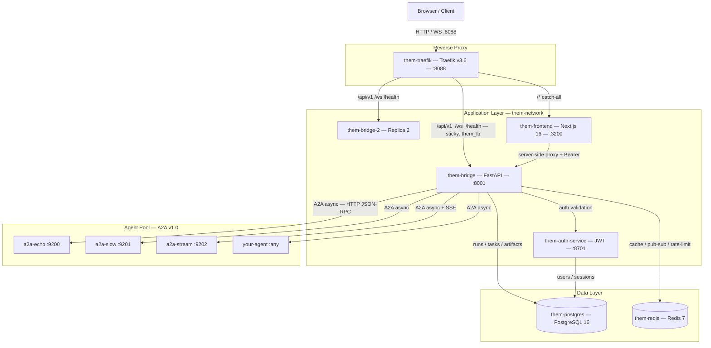

<div align="center">
  
  <h1>the-M</h1>
  <p><strong>Multi-Agent Orchestration Platform</strong></p>
  <p>Route any user goal through a pool of AI agents. Each agent is a tool.<br/>The LLM decides which ones to call, in what order, in parallel — then streams the answer back.</p>
  <p>
    
    
    
    
    
    
    
  </p>
</div>

---

## What is the-M?

**the-M** is a production-grade multi-agent orchestration platform. Any user goal enters as a natural-language message. The platform's agentic loop turns it into a sequence of tool calls across a registry of AI agents, runs them in parallel where possible, and streams a composed answer back in real time.

Agents are transport-agnostic — they speak the [Google A2A v1.0 protocol](https://a2a.rocks) over HTTP. New agents plug in without touching the orchestrator. The LLM reads each agent's `description` to decide when and how to invoke it.

---

## Architecture



**Fully isolated.** Zero dependency on any external stack — own Postgres, own Redis, own Docker network. All data bind-mounted under `data/` and survives `docker compose down`.

### Agentic Loop

```
User message → WS /ws/orchestrate/{name}
    │
    ├─ Auth: Bearer token validated (L1 in-process → L2 Redis)
    ├─ Load orchestrator config (Redis TTL 600s)
    ├─ Build tool list: each enabled agent → NeutralTool named agent__<slug>
    │
    └─ Agentic loop (≤ max_iterations)
         │
         ├─ LLM call → zero or more ToolCalls
         ├─ asyncio.gather() — parallel fan-out bounded by max_parallel_tools
         │   └─ per-agent A2A async adapter → submit → SSE stream / poll
         ├─ Artifacts stored in Postgres; hot-cached in Redis
         ├─ Budget check: tokens_used vs budget_tokens
         └─ Feed results back to LLM → next iteration
              │
              └─ Final answer → streamed as tokens to client
```

---

## Stack

| Layer | Technology |
|---|---|
| Orchestrator API | Python 3.13 · FastAPI · asyncpg · SQLAlchemy async |
| Auth service | Python 3.11 · FastAPI · bcrypt · JWT (HS256, 2-hour TTL) |
| Reverse proxy | Traefik v3.6 · Docker provider · sticky sessions |
| Database | PostgreSQL 16 |
| Cache / PubSub | Redis 7 · AOF persistence |
| Frontend | Next.js 16 · TypeScript · Tailwind CSS 4 · Zustand |
| Agent protocol | Google A2A v1.0 (async submit → SSE stream / poll) |
| Container | Docker Compose (isolated network, bind-mount data) |

---

## Features

- **Agentic loop** — LLM drives tool selection over multiple iterations; max iterations and token budget configurable per orchestrator
- **Parallel fan-out** — multiple tool calls per iteration via `asyncio.gather()`, bounded by `max_parallel_tools` and per-agent `max_concurrency`
- **A2A v1.0 protocol** — native async adapter with SSE streaming, push webhooks, and automatic fallback to polling
- **Durable task graph** — every run, task, and artifact stored in Postgres; survives WS disconnects and replica restarts
- **Context memory** — rolling LLM-generated summary injected across turns; agents retain cross-session context
- **Single port** — Traefik reverse proxy routes all traffic on `:8088`; no exposed internal ports
- **Multi-replica ready** — sticky sessions via `them_lb` cookie; shared state in Postgres + Redis; heartbeat pub/sub invalidation
- **Pluggable edges** — WebSocket (chat, Slack), SSE (streaming HTTP for TTS/voice pipelines), WebRTC planned; same orchestrator behind every edge
- **WebSocket streaming** — tokens stream to the client in real time; tool events visible as they happen
- **Agent discovery** — fetch and diff A2A agent cards from the admin UI; highlights changes, warns on orchestrator impact
- **Run history** — node graph view of each orchestration run with parallel agents at the same level
- **Rate limiting** — Redis INCR fixed-window per user per hour
- **Dashboard WS** — multiplexed channels (`runs`, `agents`, `metrics`) via Redis pub/sub
- **Playground UI** — split-pane chat + real-time trace, tasks, artifacts, and memory tabs

---

## Container Map

| Container | Role | Exposed |
|---|---|---|
| `them-traefik` | Reverse proxy — single entry point, path-based routing, sticky LB | **:8088** (traffic), **:8089** (dashboard, 127.0.0.1 only) |
| `them-postgres` | PostgreSQL 16 | internal |
| `them-redis` | Redis 7 (AOF) | internal |
| `them-auth-service` | Auth / IAM microservice (JWT, bcrypt, sessions) | internal :8701 |
| `them-bridge` | Orchestrator API + WebSocket (replica 1) | internal :8001 |
| `them-bridge-2` | Replica 2 (`--profile replica`) | internal :8001 |
| `them-frontend` | Next.js 16 dashboard | internal :3200 |
| `a2a-echo` / `a2a-slow` / `a2a-stream` | A2A v1.0 test agents (`--profile test-agents`) | internal |

---

## Quick Start

### Prerequisites

- Docker Engine + Compose plugin (Linux) or Docker Desktop (Windows/Mac)
- Python 3.x (for the test runner)
- An Anthropic API key

### 1. Clone

```bash
git clone https://github.com/aviciot/odin-stuck.git
cd odin-stuck
```

### 2. Generate secrets and set your API key

```bash
# Linux / Mac
./generate-env.sh
echo "ANTHROPIC_API_KEY=sk-ant-..." >> .env

# Windows PowerShell
.\generate-env.ps1
Add-Content .env "ANTHROPIC_API_KEY=sk-ant-..."
```

### 3. Start the stack

```bash
docker compose -f docker-compose.yml -f docker-compose.local.yml up -d --build
```

### 4. Initialize the database (first boot only)

```bash
docker cp db/001_schema.sql them-postgres:/tmp/them_001_schema.sql
docker cp auth_service/SCHEMA.sql them-postgres:/tmp/them_auth_schema.sql
docker cp db/002_seed.sql them-postgres:/tmp/them_002_seed.sql
docker cp db/003_phase8.sql them-postgres:/tmp/them_003_phase8.sql
docker cp db/004_phase9.sql them-postgres:/tmp/them_004_phase9.sql
docker cp db/005_phase10.sql them-postgres:/tmp/them_005_phase10.sql

docker exec them-postgres psql -U them -d them -c "CREATE SCHEMA IF NOT EXISTS auth_service;"
docker exec them-postgres psql -U them -d them -f /tmp/them_001_schema.sql
docker exec them-postgres psql -U them -d them -f /tmp/them_auth_schema.sql
docker exec them-postgres psql -U them -d them -f /tmp/them_002_seed.sql
docker exec them-postgres psql -U them -d them -f /tmp/them_003_phase8.sql
docker exec them-postgres psql -U them -d them -f /tmp/them_004_phase9.sql
docker exec them-postgres psql -U them -d them -f /tmp/them_005_phase10.sql
```

### 5. Verify and open

```bash
python3 scripts/tests/run_tests.py 01 02 03 04 15
```

Open **http://localhost:8088** — login with `admin` / `admin123` (credentials pre-filled in dev mode).

---

## API Reference

### Auth service (proxied via frontend — no direct exposure)

| Method | Path | Description |
|---|---|---|
| POST | `/api/auth/login` | Login → sets `them_access_token` + `them_refresh_token` cookies |
| POST | `/api/auth/refresh` | Refresh access token |
| GET | `/api/auth/me` | Current user from JWT |

### Bridge REST (via Traefik :8088)

| Method | Path | Auth | Description |
|---|---|---|---|
| GET | `/health` `/health/live` `/health/ready` | — | Health checks |
| CRUD | `/api/v1/admin/agents` | JWT | Agent registry |
| CRUD | `/api/v1/admin/orchestrators` | JWT | Orchestrator configs |
| CRUD | `/api/v1/admin/tokens` | JWT | Access token management |
| CRUD | `/api/v1/admin/applications` | JWT | Application entry points |
| GET | `/api/v1/runs` | JWT | Run history + stats |
| GET | `/api/v1/runs/{id}/tasks` | JWT | Task graph for a run |
| GET | `/api/v1/runs/{id}/artifacts` | JWT | Artifacts for a run |
| POST | `/a2a/push/{task_id}` | Bearer | A2A push webhook |
| GET | `/.well-known/agent-card.json` | — | the-M's own A2A agent card |
| GET | `/apps` | — | Public application catalogue |
| POST | `/apps/{slug}` | Bearer\|public | Fire-and-forget REST entry point |
| GET | `/apps/{slug}/tasks/{task_id}` | Bearer\|public | Poll task state |
| GET | `/apps/{slug}/sse` | Bearer\|public | SSE streaming entry point |
| WS | `/apps/{slug}/ws` | Bearer\|public | WebSocket streaming entry point |

### WebSocket orchestration (via Traefik :8088)

```jsonc
// Connect: ws://<host>:8088/ws/orchestrate/{orchestrator_name}?token=<bearer>

// Client sends:
{ "type": "message", "content": "Summarize last week's data", "context_id": "<uuid>" }

// Server streams:
{ "type": "ready",      "run_id": "...", "task_id": "...", "context_id": "..." }
{ "type": "tool_start", "tool": "agent__assistant", "iteration": 1 }
{ "type": "token",      "text": "Based on the data..." }
{ "type": "tool_done",  "tool": "agent__assistant", "duration_ms": 1240 }
{ "type": "done",       "run_id": "...", "total_tokens": 1820, "iterations": 2 }
```

### Application Entry Points

Applications bind an orchestrator to a transport edge. Create one via **Admin → Applications**.

**WebSocket** — full-duplex streaming chat (same protocol as `/ws/orchestrate`):
```
ws://<host>:8088/apps/{slug}/ws?token=<bearer>
```

**SSE** — streaming HTTP, ideal for TTS pipelines (pipe tokens directly to a speech engine):
```
GET http://<host>:8088/apps/{slug}/sse?message=Hello&context_id=<uuid>
Authorization: Bearer <token>

# Stream format:
data: The answer is        ← LLM tokens, one per frame
data:  forty-two.

event: tool_start
data: {"tool": "agent__coder", "iteration": 1}

event: done
data: {}
```

**REST + poll** — fire-and-forget for webhooks and serverless callers:
```bash
# Submit
curl -X POST http://<host>:8088/apps/{slug} \
  -H "Authorization: Bearer <token>" \
  -d '{"message": "Summarize today'\''s data"}'
# → {"task_id": "...", "poll_url": "/apps/{slug}/tasks/..."}

# Poll
curl http://<host>:8088/apps/{slug}/tasks/{task_id} \
  -H "Authorization: Bearer <token>"
# → {"state": "completed", "result": "Today'\''s summary..."}
```

---

## Project Structure

```
odin/
├── app/                          # them-bridge (FastAPI)
│   ├── adapters/                 # Agent transport layer
│   │   ├── base.py               # AgentAdapter ABC + AdapterEvent
│   │   ├── a2a_async_adapter.py  # A2A async (submit → SSE / poll)
│   │   └── factory.py            # Transport → adapter routing
│   ├── edges/                    # Pluggable output edges (WebSocket, SSE)
│   ├── routers/                  # API endpoints
│   │   ├── ws_orchestrator.py    # /ws/orchestrate/{name}
│   │   ├── ws_dashboard.py       # /ws/dashboard
│   │   ├── apps.py               # /apps/{slug} — WS, SSE, REST entry points
│   │   ├── admin_agents.py
│   │   ├── admin_orchestrators.py
│   │   ├── admin_applications.py
│   │   ├── admin_tokens.py
│   │   └── runs.py
│   └── services/
│       ├── task_runner.py        # Durable agentic loop (primary path)
│       ├── task_store.py         # Task state machine + Redis events
│       ├── context_service.py    # Artifact cache + context queries
│       ├── memory_service.py     # Rolling summary context memory
│       ├── agent_registry.py     # L1+L2 cached agent list
│       ├── token_cache.py        # Bearer token validation
│       └── rate_limiter.py       # Redis INCR rate limiting
├── auth_service/                 # them-auth-service (FastAPI)
├── frontend/                     # them-frontend (Next.js 16)
│   └── src/app/
│       ├── login/                # Login page (pre-filled in dev)
│       ├── dashboard/            # Command center
│       ├── agents/               # Agent registry + discover
│       ├── runs/                 # Run history + node graph modal
│       └── admin/                # Orchestrators, tokens, playground
├── agents/                       # Specialist A2A agents
│   ├── a2a_echo/                 # Echo test agent
│   ├── a2a_slow/                 # Slow test agent (5s delay)
│   └── a2a_stream/               # Streaming test agent (SSE)
├── traefik/                      # Traefik static config
│   └── traefik.yml
├── db/                           # Schema DDL + migrations
│   ├── 001_schema.sql            # Base schema
│   ├── 002_seed.sql              # Initial data
│   ├── 003_phase8.sql            # Memory + A2A inbound + edges columns
│   ├── 004_phase9.sql            # tasks.user_id + them.applications
│   └── 005_phase10.sql           # entry_point_type updated (websocket|sse|webrtc)
├── scripts/tests/                # Cross-platform test runner
│   ├── run_tests.py
│   └── INDEX.md
├── docs/                         # Architecture, schema, Redis, lessons learned
├── logo/                         # Brand assets
├── generate-env.ps1              # Secret derivation (Windows)
├── generate-env.sh               # Secret derivation (Linux/Mac)
├── docker-compose.yml            # Base compose
└── docker-compose.local.yml      # Local dev override (path-only router rules)
```

---

## Scalability

the-M is multi-replica from day one. Enable replica 2:

```bash
docker compose -f docker-compose.yml -f docker-compose.local.yml --profile replica up -d them-bridge-2
```

| State | Where | Replica-safe |
|---|---|---|
| Token cache L1 | In-process per replica | Each replica caches independently |
| Token cache L2 | Redis `them:session:token:*` TTL 300s | Yes — shared |
| Rate limiting | Redis INCR `rl:them:*` | Yes |
| Agent registry | Redis `them:agents:registry` + pub/sub invalidation | Yes |
| Orchestrator config | Redis `them:orchestrators:{name}` TTL 600s | Yes |
| Task + artifact state | Postgres `them.tasks`, `them.artifacts` | Yes |
| WS connections | In-process per replica | By design — Traefik sticky sessions (`them_lb`) |

---

## Testing

```bash
# Full suite — ~30s, zero failures required before committing
python3 scripts/tests/run_tests.py

# Sanity only — ~15s, run after every docker compose up
python3 scripts/tests/run_tests.py 01 02 03 04 15

# E2E (requires admin JWT)
ADMIN_JWT=<token> python3 scripts/tests/run_tests.py 14
```

See `scripts/tests/INDEX.md` for the full test index and trigger map.

---

## Adding an Agent

Any service that implements the [A2A v1.0 protocol](https://a2a.rocks) can be registered:

1. POST to `/api/v1/admin/agents`:
```json
{
  "slug": "my_agent",
  "display_name": "My Agent",
  "description": "What this agent does — the LLM reads this to decide when to call it",
  "transport": "a2a_async",
  "endpoint_url": "http://my-agent-host:9000",
  "auth_token": "optional-bearer-token",
  "timeout_seconds": 30,
  "max_concurrency": 3
}
```

2. Add the agent's ID to an orchestrator's `allowed_agent_ids` via the Orchestrators admin page.

3. Connect: `ws://localhost:8088/ws/orchestrate/{orchestrator_name}?token=<bearer>`

---

## License

© 2026 Avi Cohen. All rights reserved.
