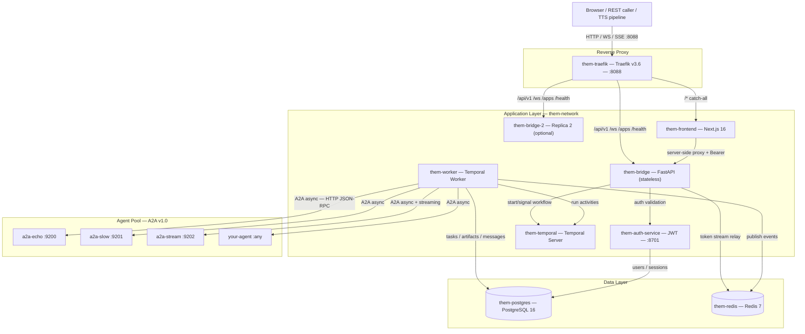

<div align="center">
  
  <h1>the-M</h1>
  <p><strong>Multi-Agent Orchestration Platform</strong></p>
  <p>Give an LLM a team of specialized AI agents as tools.<br/>It decides which to call, runs them in parallel, and streams the composed answer back — durably.</p>
  <p>
    
    
    
    
    
    
    
    
  </p>
</div>

---

## What is the-M?

**the-M** is a production-grade multi-agent orchestration platform built on [Temporal](https://temporal.io/).

You define a team of AI agents and describe what each one does. When a user sends a message, the platform's LLM-driven loop decides which agents to call, fans them out in parallel, and streams a composed answer back — all tracked in a durable workflow that survives restarts, scales across replicas, and records every decision.

Agents speak the [Google A2A v1.0 protocol](https://google.github.io/A2A/) over HTTP, so any A2A-compatible service can join the pool without touching orchestration code. The LLM reads each agent's `description` field to decide when and how to invoke it — no routing rules to write.

The bridge is fully stateless. Temporal holds all run state, so any replica can serve any connection and a crash mid-run loses nothing.

---

## Architecture



**Fully isolated.** Zero dependency on any external stack — own Postgres, own Redis, own Temporal, own Docker network (`them-network`). All data bind-mounted under `data/` and survives `docker compose down`.

### Durable Agentic Loop (Temporal)

```
Any edge (WebSocket / SSE / REST) → Bridge authenticates + starts Temporal workflow
    │
    └─ OrchestrationWorkflow (them-worker):
         ├─ load_orchestration_context  → orchestrator config, agent list, prior history
         ├─ init_run                    → create run + root task rows in Postgres
         │
         └─ Agentic loop (≤ max_iterations)
              │
              ├─ plan_turn             → LLM streaming call; tokens → Redis → Bridge → client
              ├─ invoke_agent × N      → asyncio.gather, bounded by max_parallel_tools
              │   └─ A2A async adapter → submit → poll/stream result
              ├─ record_tool_results   → persist tool_result messages to DB (multi-turn safety)
              └─ summarize_context     → rolling summary artifact if memory_enabled
                   │
                   └─ finalize_run     → complete run, write Final Answer artifact
```

State lives in Temporal (in-flight) and Postgres (durable). Bridge relays Redis token streams to WebSocket clients. A bridge restart or replica failover does not interrupt a running workflow.

---

## Stack

| Layer | Technology |
|---|---|
| Orchestrator API | Python 3.13 · FastAPI · asyncpg · SQLAlchemy async |
| Durable orchestration | Temporal 1.x · `temporalio` Python SDK · OrchestrationWorkflow |
| Auth service | Python 3.11 · FastAPI · bcrypt · JWT (HS256, 2-hour TTL) |
| Reverse proxy | Traefik v3.6 · Docker label provider · `traefik-instance=them` constraint |
| Database | PostgreSQL 16 |
| Cache / PubSub | Redis 7 · AOF persistence |
| Frontend | Next.js 16 · TypeScript · Tailwind CSS 4 · Zustand |
| Agent protocol | Google A2A v1.0 (async submit → streaming result) |
| Container | Docker Compose · isolated network · bind-mount data |

---

## Features

- **Durable agentic loop** — every run is a Temporal workflow; survives bridge restarts, replica failovers, and mid-run crashes; HITL pause/resume via signal
- **Parallel fan-out** — multiple tool calls per iteration via `asyncio.gather()`, bounded by `max_parallel_tools` and per-agent `max_concurrency`
- **A2A v1.0 protocol** — native async adapter; push webhooks; automatic task reaping for timed-out tasks; typed JSON input parts
- **Multi-turn conversation** — full dialogue history reconstructed from Postgres on every turn; survives WS reconnects, bridge restarts, and replica changes; `history_window` per orchestrator bounds token cost
- **Session resume** — playground persists `context_id` to localStorage; "Resume last conversation?" banner on page load; full history reconstructed from DB
- **Context memory** — rolling LLM-generated summary injected into agent inputs each turn; cross-session continuity
- **Pluggable edges** — WebSocket (chat), SSE (streaming HTTP for TTS/voice); same orchestrator behind every edge; WebRTC planned
- **Applications** — named entry points bind an orchestrator to an edge; `websocket` or `sse`; public or token access policy
- **Single port** — Traefik on `:8088`; `traefik-instance=them` constraint prevents cross-stack conflicts on shared Docker hosts
- **Multi-replica ready** — bridge is fully stateless (Temporal holds all run state); shared Postgres + Redis; pub/sub cache invalidation; N replicas without sticky sessions
- **Production hardening** — rate limiting (Redis INCR), token expiry enforcement, ownership isolation (`owns_task`), body/batch size limits, TOCTOU-safe scope checks, 30-min task deadline
- **Agent discovery** — fetch and diff A2A agent cards from the admin UI; highlights changes, warns on orchestrator impact
- **Debate stack** — 4 A2A debate agents (evidence, logic, creative on Haiku; judge on Sonnet); context compaction keeps LLM cost flat across rounds; full arguments preserved in artifacts
- **Dashboard WS** — multiplexed channels (`runs`, `agents`, `metrics`) via Redis pub/sub; dual-channel publishing so trace tab and stream client both receive all events
- **Playground UI** — split-pane chat + real-time trace, tasks, artifacts, memory, and sessions debug tabs

---

## Container Map

| Container | Role | Port |
|---|---|---|
| `them-traefik` | Reverse proxy — single entry point, path-based routing | **:8088** host · **:8089** dashboard (127.0.0.1) |
| `them-postgres` | PostgreSQL 16 | internal |
| `them-redis` | Redis 7 (AOF) | internal |
| `them-auth-service` | Auth / IAM — JWT, bcrypt, sessions | internal :8701 |
| `them-bridge` | Orchestrator API + all edges (replica 1, stateless) | internal :8001 |
| `them-bridge-2` | Replica 2 (`--profile replica`) | internal :8001 |
| `them-worker` | Temporal worker — runs all orchestration activities | internal |
| `them-temporal` | Temporal server (`--profile temporal`) | internal :7233 |
| `them-temporal-ui` | Temporal web UI — proxied at `/temporal/` | internal |
| `them-frontend` | Next.js 16 admin dashboard | internal :3200 |
| `a2a-echo` / `a2a-slow` / `a2a-stream` | A2A v1.0 test agents (`--profile test-agents`) | internal 9200–9202 |
| `agent-evidence` / `agent-logic` / `agent-creative` / `agent-judge` | Debate stack A2A agents | internal 9401–9404 |

---

## Quick Start

### Prerequisites

- Docker Engine + Compose plugin (Linux) or Docker Desktop (Windows/Mac)
- Python 3.x (for the test runner)
- An Anthropic API key

### 1. Clone

```bash
git clone https://github.com/aviciot/odin-stuck.git
cd odin-stuck
```

### 2. Generate secrets and set your API key

```bash
# Linux / Mac
./generate-env.sh
echo "ANTHROPIC_API_KEY=sk-ant-..." >> .env

# Windows PowerShell
.\generate-env.ps1
Add-Content .env "ANTHROPIC_API_KEY=sk-ant-..."
```

### 3. Start the stack (with Temporal — required for orchestration)

```bash
docker compose -f docker-compose.yml -f docker-compose.local.yml --profile temporal up -d --build
```

### 4. Initialize the database (first boot only)

```bash
for f in db/001_schema.sql auth_service/SCHEMA.sql db/002_seed.sql \
          db/003_phase8.sql db/004_phase9.sql db/005_phase10.sql \
          db/006_phase11.sql db/007_docu_stack.sql db/008_debate_stack.sql; do
  docker cp $f them-postgres:/tmp/$(basename $f)
done

docker exec them-postgres psql -U them -d them -c "CREATE SCHEMA IF NOT EXISTS auth_service;"
docker exec them-postgres psql -U them -d them -f /tmp/001_schema.sql
docker exec them-postgres psql -U them -d them -f /tmp/SCHEMA.sql
docker exec them-postgres psql -U them -d them -f /tmp/002_seed.sql
docker exec them-postgres psql -U them -d them -f /tmp/003_phase8.sql
docker exec them-postgres psql -U them -d them -f /tmp/004_phase9.sql
docker exec them-postgres psql -U them -d them -f /tmp/005_phase10.sql
docker exec them-postgres psql -U them -d them -f /tmp/006_phase11.sql
docker exec them-postgres psql -U them -d them -f /tmp/007_docu_stack.sql
docker exec them-postgres psql -U them -d them -f /tmp/008_debate_stack.sql
```

### 5. Verify and open

```bash
python3 scripts/tests/run_tests.py 01 02 03 04 15
```

Open **http://localhost:8088** — login with `admin` / `admin123` (credentials pre-filled in dev mode).

Temporal UI: **http://localhost:8088/temporal/** (requires `--profile temporal`)

---

## API Reference

### Auth (proxied via frontend — no direct host exposure)

| Method | Path | Description |
|---|---|---|
| POST | `/api/auth/login` | Login → sets `them_access_token` + `them_refresh_token` httpOnly cookies |
| POST | `/api/auth/refresh` | Refresh access token |
| GET | `/api/auth/me` | Current user from JWT |

### Bridge REST (via Traefik :8088)

| Method | Path | Auth | Description |
|---|---|---|---|
| GET | `/health` `/health/live` `/health/ready` | — | Health checks |
| CRUD | `/api/v1/admin/agents` | JWT | Agent registry |
| CRUD | `/api/v1/admin/orchestrators` | JWT | Orchestrator configs |
| CRUD | `/api/v1/admin/tokens` | JWT | Access token management |
| CRUD | `/api/v1/admin/applications` | JWT | Application entry points |
| GET | `/api/v1/runs` | JWT | Run history + stats |
| GET | `/api/v1/runs/{id}/tasks` | JWT | Task graph for a run |
| GET | `/api/v1/runs/{id}/artifacts` | JWT | Artifacts for a run |
| POST | `/api/v1/runs/{run_id}/signal` | JWT | HITL: submit human response to paused workflow |
| POST | `/a2a/push/{task_id}` | Bearer | A2A push webhook |
| GET | `/.well-known/agent-card.json` | — | the-M's own A2A agent card |
| GET | `/apps` | — | Public application catalogue |
| GET | `/apps/{slug}/sse` | Bearer / public | SSE streaming entry point |
| WS | `/apps/{slug}/ws` | Bearer / public | WebSocket streaming entry point |

### WebSocket orchestration

```jsonc
// Connect: ws://<host>:8088/ws/orchestrate/{name}?token=<bearer>

// Client →
{ "content": "Summarize last week's data", "context_id": "<uuid>" }

// Server streams:
{ "type": "ready",           "run_id": "...", "context_id": "..." }
{ "type": "iteration_start", "iteration": 1, "agents": ["agent__researcher"] }
{ "type": "tool_start",      "tool": "agent__researcher", "iteration": 1 }
{ "type": "token",           "text": "Based on the data..." }
{ "type": "tool_done",       "tool": "agent__researcher", "duration_ms": 1240 }
{ "type": "done",            "run_id": "...", "total_tokens": 1820, "iterations": 2 }
```

`context_id` is optional on the first message; the server assigns one and echoes it in the `ready` event. Send the same `context_id` on follow-up messages to continue the conversation — full history is reconstructed from Postgres.

### Application Entry Points

Applications bind an orchestrator to a transport edge. Create one via **Admin → Applications**.

**WebSocket** — full-duplex streaming chat:
```
ws://<host>:8088/apps/{slug}/ws?token=<bearer>
```

**SSE** — streaming HTTP. Ideal for TTS pipelines:
```
GET http://<host>:8088/apps/{slug}/sse?message=Hello&context_id=<uuid>
Authorization: Bearer <token>

# Response: text/event-stream
data: The answer              ← one LLM token per frame
data:  is forty-two.

event: tool_start
data: {"tool": "agent__coder", "iteration": 1}

event: done
data: {}
```

---

## Project Structure

```
odin/
├── app/                          # them-bridge (FastAPI — stateless edge)
│   ├── adapters/                 # Agent transport (A2A async)
│   │   ├── base.py               # AgentAdapter ABC + AdapterEvent
│   │   ├── a2a_async_adapter.py  # A2A v1.0 async adapter
│   │   └── factory.py            # Slug → adapter routing
│   ├── edges/                    # Client transport edges
│   │   ├── base.py               # EdgeAdapter ABC + EdgeRequest
│   │   ├── websocket_edge.py     # WebSocket (chat)
│   │   ├── sse_edge.py           # SSE streaming (TTS, voice)
│   │   └── registry.py           # Edge name → class lookup
│   ├── routers/                  # API endpoints
│   │   ├── ws_orchestrator.py    # WS /ws/orchestrate/{name} → starts Temporal workflow
│   │   ├── ws_dashboard.py       # WS /ws/dashboard — multiplexed Redis pub/sub
│   │   ├── apps.py               # /apps/{slug} — WS, SSE, REST entry points
│   │   ├── a2a_server.py         # /a2a — inbound A2A JSON-RPC (orchestrator-as-agent)
│   │   ├── runs.py               # Run history + signal endpoint
│   │   ├── admin_agents.py
│   │   ├── admin_orchestrators.py
│   │   ├── admin_applications.py
│   │   └── admin_tokens.py
│   ├── temporal/                 # Temporal workflow + activities
│   │   ├── workflows.py          # OrchestrationWorkflow — deterministic orchestration loop
│   │   ├── activities.py         # All I/O: load_context, plan_turn, invoke_agent, record_tool_results, finalize_run
│   │   ├── shared.py             # Serializable dataclasses crossing workflow↔activity boundary
│   │   ├── bridge_client.py      # start_orchestration(), submit_human_response() — signals Temporal
│   │   ├── worker.py             # Worker entrypoint (them-worker container)
│   │   └── serde.py              # Custom Temporal converter for dataclasses
│   └── services/
│       ├── task_store.py         # Task state machine + artifacts
│       ├── context_service.py    # Artifact cache + context queries
│       ├── memory_service.py     # Rolling summary context memory
│       ├── agent_registry.py     # L1+L2 cached agent list
│       ├── token_cache.py        # Bearer token validation + expiry
│       └── rate_limiter.py       # Redis INCR rate limiting
├── auth_service/                 # them-auth-service (FastAPI)
├── frontend/                     # them-frontend (Next.js 16)
│   └── src/app/
│       ├── login/                # Login (credentials pre-filled in dev)
│       ├── dashboard/            # Command center
│       ├── agents/               # Agent registry + discover
│       ├── runs/                 # Run history + node graph modal
│       └── admin/
│           ├── orchestrators/    # Orchestrator config + LLM settings
│           ├── applications/     # Application entry points
│           ├── tokens/           # Access token management
│           └── playground/       # Chat + trace/tasks/artifacts/memory/sessions tabs
├── agents/                       # A2A v1.0 agents
│   ├── a2a_echo/                 # Test: immediate echo
│   ├── a2a_slow/                 # Test: 5-second delay
│   ├── a2a_stream/               # Test: word-by-word streaming
│   └── debate/                   # Debate stack
│       ├── agent_evidence/       # Argues from empirical data (Haiku)
│       ├── agent_logic/          # Argues from first principles (Haiku)
│       ├── agent_creative/       # Argues from lateral fields (Haiku)
│       └── agent_judge/          # Scores + synthesizes final verdict (Sonnet)
├── traefik/traefik.yml           # Traefik static config
├── db/                           # Schema DDL + migrations (idempotent)
│   ├── 001_schema.sql            # Base schema
│   ├── 002_seed.sql              # Seed agents + orchestrators
│   ├── 003_phase8.sql            # Memory columns
│   ├── 004_phase9.sql            # tasks.user_id + them.applications
│   ├── 005_phase10.sql           # SSE edge entry_point_type
│   ├── 006_phase11.sql           # task_messages + history_window + agent_card columns
│   ├── 007_docu_stack.sql        # docu_writer agent
│   └── 008_debate_stack.sql      # Debate agents + debate_flow orchestrator
├── scripts/tests/
│   ├── run_tests.py              # Cross-platform test runner (400+ checks)
│   └── INDEX.md                  # Test index + trigger map
├── docs/                         # Architecture, schema, Redis, adapter, lessons, status
├── generate-env.ps1              # Secret derivation (Windows)
├── generate-env.sh               # Secret derivation (Linux/Mac)
├── docker-compose.yml            # Base compose
└── docker-compose.local.yml      # Local dev override (PathPrefix-only routing)
```

---

## Scalability

the-M is multi-replica from day one. The bridge is fully stateless — Temporal holds all orchestration state.

Enable replica 2:

```bash
docker compose -f docker-compose.yml -f docker-compose.local.yml --profile replica up -d them-bridge-2
```

| State | Where | Replica-safe |
|---|---|---|
| Orchestration state | Temporal workflow | Yes — any replica relays, worker executes |
| Token cache L1 | In-process per replica | Each replica caches independently |
| Token cache L2 | Redis `them:session:token:*` TTL 300s | Yes — shared |
| Rate limiting | Redis INCR `rl:them:*` | Yes |
| Agent registry | Redis `them:agents:registry` + pub/sub invalidation | Yes |
| Orchestrator config | Redis `them:orchestrators:{name}` TTL 600s | Yes |
| Task + artifact state | Postgres `them.tasks`, `them.artifacts`, `them.task_messages` | Yes |
| WS connections | In-process per replica | Yes — any replica can relay any run's token stream |

---

## Testing

```bash
# Sanity — ~15s, run after every docker compose up
python3 scripts/tests/run_tests.py 01 02 03 04 15

# Full suite — ~30s, zero new failures required before committing
python3 scripts/tests/run_tests.py

# E2E (requires admin JWT)
ADMIN_JWT=<token> python3 scripts/tests/run_tests.py 14

# Temporal end-to-end (run inside worker container)
docker cp scripts/test_temporal_workflow.py them-worker:/tmp/test_temporal_workflow.py
docker exec them-worker python3 /tmp/test_temporal_workflow.py

# Multi-turn behavioral test (runs inside bridge container, auto-fetches JWT)
docker cp scripts/test_multiturn.py them-bridge:/tmp/test_multiturn.py
docker exec them-bridge python3 /tmp/test_multiturn.py
```

See `scripts/tests/INDEX.md` for the full test index and trigger map.

---

## Adding an Agent

Any service that implements the [A2A v1.0 protocol](https://google.github.io/A2A/) can be registered:

1. **Register** via the Agents admin page or POST to `/api/v1/admin/agents`:

```json
{
  "slug": "my_agent",
  "display_name": "My Agent",
  "description": "What this agent does — the LLM reads this to decide when to call it",
  "transport": "a2a_async",
  "endpoint_url": "http://my-agent-host:9000",
  "auth_token": "optional-bearer-token",
  "timeout_seconds": 30,
  "max_concurrency": 3
}
```

2. **Discover** its agent card via the Discover button — the platform fetches, diffs, and stores the card including input modes and skills.

3. **Add** the agent to an orchestrator's `allowed_agent_ids` via the Orchestrators page.

4. **Connect** via any edge:
   - WebSocket: `ws://localhost:8088/ws/orchestrate/{name}?token=<bearer>`
   - SSE: `GET http://localhost:8088/apps/{slug}/sse?message=<text>`
   - Playground: `/admin/playground`

---

## License

© 2026 Avi Cohen. All rights reserved.
