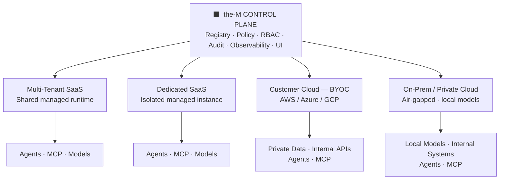
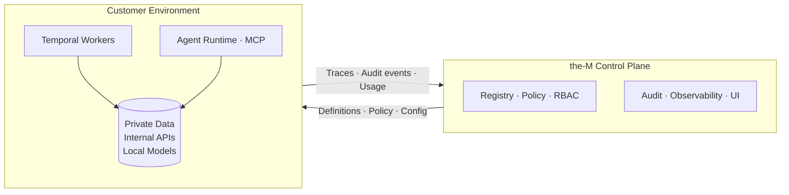
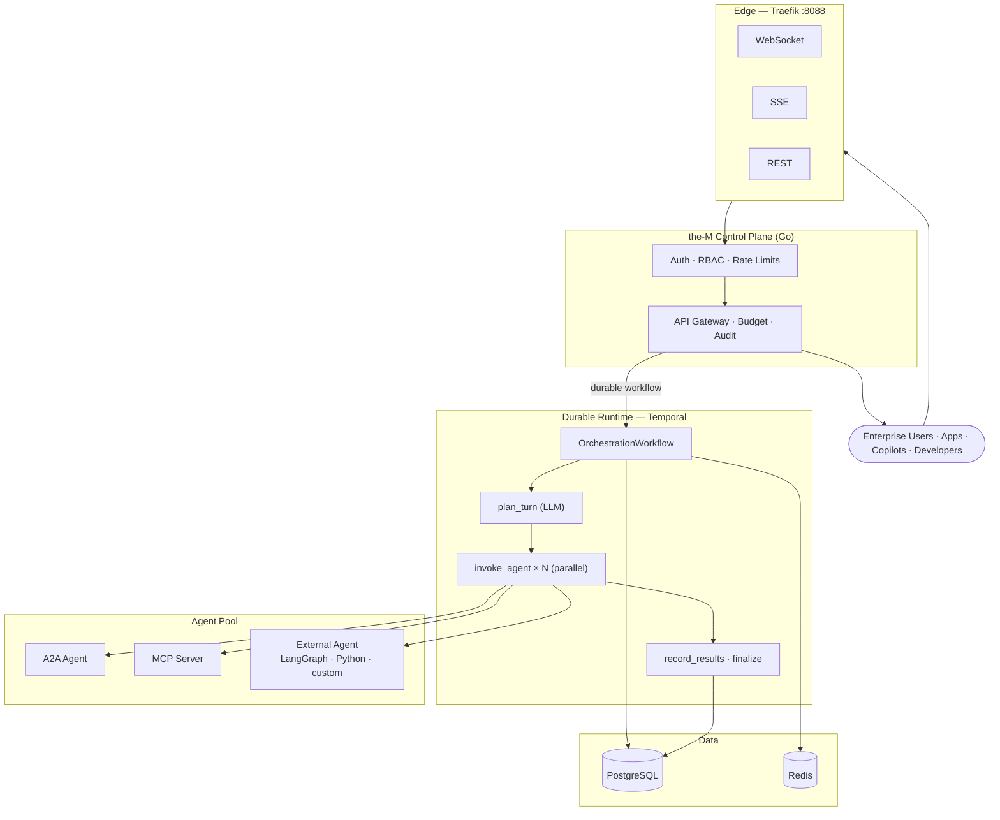

<div align="center">
  

  <h1>the-M</h1>
  <h3>The Enterprise Operating System for AI</h3>

  <p>
    <em>Build AI anywhere. &nbsp;·&nbsp; Connect it to the-M. &nbsp;·&nbsp; Govern it. Secure it. Orchestrate it. Observe it.</em>
  </p>

  <p>
    
    
    
    
    
    
    
  </p>
</div>

---

## The AI Infrastructure Problem

The cost of building an AI agent has collapsed. Teams ship useful agents in days. Models are cheap. Frameworks are abundant.

This creates a problem nobody anticipated:

> **When building agents is easy, *operating* hundreds of them safely becomes the hard problem.**

Inside every enterprise deploying AI at scale, the same questions surface:

- Who owns each agent? Who approved it?
- Which models may it use, and at what cost?
- What data can it access? Which actions require human approval?
- How do we audit what AI did yesterday?
- How do we replace an underlying model without rebuilding everything?
- How do 50 agents built by different teams become one governed AI environment?

A single agent does not answer those questions. In fact, the cheaper agents become to build, the larger this management problem grows.

**the-M is built to solve it.**

---

## What the-M Is

the-M is an **Enterprise AI Control Plane** — the layer above your agents, models, tools, and frameworks where enterprises manage, govern, secure, orchestrate, and observe all AI activity across the organization.

```
                      ┌─────────────────────────────────┐
                      │        the-M Control Plane       │
                      │  Registry · Gateway · Governance  │
                      │  Orchestration · Observability    │
                      └──────────────┬──────────────────-┘
                                     │
           ┌─────────────────────────┼──────────────────────┐
           │                         │                      │
    ┌──────▼──────┐          ┌───────▼──────┐       ┌──────▼──────┐
    │  Your own   │          │  External    │       │  Built in   │
    │  agents     │          │  agents      │       │  the-M      │
    │  (any stack)│          │  (A2A / MCP) │       │  canvas     │
    └─────────────┘          └──────────────┘       └─────────────┘
```

It is **not** an agent builder. Not a chatbot framework. Not a workflow tool.

It is the layer that every one of those plugs into.

> **Use whatever AI stack you want. the-M gives your organization control over all of it.**

---

## Core Capabilities

### AI Gateway
A single governed entry point for all model, agent, and tool traffic — authentication, authorization, routing, rate limiting, budget enforcement, policy application, and audit. Once traffic passes through the-M, the organization has full visibility and control.

### AI Asset Registry
Every enterprise AI asset — agents, models, MCP servers, tools, workflows, prompts — becomes a managed, versioned, discoverable entry with owner, environment, health, cost, and access rules attached.

Think of it as the **service catalog and CMDB for enterprise AI.**

| Registered asset | What the-M tracks |
|---|---|
| Agents | owner · version · environment · health · cost · dependencies |
| Models & providers | capabilities · cost · data-handling policy |
| MCP servers | tools exposed · access rules · versions |
| A2A endpoints | capabilities · input/output types · wire format |
| Workflows | step graph · inputs · outputs · assigned agents |

### Agent Runtime & Orchestration
Production-grade execution for multi-agent workflows — built on [Temporal](https://temporal.io/) for durability:

- Crash-proof, resumable, exactly-once workflow execution
- Parallel agent fan-out across a single turn
- Multi-turn conversation history, durable across restarts and replica changes
- Human-in-the-loop pause/resume, approval flows, event-driven scheduling
- Retries, cancellation, timeouts, idempotency — all handled at the runtime level

### Governance & Policy
Policy enforced at every layer of execution:

```
User → Agent → Tool → Data → Model → Action
```

Examples: finance agents may only call approved models · PCI data may not route to public providers · actions above a cost threshold require approval · an agent may only call its assigned MCP servers.

### Observability & AI Operations
Every run produces a full structured trace — agent called, model used, tools invoked, tokens consumed, cost incurred, policies applied, errors, business outcome. No more debugging AI by guessing.

```
Run
 ├── Agent
 ├── Workflow
 │    └── Node: Input · Output · Model · Tokens · Cost · Latency · Tool calls
 ├── Policies applied
 ├── Errors
 └── Final result
```

---

## Who the-M Is For

Different organizations arrive at the same control-plane problem from different directions.

### Large Enterprise / FinTech
Multiple teams. Multiple LLM providers. AI experiments in every business unit. No central view of what exists, who owns it, or what it costs. No consistent audit trail.

**→ the-M becomes the company's AI control layer:** unified registry, governed gateway, consistent policy, full audit, cost attribution per team and agent.

### Banks, Insurance, and Regulated Enterprises
Sensitive customer data. Internal Oracle, CRM, and core banking systems. Identity via Entra ID or Okta. Regulators demanding audit trails on every AI action that touches customer records.

**→ the-M supports a hybrid model:** control plane manages definitions, RBAC, policy, and audit centrally — Temporal workers and agent runtimes execute *inside* the customer's perimeter, close to private data. Definitions travel. Data does not.

*A bank's security team sees a complete audit trail in the central UI. Raw data never leaves their infrastructure.*

### Enterprise SaaS Companies
Need to embed AI for their own customers. Different tenants need different agents, models, usage limits, and isolation.

**→ the-M operates as the multi-tenant AI platform layer:** each tenant gets isolated agents, entry points, usage buckets, and policies. No custom infrastructure per customer.

### Organizations with Existing Agents
Already have Python agents, LangGraph workflows, Claude-based tools, custom REST services, MCP servers. Rebuilding is not an option.

**→ Register and govern without rebuilding.** Any A2A, MCP, or REST endpoint connects to the-M immediately. Existing agents gain governance, observability, and orchestration without code changes.

> Build AI anywhere. Operate it through the-M.

### Platform Engineering Teams
Tasked with one approved enterprise way to expose AI to business units — shared agents, shared MCP services, approved models, consistent policies.

**→ the-M is the internal AI platform:** platform team manages the governed layer; business units self-serve within it.

### Government / Security-Sensitive Organizations
On-premises or private cloud. No sensitive data leaving the network. Only approved or locally-hosted models.

**→ Full private deployment:** the entire stack runs inside the customer's infrastructure. No external model API calls required. Air-gap compatible.

---

## Adoption Path

No organization needs the full platform on day one. Each phase delivers standalone value.

| Phase | What you get | How |
|---|---|---|
| **1 — Control & Visibility** | Central registry, governed gateway, RBAC, audit trail | Gateway + Agent Registry + MCP Registry + Governance |
| **2 — Orchestration** | Multi-agent workflows, durable runtime, HITL approvals | Orchestration + Temporal Runtime + Agent Canvas |
| **3 — Operations at Scale** | Full observability, cost attribution, AI diagnostics, agent marketplace | Observability + Cost Tracking + Copilot + Evaluation |

Start with control. Grow into full operations.

---

## Deployment Architecture

One product. Multiple deployment models. The same agent definitions, governance rules, and runtime contracts work across all of them.


```mermaid
flowchart TD
    CP["⬛  the-M CONTROL PLANE\nRegistry · Policy · RBAC · Audit · Observability · UI"]

    CP --> A["Multi-Tenant SaaS\nShared managed runtime"]
    CP --> B["Dedicated SaaS\nIsolated managed instance"]
    CP --> C["Customer Cloud — BYOC\nAWS / Azure / GCP"]
    CP --> D["On-Prem / Private Cloud\nAir-gapped · local models"]

    A --> A2["Agents · MCP · Models"]
    B --> B2["Agents · MCP · Models"]
    C --> C2["Private Data · Internal APIs\nAgents · MCP"]
    D --> D2["Local Models · Internal Systems\nAgents · MCP"]
```

### The Two Planes

**Control Plane** — always centrally managed

| Component | Role |
|---|---|
| Management UI | Admin dashboard, canvas, observability |
| Agent & MCP Registry | Definitions, versions, ownership, health |
| Identity / RBAC | Users, roles, teams, permissions, IdP integration |
| Governance & Policy | Per-agent, per-tool, per-application rules |
| Audit Log | Immutable record of every significant action |
| Global Observability | Traces, costs, and usage across all runtimes |

**Execution Plane** — runs wherever the data is

| Component | Role |
|---|---|
| Agent Runtime | Hosts and executes A2A agents |
| Temporal Workers | Durable orchestration activities |
| MCP Service | Tool supervisor and executor |
| Workflow Runner | DAG and canvas workflow execution |
| Local Integrations | Internal APIs, databases, private MCP servers |

### Hybrid Model — The Key Pattern for Regulated Enterprises


```mermaid
flowchart LR
    subgraph CP["the-M Control Plane"]
        REG["Registry · Policy · RBAC"]
        AUD["Audit · Observability · UI"]
    end

    subgraph CUST["Customer Environment"]
        WRK["Temporal Workers"]
        RT["Agent Runtime · MCP"]
        DB[("Private Data\nInternal APIs\nLocal Models")]
    end

    CP -- "Definitions · Policy · Config" --> CUST
    CUST -- "Traces · Audit events · Usage" --> CP
    WRK & RT --> DB
```

> Sensitive data stays inside the customer's perimeter. Governance and observability remain centralized.

### Deployment Options at a Glance

| Model | Isolation | Ops burden | Typical fit |
|---|---|---|---|
| Multi-Tenant SaaS | App-level | None | FinTechs, SaaS companies |
| Dedicated SaaS | Infrastructure-level | None | Large enterprises |
| BYOC | Customer cloud boundary | Low | Cloud-residency requirements |
| On-Prem / Private Cloud | Full perimeter | Customer-managed | Banks, government, regulated |
| Hybrid Control + Runtime | Split by plane | Low | Regulated enterprises with private data |

A customer can start on SaaS and migrate the execution plane to BYOC or on-prem as requirements evolve — **no agent redesign, no policy rebuild.**

---

## Technical Architecture


```mermaid
flowchart TD
    U(["Enterprise Users · Apps · Copilots · Developers"])

    subgraph Edge["Edge — Traefik :8088"]
        WS["WebSocket"] & SSE["SSE"] & REST["REST"]
    end

    subgraph CP["the-M Control Plane (Go)"]
        Auth["Auth · RBAC · Rate Limits"]
        GW["API Gateway · Budget · Audit"]
    end

    subgraph RT["Durable Runtime — Temporal"]
        W["OrchestrationWorkflow"]
        A1["plan_turn (LLM)"]
        A2["invoke_agent × N (parallel)"]
        A3["record_results · finalize"]
    end

    subgraph Pool["Agent Pool"]
        AG1["A2A Agent"]
        AG2["MCP Server"]
        AG3["External Agent\nLangGraph · Python · custom"]
    end

    subgraph Data["Data"]
        PG[("PostgreSQL")]
        RD[("Redis")]
    end

    U --> Edge --> Auth --> GW
    GW -- "durable workflow" --> W
    W --> A1 --> A2 --> AG1 & AG2 & AG3
    A2 --> A3
    W --> RD
    GW --> U
    W & A3 --> PG
```

### Agentic Loop

Each run is a Temporal workflow. The LLM plans; agents execute.

```
OrchestrationWorkflow
  ├─ load_context       ← config, agent list, conversation history
  ├─ init_run           ← create run + root task in Postgres
  └─ loop (≤ max_iterations)
       ├─ plan_turn     ← LLM chooses agents; streams tokens to client
       ├─ invoke × N    ← parallel A2A calls
       ├─ record        ← persist results; keep history valid
       └─ summarize     ← rolling summary for future turns
  └─ finalize_run       ← always runs; writes Final Answer artifact
```

### Key Properties

| Property | How |
|---|---|
| **Crash recovery** | Temporal replays workflow from last checkpoint on any restart |
| **Exactly-once execution** | Activity retries are idempotent; DB writes keyed by sequence number |
| **Stateless gateway** | All state in Temporal + Postgres + Redis; any replica serves any connection |
| **History integrity** | Multi-turn history reconstructed from Postgres; orphaned pairs sanitized before each turn |
| **Context compaction** | Tool results reduced to routing fields; full content in artifacts; rolling LLM summary |
| **HITL** | Workflow blocks on human signal indefinitely without consuming worker resources |

---

## Protocol Support

### A2A — Agent-to-Agent

Agents communicate via [Google A2A v1.0](https://google.github.io/A2A/) — a vendor-neutral HTTP standard. Any A2A-compatible service joins the agent pool without touching orchestration code.

**Connecting an agent — three steps:**
1. **Register** — `POST /api/v1/admin/agents` with slug, description, endpoint URL
2. **Discover** — the-M fetches and stores the agent card
3. **Assign** — add the agent to an orchestrator's allowed list

The LLM reads the description to decide when to call the agent. No routing rules. No code changes.

### MCP — Model Context Protocol

MCP servers are first-class registered assets — tool manifest, access policy, assigned applications, lifecycle managed by the-M MCP supervisor.

### External Agents

Any agent built with LangGraph, CrewAI, Python, cloud functions, or a custom framework connects via its REST or A2A interface. Once registered, it receives the same governance, observability, and orchestration as a natively-built agent.

---

## Capabilities Summary

| Area | What's shipped |
|---|---|
| **Gateway** | JWT auth, bearer tokens, per-app rate limiting, RBAC, audit log, budget controls |
| **Registry** | Agent CRUD, MCP management, orchestrator config, A2A card discovery + diff |
| **Orchestration** | LLM-driven agentic loop, token budget enforcement, configurable iterations |
| **Execution** | Parallel fan-out, per-agent concurrency limits, durable Temporal activities |
| **Durability** | Crash recovery, idempotent retries, full run history, HITL pause/resume |
| **Multi-turn** | History from DB; threads across reconnects, restarts, and replica changes |
| **Edges** | WebSocket · SSE · REST — same orchestrator behind every transport |
| **Observability** | Real-time trace viewer, task graph, artifact browser, per-turn token + cost |
| **MCP** | Server registry, lifecycle management, tool access policy |
| **Canvas** | Visual agent builder with live validation and execution tracing |

---

## Technology Stack

| Layer | Technology |
|---|---|
| API gateway & services | Go 1.23 |
| Durable orchestration | Temporal 1.x |
| Auth | Go · bcrypt · JWT HS256 |
| Reverse proxy | Traefik v3.6 |
| Database | PostgreSQL 16 |
| Cache & pub/sub | Redis 7 (AOF) |
| Frontend | Next.js 16 · TypeScript · Tailwind CSS 4 |
| Agent protocol | Google A2A v1.0 |
| Tool protocol | MCP (Model Context Protocol) |

---

## Roadmap

**Shipped**

| Item |
|---|
| Go API gateway, auth service, Temporal worker |
| A2A v1.0 — official a2a-go/v2 SDK |
| Durable orchestration, parallel fan-out, context compaction |
| HITL pause/resume · SSE + WebSocket edges |
| MCP server registry and supervisor |
| Visual agent canvas (canvas builder) |
| Live Monitor — realtime session and run event feed |

**Next**

| Item |
|---|
| Policy engine — AI Policy as Code |
| Cost-aware model routing |
| Swarm mode — agents spawning sub-agents |
| WebRTC edge (real-time voice) |
| Agent marketplace and discovery index |
| Evaluation harness — agent quality benchmarking |
| AI-assisted run diagnostics ("why did this fail?") |

---

## The Bigger Picture

AI agents are becoming cheap to build. That means enterprises will soon have hundreds of them — built by different teams, using different models, different tools, different frameworks.

Most of the effort today goes into building individual agents.

The next wave of effort will go into **operating them at scale** — safely, consistently, with full governance and observability.

That is the infrastructure gap the-M is built to fill.

```
Today:    Build an agent.

Tomorrow: Govern 500 of them.
          Know what every one does.
          Control what every one can access.
          See every execution.
          Enforce every policy.
          Replace any model without breaking anything.
          Measure every dollar spent.
```

> **The future is not one powerful enterprise agent.**
> **The future is thousands of specialized AI systems working across an organization.**
> **the-M is the operating system that makes that future manageable.**

---

## Getting Started

**Prerequisites:** Docker Engine + Compose, Anthropic API key (or another supported model provider).

```bash
git clone <repository-url> && cd them

# Generate secrets
./generate-env.sh                          # Linux/Mac
# .\generate-env.ps1                       # Windows
echo "ANTHROPIC_API_KEY=sk-ant-..." >> .env

# Start the stack
docker compose --project-name them_gateway \
  -f docker-compose.yml -f docker-compose.dev.yml \
  --profile temporal up -d

# Initialize the database (first boot only)
docker cp db/001_schema.sql them-postgres:/tmp/them_001_schema.sql
docker cp auth_service/SCHEMA.sql them-postgres:/tmp/them_auth_schema.sql
docker cp db/002_seed.sql them-postgres:/tmp/them_002_seed.sql
docker exec them-postgres psql -U them -d them -c "CREATE SCHEMA IF NOT EXISTS auth_service;"
docker exec them-postgres psql -U them -d them -f /tmp/them_001_schema.sql
docker exec them-postgres psql -U them -d them -f /tmp/them_auth_schema.sql
docker exec them-postgres psql -U them -d them -f /tmp/them_002_seed.sql
# Apply migrations 003–latest: see docs/CURRENT.md
```

**Dashboard:** `http://localhost:8088` — `admin` / `admin123`  
**Temporal UI:** `http://localhost:8088/temporal/`

---

## Major Components

| Container | Role | Port |
|---|---|---|
| `them-traefik` | Reverse proxy — single entry point, path routing, sticky LB | **8088** |
| `them-go-bridge` | API gateway — all routes, auth, WebSocket/SSE/REST | 8002 |
| `them-go-worker` | Temporal worker — durable orchestration activities | — |
| `them-dag-worker` | DAG worker — canvas workflow execution | — |
| `them-agent-runtime` | Agent runtime — 2 replicas | 9300 |
| `them-auth-go` | Auth service — login, session, JWT, RBAC | 8703 |
| `them-mcp-service` | MCP supervisor and executor (internal only) | 8010 |
| `them-frontend` | Next.js 16 — canvas, admin, observability | 3200 |
| `them-postgres` | PostgreSQL 16 — main data store | 5432 |
| `them-redis` | Redis 7 — streams, pub/sub, rate limits, cache | 6379 |

---

## Documentation

| Doc | Contents |
|---|---|
| `docs/CURRENT.md` | Architecture state, migration progress, next steps |
| `docs/SCHEMA.md` | DB tables, columns, invariants |
| `docs/REDIS.md` | Redis key layout |
| `docs/ADAPTERS.md` | A2A adapter protocol |
| `docs/A2A_AGENTS.md` | Test agents — start/stop, commands |
| `docs/STATUS.md` | Open items and known blockers |
| `docs/LESSONS.md` | Hard-won lessons — Temporal, A2A, context |
| `go/CLAUDE.md` | Go package map and conventions |
| `scripts/tests/INDEX.md` | Test index and trigger map |

---

## License

© 2026 Avi Cohen. All rights reserved.
