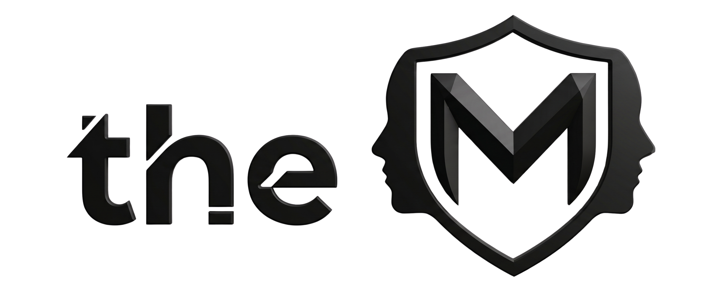
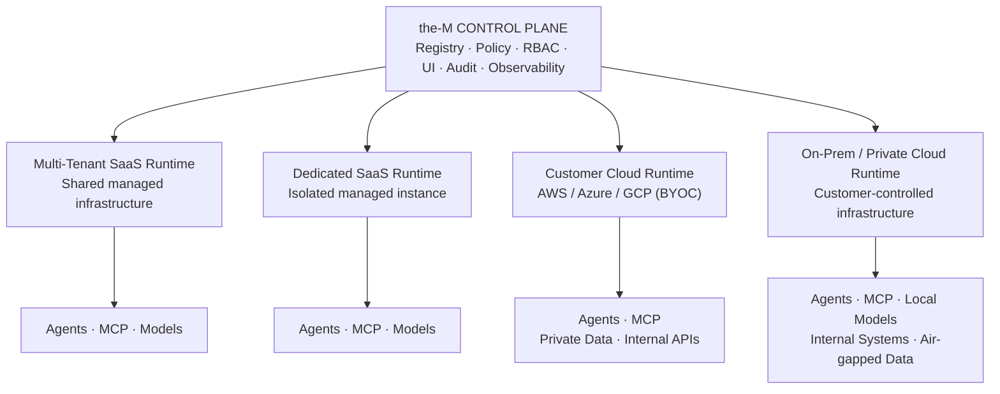
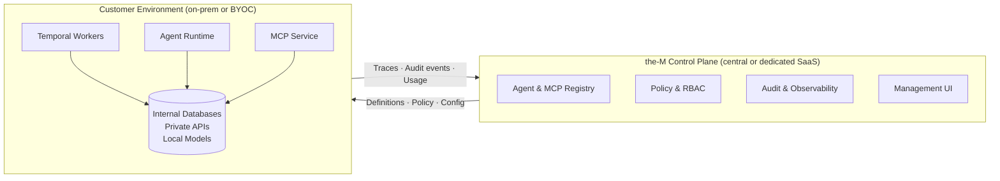
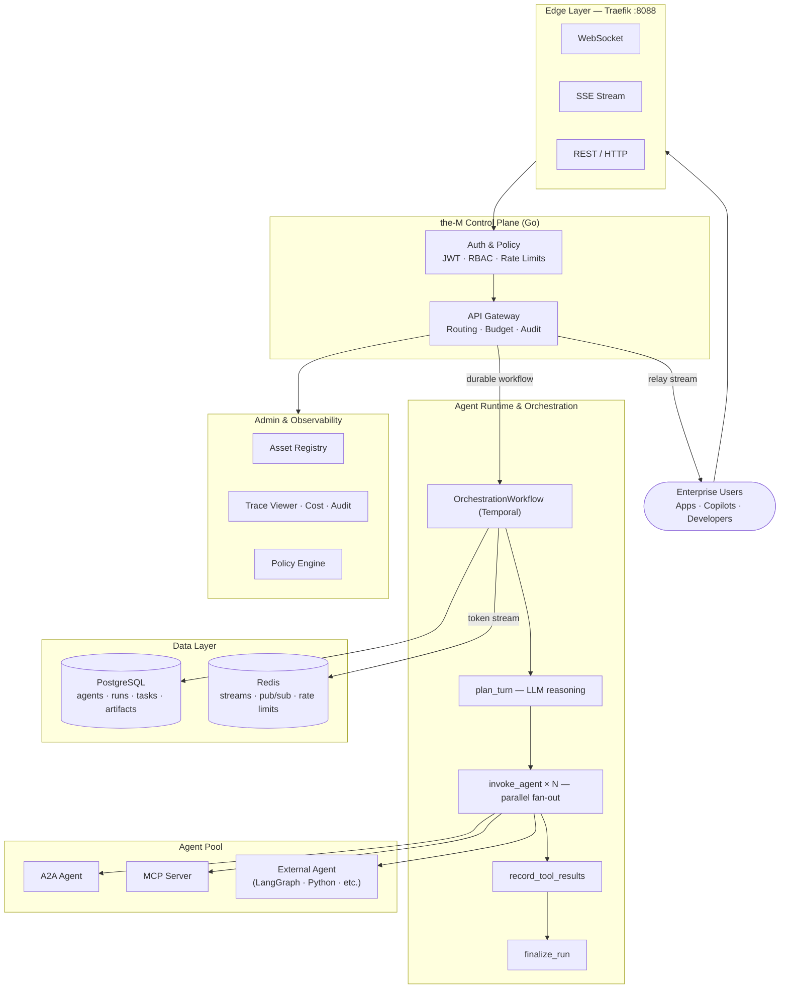
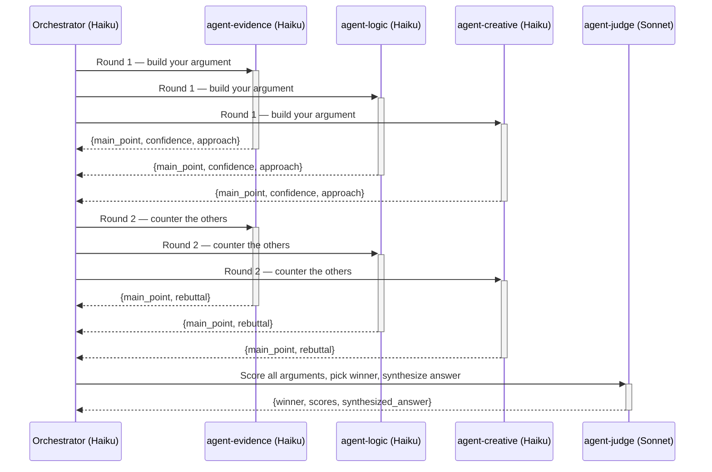

<div align="center">
  

  <h1>the-M</h1>
  <h3>The Enterprise Operating System for AI</h3>
  <p>
    Anyone can build an agent.<br/>
    the-M gives enterprises one control plane to run hundreds — or thousands — of them safely.
  </p>
  <p>
    Build AI anywhere. Connect it to the-M.<br/>
    Govern it. Secure it. Orchestrate it. Observe it. Scale it.
  </p>

  <p>
    
    
    
    
    
    
    
  </p>
</div>

---

## Why the-M Exists

The cost of building an AI agent is collapsing. A team can now ship a useful internal agent in days using Claude, OpenAI, LangGraph, Python, or any number of frameworks and tools.

That is not the hard problem anymore.

The hard problem is what happens next — at scale, across an organization:

- Who owns each agent?
- Which models may it use, and at what cost?
- What data can it access? Which actions require approval?
- What did it do yesterday — and did it produce the right business outcome?
- How do you replace its underlying model without rebuilding everything?
- How do hundreds of independently-built agents become one manageable enterprise AI environment?

> **Building an agent is cheap. Building the infrastructure to operate hundreds of agents safely is not.**

the-M exists to solve the second problem.

---

## What the-M Is

the-M is an **Enterprise AI Control Plane** — the operational layer that enterprises use to manage, secure, govern, orchestrate, and observe all AI activity across the organization.

It is **not** another agent builder, chatbot framework, or workflow tool.

It is the layer that sits above all of them.

**Use whatever AI stack you want. the-M gives your organization control over all of it.**

Agents may be built natively inside the-M's visual canvas, or externally using Python, Go, Claude, OpenAI, LangGraph, CrewAI, custom frameworks, or any other tool — as long as they expose a standard interface (A2A, MCP, REST). the-M registers them, secures them, governs them, orchestrates them, and makes them observable.

---

## Core Platform Capabilities

### AI Gateway
Every interaction with models, tools, agents, and external AI systems passes through a single governed layer:

- Authentication and authorization
- Routing and load balancing
- Rate limiting and budget controls
- Policy enforcement and secret management
- Model selection and provider abstraction
- Prompt and response filtering
- Audit logging and usage tracking
- Failover and cost-aware routing

Once traffic passes through the-M's gateway, the organization gains visibility and control over all AI activity.

### AI Asset Registry
Every enterprise AI capability becomes a managed, discoverable asset:

| Asset type | Tracked metadata |
|---|---|
| Agents | owner, version, environment, health, cost, dependencies |
| Models & providers | capabilities, cost, data-handling policy |
| MCP servers | tools exposed, access rules, versions |
| A2A endpoints | capabilities, input/output types, wire format |
| Workflows & orchestrators | step graph, inputs, outputs, assigned agents |
| Prompts & knowledge sources | versions, ownership, usage |

Think of it as the **service catalog and CMDB for enterprise AI** — so any stakeholder can answer the question: *"What AI do we actually have, and what is it doing?"*

### Agent Runtime & Orchestration
Organizations will not have one agent. They will have hundreds.

the-M provides a production-grade execution layer for agentic workflows:

- **Durable execution** via Temporal — crash-proof, resumable, auditable
- **Parallel fan-out** — multiple agents execute concurrently across a single turn
- **Multi-turn conversation history** — reconstructed from Postgres; valid across restarts and replica changes
- **Retries, cancellation, timeouts, idempotency**
- **Human-in-the-loop** — pause/resume via Temporal signals, approval workflows
- **Scheduling and event-driven execution**
- **Swarm mode** — agents spawning sub-agents (planned)

### Governance & Security
Enterprise adoption is ultimately won here. the-M enforces policy at multiple levels:

```
User → Agent → Tool → Data → Model → Action
```

Examples of expressible policy:

- Finance agents may only call approved enterprise models
- Agents handling PCI data may not route to public model providers
- Actions above a cost threshold require human approval
- An agent may only call the MCP servers assigned to its application
- External agents must authenticate before invoking internal capabilities

### Observability & AI Operations
For every execution, the-M answers:

- Which agent ran, and which model did it call?
- Which tools were invoked, and what data passed through?
- How many tokens were consumed? What did it cost?
- Where did it fail — and why?
- What was the business outcome?

Every run produces a structured trace:

```
Run
 ├── Agent
 ├── Workflow
 │    ├── Node
 │    │    ├── Input / Output
 │    │    ├── Model + tokens + cost + latency
 │    │    └── Tool calls
 │    └── Node
 ├── Policies applied
 ├── Security decisions
 ├── Errors
 └── Final result
```

---

## Who the-M Is For

the-M is not a one-size-fits-all tool. Different organizations come to it from different directions, and the platform is designed to meet them where they are — without requiring a full adoption on day one.

---

### Large Enterprise / FinTech

**The situation:** Multiple development teams building AI independently. Five different LLM providers. Internal APIs, databases, and MCP servers scattered across business units. No central view of what AI the company actually has, who owns it, or what it costs.

**The problem:** Every team reinvents auth, secrets management, model routing, and rate limiting. There is no consistent audit trail. No one can answer "which agents can access customer PII?" Security and compliance reviews become investigations.

**How the-M helps:** the-M becomes the company's central AI control plane. All agents — regardless of where they were built — are registered. All model traffic flows through the gateway. Policies apply consistently across teams. Every execution is traced. Costs are tracked per application, per team, per agent.

Relevant capabilities: registry, gateway, RBAC, policy enforcement, cost tracking, audit log, observability, lifecycle management.

---

### Banks, Insurance, and Highly Regulated Enterprises

**The situation:** Sensitive customer data. Internal Oracle, core banking, or CRM systems. Identity managed through Microsoft Entra ID, Okta, SAML, or OIDC. Strict regulatory requirements around data residency, audit, and authorization. AI execution cannot freely reach production data.

**The problem:** Most AI platforms assume they own the execution environment. That does not work when PCI data must stay inside a controlled perimeter, or when regulators require a complete audit trail of every AI action that touched a customer record.

**How the-M helps:** the-M supports a hybrid deployment model. The control plane — registry, policies, RBAC, audit, orchestration definitions — can run centrally or in a dedicated environment. Temporal workers and agent runtimes execute close to the customer's sensitive systems, within their own infrastructure. Definitions travel; data does not.

A bank using Entra ID and internal Oracle databases does not need to rebuild its identity layer. the-M integrates with existing IdPs via standard protocols. MCP servers wrap internal APIs without exposing them externally. The audit trail is complete because it is recorded at the control plane, not inside individual agents.

Relevant capabilities: hybrid runtime deployment, IdP integration, per-agent data-access policy, human-in-the-loop approvals, immutable audit log, RBAC with fine-grained scope.

---

### Enterprise SaaS Companies

**The situation:** An enterprise SaaS product that needs to embed AI capabilities for its own customers. Different tenants need different agents, different models, different usage limits, and full isolation from each other.

**The problem:** Building multi-tenant AI infrastructure correctly is hard. Usage tracking, model routing, per-customer policies, agent lifecycle management, and tenant isolation are all engineering problems that distract from the core product.

**How the-M helps:** the-M operates as a multi-tenant AI platform underneath the SaaS product. Each customer tenant gets its own isolated application context — its own agents, entry points, usage buckets, and policies. The SaaS company's engineering team manages the platform; tenants interact with AI capabilities through the product surface.

Relevant capabilities: application-scoped tenancy, per-application rate limiting and budget, agent and orchestrator assignment per application, token-based entry points, usage tracking by tenant.

---

### Organizations with Existing Agents

**The situation:** The engineering team has already built Python agents, LangGraph workflows, Claude-based tools, custom REST services, and several MCP servers. Rebuilding them is not on the table.

**The problem:** Each agent has its own auth, its own secrets, its own logging. There is no consistent way to apply a policy, observe a run, or understand costs across all of them.

**How the-M helps:** the-M does not require agents to be rebuilt. Any agent that exposes an A2A, MCP, or REST interface can be registered and managed through the platform immediately.

> **Build AI anywhere. Operate it through the-M.**

Once registered, an existing agent gets the same governance, observability, and orchestration capabilities as a natively-built one. The entry cost is low: register the endpoint, define the access policy, assign it to an application.

Relevant capabilities: A2A and MCP registration, agent card discovery, external agent assignment to orchestrators, policy application without code changes.

---

### Platform Engineering / Internal AI Platform Teams

**The situation:** An architecture or platform team tasked with creating one approved enterprise way to expose AI to business units. They need reusable agents, shared MCP services, approved models, and consistent policies — without becoming a bottleneck.

**The problem:** Without a platform, every business unit builds its own infrastructure. With too much centralization, the platform team becomes the blocker. The right model is a managed set of shared primitives that business units can self-serve within defined guardrails.

**How the-M helps:** the-M becomes the internal AI platform layer. The platform team manages the registry, approved models, shared MCP servers, and organizational policies. Business units build and deploy their own agents within that governed environment, using the platform's entry points and tooling without touching the underlying infrastructure.

Relevant capabilities: registry, approved model list, shared MCP server management, application-scoped policies, agent canvas for business-unit self-service, RBAC separating platform admins from application owners.

---

### Government and Security-Sensitive Organizations

**The situation:** On-premises or private cloud requirement. Only approved or locally-hosted models. No sensitive data leaving controlled networks. Air-gapped or network-restricted environments. Strong audit requirements from internal or external oversight bodies.

**The problem:** Cloud-first AI platforms are a non-starter. Custom-built internal solutions take years and leave gaps in governance and observability.

**How the-M helps:** the-M is deployable as a fully private stack — Postgres, Redis, Temporal workers, and agent runtimes all run within the customer's controlled environment. Local or approved models are registered as providers. No external model API calls are required. The full audit trail and governance layer operates entirely within the perimeter.

Relevant capabilities: private/on-prem deployment, local model provider support, air-gap compatible runtime, full audit log, execution isolation per application.

---

### Adoption Path — Start Where You Are

No organization needs to adopt the full platform on day one.

A common entry point is:

**Phase 1 — Control and Visibility**
Register existing agents and MCP servers. Route model traffic through the gateway. Apply RBAC and basic policies. Start producing an audit trail.
> Gateway + Agent Registry + MCP Registry + Governance

**Phase 2 — Orchestration and Runtime**
Connect agents into multi-agent workflows. Move execution onto the durable runtime. Add human-in-the-loop steps and approval flows.
> Orchestration + Temporal Runtime + Agent Canvas

**Phase 3 — Operations and Scale**
Full observability across all runs. Cost attribution by team and application. AI-assisted diagnostics. Agent marketplace and reuse.
> Observability + Cost Tracking + Copilot + Evaluation

Each phase delivers standalone value. The platform deepens as adoption grows.

---

### Deployment Models

| Model | Description | Typical customer |
|---|---|---|
| **Multi-tenant SaaS** | Shared platform, application-scoped isolation | SaaS companies, FinTechs, startups scaling fast |
| **Dedicated SaaS** | Single-tenant hosted instance | Large enterprises needing isolation without on-prem ops |
| **Customer Cloud (BYOC)** | the-M deployed into the customer's cloud account | Enterprises with cloud-residency requirements |
| **On-Prem / Private Cloud** | Full stack runs inside the customer's infrastructure | Banks, government, regulated industries |
| **Hybrid — Control Plane + Customer Runtime** | Centrally managed control plane; workers and agent runtimes run customer-side | Banks with sensitive data that cannot leave their perimeter |

---

## Deployment Architecture

the-M is one product that supports multiple enterprise deployment models. The core architecture, agent definitions, governance model, and runtime contract are identical across all of them. What changes is where the components run — not how they work.

> **Control can be centralized while execution remains close to the customer's data.**

### Control Plane vs. Execution Plane

the-M is logically split into two separable layers:

**Control Plane** — manages definitions, policies, and visibility. Can run centrally.

| Component | Role |
|---|---|
| Management UI | Admin dashboard, canvas, observability |
| Agent & MCP Registry | Definitions, versions, ownership, health |
| Identity / RBAC | Users, roles, teams, permissions, IdP integration |
| Governance & Policy | Per-agent, per-tool, per-application rules |
| Configuration | Orchestrators, entry points, model providers |
| Audit Log | Immutable record of all significant actions |
| Global Observability | Traces, costs, usage across all runtimes |

**Execution Plane** — runs agents, calls models and tools, accesses data. Can run anywhere.

| Component | Role |
|---|---|
| Agent Runtime | Hosts and executes A2A agents |
| Temporal Workers | Durable orchestration activities |
| MCP Service | Tool supervisor and executor |
| Model calls | LLM API calls to local or external providers |
| Workflow execution | DAG and canvas workflow runner |
| Local integrations | Internal APIs, databases, private MCP servers |

This separation is the architectural foundation for all deployment models below.

---

### Deployment Models


```mermaid
flowchart TD
    CP["the-M CONTROL PLANE\nRegistry · Policy · RBAC · UI · Audit · Observability"]

    CP --> ST["Multi-Tenant SaaS Runtime\nShared managed infrastructure"]
    CP --> DS["Dedicated SaaS Runtime\nIsolated managed instance"]
    CP --> CC["Customer Cloud Runtime\nAWS / Azure / GCP (BYOC)"]
    CP --> OP["On-Prem / Private Cloud Runtime\nCustomer-controlled infrastructure"]

    ST --> ST_A["Agents · MCP · Models"]
    DS --> DS_A["Agents · MCP · Models"]
    CC --> CC_A["Agents · MCP\nPrivate Data · Internal APIs"]
    OP --> OP_A["Agents · MCP · Local Models\nInternal Systems · Air-gapped Data"]
```

---

#### 1. Multi-Tenant SaaS

Multiple customers share the same managed platform instance with strong application-level tenant isolation. Each tenant has its own agents, entry points, usage buckets, and policies. No dedicated infrastructure per customer.

- Fast onboarding — no infrastructure provisioning required
- Centralized operations and upgrades
- Full tenant isolation enforced at the application boundary
- Suitable for customers without dedicated infrastructure requirements

---

#### 2. Dedicated SaaS

A fully isolated the-M environment per customer — separate compute, storage, secrets, and runtime boundaries — still managed and operated centrally.

- Stronger isolation than multi-tenant without customer ops overhead
- Separate database, Redis, and Temporal namespaces per customer
- Suitable for larger enterprises requiring infrastructure-level separation
- Same platform, different deployment boundary

---

#### 3. BYOC — Customer Cloud

the-M components deploy inside the customer's own cloud account (AWS, Azure, GCP). Useful when data, agents, MCP servers, or integrations must remain within the customer's cloud boundary.

- Customer owns the cloud account; the-M operates the platform within it
- Agents and MCP servers run alongside private cloud resources
- Data does not leave the customer's cloud environment
- Control plane management experience is preserved

---

#### 4. On-Prem / Private Cloud

Full deployment inside customer-controlled infrastructure. No external dependencies required. Designed for banks, government agencies, regulated industries, and security-sensitive organizations.

- Runs entirely within the customer's network perimeter
- Supports private or locally-hosted models — no public model API calls required
- Compatible with internal databases, private MCP servers, and air-gapped environments
- Full audit trail and governance layer operates within the perimeter
- Supports IdP integration with Entra ID, Okta, SAML, OIDC

---

#### 5. Hybrid — Control Plane + Customer Runtime

The most architecturally significant model for regulated enterprises. the-M's Control Plane runs centrally (or in a dedicated SaaS instance) and manages all definitions, policies, and audit. The Execution Plane — workers, agent runtimes, MCP services — runs inside the customer's infrastructure, close to private data and internal systems.


```mermaid
flowchart LR
    subgraph Central["the-M Control Plane (central or dedicated SaaS)"]
        REG["Agent & MCP Registry"]
        POL["Policy & RBAC"]
        AUD["Audit & Observability"]
        UI["Management UI"]
    end

    subgraph Customer["Customer Environment (on-prem or BYOC)"]
        WRK["Temporal Workers"]
        RT["Agent Runtime"]
        MCP["MCP Service"]
        DB[("Internal Databases\nPrivate APIs\nLocal Models")]
    end

    Central -- "Definitions · Policy · Config" --> Customer
    Customer -- "Traces · Audit events · Usage" --> Central
    WRK --> DB
    RT --> DB
    MCP --> DB
```

Sensitive data never leaves the customer environment. Agent definitions, governance policies, and RBAC are authored centrally and pushed to the runtime. Execution results and audit events flow back to the control plane for observability — without exposing underlying data.

**Example:** A bank using Microsoft Entra ID and internal Oracle databases deploys Temporal workers and agent runtimes inside its private cloud. the-M's control plane manages which agents exist, which tools they may call, and who may invoke them. The workers execute close to the data. The bank's security team sees a complete audit trail in the central UI without raw data leaving their perimeter.

---

### One Platform, Multiple Deployment Models

Agent definitions, governance rules, and runtime contracts are identical across all deployment models. A customer can:

1. Start on **Multi-Tenant SaaS** for fast onboarding
2. Migrate to **Dedicated SaaS** as usage grows
3. Move the execution plane to **BYOC** when data-residency requirements arrive
4. Shift to **Hybrid or On-Prem** when regulatory or security requirements demand it

No agent rebuilding. No policy redesign. The deployment model changes; the platform does not.

---

## Architecture Overview


```mermaid
flowchart TD
    U(["Enterprise Users\nApps · Copilots · Developers"])

    subgraph Edge["Edge Layer — Traefik :8088"]
        WS["WebSocket"]
        SSE["SSE Stream"]
        REST["REST / HTTP"]
    end

    subgraph Core["the-M Control Plane (Go)"]
        Auth["Auth & Policy\nJWT · RBAC · Rate Limits"]
        Bridge["API Gateway\nRouting · Budget · Audit"]
    end

    subgraph Runtime["Agent Runtime & Orchestration"]
        W["OrchestrationWorkflow (Temporal)"]
        A1["plan_turn — LLM reasoning"]
        A2["invoke_agent × N — parallel fan-out"]
        A3["record_tool_results"]
        A4["finalize_run"]
    end

    subgraph Pool["Agent Pool"]
        AG1["A2A Agent"]
        AG2["MCP Server"]
        AG3["External Agent\n(LangGraph · Python · etc.)"]
    end

    subgraph Data["Data Layer"]
        PG[("PostgreSQL\nagents · runs · tasks · artifacts")]
        RD[("Redis\nstreams · pub/sub · rate limits")]
    end

    subgraph Admin["Admin & Observability"]
        REG["Asset Registry"]
        OBS["Trace Viewer · Cost · Audit"]
        GOV["Policy Engine"]
    end

    U --> Edge --> Auth --> Bridge
    Bridge -- "durable workflow" --> W
    W --> A1 --> A2
    A2 --> AG1 & AG2 & AG3
    A2 --> A3 --> A4
    W -- "token stream" --> RD
    Bridge -- "relay stream" --> U
    W --> PG
    Bridge --> Admin
```

### The Agentic Loop

Each orchestrated run executes inside a Temporal workflow. The LLM is the planner; agents are the executors.

```
OrchestrationWorkflow
  ├─ load_orchestration_context  ← config, agent list, prior conversation history
  ├─ init_run                    ← create run + root task in Postgres
  │
  └─ loop (≤ max_iterations)
       ├─ plan_turn              ← LLM decides which agents to call; streams tokens to client
       ├─ invoke_agent × N       ← parallel A2A calls, bounded by max_parallel_tools
       ├─ record_tool_results    ← persist tool results so multi-turn history stays valid
       └─ summarize_context      ← rolling summary injected into future agent calls
  │
  └─ finalize_run                ← always runs; completes run record, writes Final Answer artifact
```

---

## Major Components

| Container | Role | Port |
|---|---|---|
| `them-traefik` | Reverse proxy — single external entry point, path routing, sticky LB | **8088** (host) |
| `them-go-bridge` | Go API gateway — all routes, auth middleware, WebSocket/SSE/REST | 8002 (internal) |
| `them-go-worker` | Go Temporal worker — durable orchestration activities | — |
| `them-dag-worker` | Go DAG worker — canvas workflow execution (`CanvasAgentWorkflow`) | — |
| `them-agent-runtime` | Go agent runtime — runs 2 replicas (port 9300) | 9300 (internal) |
| `them-auth-go` | Go auth service — login, session, JWT (replaces Python auth for UI contract) | 8703 (internal) |
| `them-auth-service` | Python IAM — users/roles/teams/permissions admin CRUD | 8701 (internal) |
| `them-mcp-service` | Go MCP server supervisor and executor (internal only) | 8010 (internal) |
| `them-frontend` | Next.js 16 dashboard — canvas, admin, observability | 3200 (internal) |
| `them-postgres` | PostgreSQL 16 — main data store (`them` schema) | 5432 (internal) |
| `them-redis` | Redis 7 — token streams, pub/sub, rate limiting, cache | 6379 (internal) |

---

## Agent & Protocol Connectivity

### A2A — Agent-to-Agent Protocol

Agents communicate via the [Google A2A v1.0](https://google.github.io/A2A/) HTTP protocol — a vendor-neutral standard for agent interoperability. Any A2A-compatible service can join the agent pool without touching orchestration code.

the-M handles:
- Fetching and caching agent cards (capability declarations)
- Routing typed JSON or plain-text inputs based on declared `input_modes`
- Async submit → poll/stream lifecycle
- Deduplicating streaming artifact chunks

**Adding an A2A agent — three steps:**

1. **Register** — POST to `/api/v1/admin/agents` with `slug`, `description`, `endpoint_url`
2. **Discover** — click Discover in the admin UI to fetch and store the agent card
3. **Assign** — add the agent to an orchestrator's allowed list

No routing rules. No code changes. The LLM reads the `description` field to decide when to call the agent.

### MCP — Model Context Protocol

the-M manages MCP servers as first-class registered assets. Each server is registered with its tool manifest, access policy, and assigned applications. The MCP service supervisor handles lifecycle management and secure execution.

### External & Framework-Built Agents

Agents built outside the-M — using LangGraph, CrewAI, Python scripts, cloud functions, or any other tool — can be connected via their REST or A2A interface. Once registered, they receive the same governance, observability, and orchestration capabilities as natively-built agents.

---

## Key Technical Properties

### Durability via Temporal

Orchestration state is never held in process memory. Temporal guarantees:

- **Crash recovery** — a worker restart replays the workflow from the last checkpoint
- **Exactly-once activity execution** — retries are idempotent; DB writes keyed by sequence number
- **Cancellation with correct semantics** — stop button sets `status=canceled`, not `failed`
- **HITL pause/resume** — a workflow blocks on a human signal without consuming resources

### Stateless Gateway, N Replicas

Because all state is in Temporal + Postgres + Redis, the gateway process holds nothing. Any replica can serve any WebSocket connection. Scaling is a single compose command — no sticky sessions, no coordination required.

### Multi-Turn History with Integrity Guarantees

Every message in a conversation is persisted to `task_messages` in Postgres:

```
Turn N root task:
  seq=0  user message
  seq=1  assistant turn  [tool_use blocks]
  seq=2  tool results    [tool_result blocks, 1:1 with seq=1]
  seq=3  assistant final answer
```

On the next turn, history is reconstructed from Postgres and passed through a sanitizer that removes orphaned `tool_use`/`tool_result` pairs — preventing API errors when a prior run was interrupted mid-iteration.

### Context Compaction

Long orchestrations grow the LLM context window exponentially. the-M addresses this at three levels:

- **Tool result compaction** — JSON responses are reduced to routing fields; full content stored in artifacts
- **Assistant turn slimming** — heavy nested argument arrays stripped from in-memory turn records
- **Rolling summary** — a background activity summarizes recent outputs and injects the summary into future agent inputs

---

## Example: Structured Multi-Agent Reasoning

The debate stack shows what the-M's runtime makes straightforward to build.

Four specialized A2A agents debate a proposition across two rounds; a judge synthesizes a verdict. All argument agents run in parallel each round. Full text is preserved in Postgres artifacts; only summary fields flow through the orchestrator's context window — keeping LLM cost flat regardless of argument length.


```mermaid
sequenceDiagram
    participant O as Orchestrator (Haiku)
    participant E as agent-evidence (Haiku)
    participant L as agent-logic (Haiku)
    participant C as agent-creative (Haiku)
    participant J as agent-judge (Sonnet)

    O->>+E: Round 1 — build your argument
    O->>+L: Round 1 — build your argument
    O->>+C: Round 1 — build your argument
    E-->>-O: {main_point, confidence, approach}
    L-->>-O: {main_point, confidence, approach}
    C-->>-O: {main_point, confidence, approach}

    O->>+E: Round 2 — counter the others
    O->>+L: Round 2 — counter the others
    O->>+C: Round 2 — counter the others
    E-->>-O: {main_point, rebuttal}
    L-->>-O: {main_point, rebuttal}
    C-->>-O: {main_point, rebuttal}

    O->>+J: Score all arguments, pick winner, synthesize answer
    J-->>-O: {winner, scores, synthesized_answer}
```

---

## Platform Capabilities at a Glance

| Area | Capability |
|---|---|
| **Gateway** | JWT auth, bearer tokens, per-app rate limiting, RBAC, audit log, budget controls |
| **Registry** | Agent CRUD, MCP server management, orchestrator config, A2A card discovery + diff |
| **Orchestration** | LLM-driven agentic loop, configurable `max_iterations`, token budget enforcement |
| **Execution** | Parallel fan-out, per-agent concurrency limits, durable Temporal activities |
| **Agent protocol** | Google A2A v1.0 — async submit, SSE/poll streaming, push webhooks, typed JSON parts |
| **Durability** | Crash recovery, idempotent retries, full run history in Postgres, HITL pause/resume |
| **Multi-turn** | Conversation history reconstructed from DB; context threads across reconnects and replicas |
| **Memory** | Rolling LLM-generated summary injected into agent inputs across turns |
| **Edges** | WebSocket, SSE, REST fire-and-forget — same orchestrator behind every transport |
| **Applications** | Named entry points bind an orchestrator to an edge; public or token access policy |
| **Observability** | Real-time trace tab, task graph, artifact browser, per-turn token + cost tracking, Temporal UI |
| **MCP** | MCP server registry, lifecycle management, tool access policy |

---

## Technology Stack

| Layer | Technology |
|---|---|
| API gateway & services | Go 1.23 |
| Durable orchestration | Temporal 1.x |
| Auth | Go · bcrypt · JWT HS256 |
| Reverse proxy | Traefik v3.6 · Docker label provider |
| Database | PostgreSQL 16 |
| Cache & pub/sub | Redis 7 (AOF persistence) |
| Frontend | Next.js 16 · TypeScript · Tailwind CSS 4 |
| Agent protocol | Google A2A v1.0 |
| Tool protocol | MCP (Model Context Protocol) |

---

## Roadmap

| Status | Item |
|---|---|
| ✅ Done | Go API gateway (replaces Python bridge) |
| ✅ Done | Go Temporal worker (replaces Python worker) |
| ✅ Done | Go auth service (HS256 JWT + bcrypt) |
| ✅ Done | A2A v1.0 agent protocol (official a2a-go/v2 SDK) |
| ✅ Done | Durable execution via Temporal |
| ✅ Done | Multi-turn conversation history |
| ✅ Done | Parallel fan-out + context compaction |
| ✅ Done | HITL pause/resume via Temporal signals |
| ✅ Done | SSE + WebSocket pluggable edges |
| ✅ Done | MCP server registry and supervisor |
| ✅ Done | Live Monitor — realtime session and run event feed |
| ✅ Done | Visual agent canvas (canvas builder) |
| 🔄 Planned | Policy engine — AI Policy as Code |
| 🔄 Planned | WebRTC edge (real-time voice) |
| 🔄 Planned | Swarm execution mode (agents spawning sub-agents) |
| 🔄 Planned | Cost-aware model routing |
| 🔄 Planned | Agent marketplace and discovery index |
| 🔄 Planned | Evaluation harness for agent quality benchmarking |
| 🔄 Planned | AI-assisted run diagnostics (why did this fail?) |

---

## Getting Started

**Prerequisites:** Docker Engine + Compose plugin, Anthropic API key (or another supported model provider).

```bash
git clone <repository-url> && cd them

# Generate secrets and set your API key
./generate-env.sh                         # Linux/Mac
# .\generate-env.ps1                      # Windows
echo "ANTHROPIC_API_KEY=sk-ant-..." >> .env

# Start the full stack (Temporal required for orchestration)
docker compose --project-name them_gateway \
  -f docker-compose.yml -f docker-compose.dev.yml \
  --profile temporal up -d

# Initialize the database (first boot only)
docker cp db/001_schema.sql them-postgres:/tmp/them_001_schema.sql
docker cp auth_service/SCHEMA.sql them-postgres:/tmp/them_auth_schema.sql
docker cp db/002_seed.sql them-postgres:/tmp/them_002_seed.sql
docker exec them-postgres psql -U them -d them -c "CREATE SCHEMA IF NOT EXISTS auth_service;"
docker exec them-postgres psql -U them -d them -f /tmp/them_001_schema.sql
docker exec them-postgres psql -U them -d them -f /tmp/them_auth_schema.sql
docker exec them-postgres psql -U them -d them -f /tmp/them_002_seed.sql
# Apply migrations 003 through latest — see docs/CURRENT.md for full list

# Verify the stack
docker compose --project-name them_gateway \
  -f docker-compose.yml -f docker-compose.dev.yml ps
```

**Dashboard:** `http://localhost:8088` — login `admin` / `admin123`  
**Temporal UI:** `http://localhost:8088/temporal/`

---

## Documentation

| Doc | Contents |
|---|---|
| `docs/CURRENT.md` | Current architecture state, migration progress, next steps |
| `docs/SCHEMA.md` | All DB tables, columns, and invariants |
| `docs/REDIS.md` | Redis key layout and usage patterns |
| `docs/ADAPTERS.md` | A2A adapter protocol details |
| `docs/A2A_AGENTS.md` | A2A test agents — start/stop, enable, test commands |
| `docs/STATUS.md` | Current build state, open items, known blockers |
| `docs/LESSONS.md` | Hard-won lessons — Temporal edge cases, A2A quirks, context explosion |
| `docs/AUTH.md` | Authentication architecture |
| `go/CLAUDE.md` | Go package map and development conventions |
| `scripts/tests/INDEX.md` | Test index and trigger map |

---

## License

© 2026 Avi Cohen. All rights reserved.
