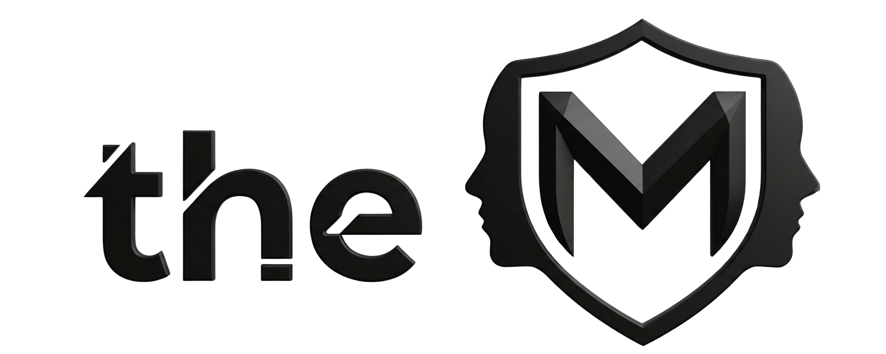
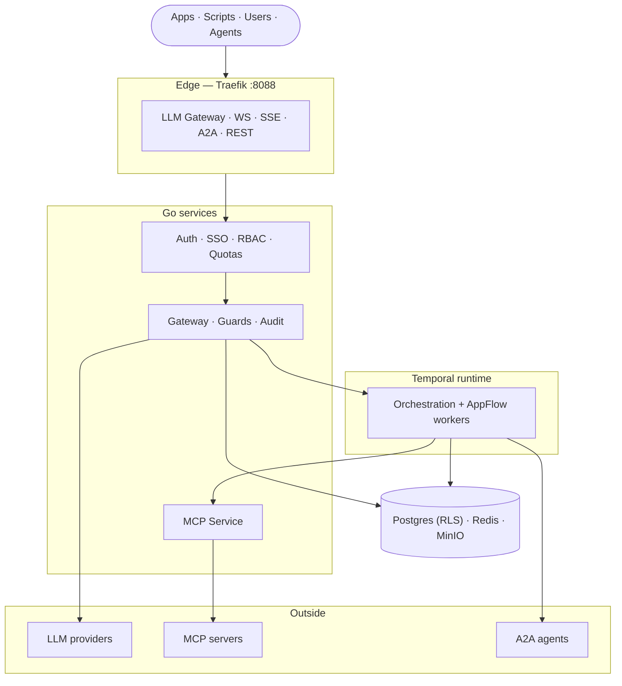

<div align="center">
  

  <h1>the-M</h1>
  <h3>The Operating System for Enterprise AI</h3>

  <p>
    <em>One governed door for every model, tool and agent. &nbsp;·&nbsp; Secure it. Control it. See it.</em>
  </p>

  <p>
    
    
    
    
    
    
  </p>
</div>

---

## Why the-M

Building AI got cheap. **Running hundreds of AIs safely did not.**

Every organization now has scripts, services and agents calling LLMs and tools, built by different teams, with provider keys pasted into forty repos. Nobody can answer:

- Which AI is running, and who owns it?
- What does it cost, per team and per use case?
- Did it send customer data or card numbers to a public model?
- Which tools can this person or agent actually use?
- What did AI do yesterday, and can we prove it?

**the-M is the operating system that answers those questions.** Applications, agents and tools connect to the-M, and the-M sits in the middle as the governed gateway: it authenticates, applies policy, records everything, and meters every dollar.

```
   Closed apps & scripts ──┐                          ┌── LLM providers
   MCP clients / agents  ──┼──►  the-M  ─────────────►├── MCP servers (tools)
   Users (web, voice, API)─┘  Gateway · Governance    └── A2A agents
                              Orchestration · Observability
                              Multi-tenant · RBAC · Audit
```

**Status tags used below:** ✅ **Live** (shipped) · 🔶 **Preview** (works, narrow or still being polished) · 🗺️ **Roadmap** (designed, not built)

---

## One OS, Three Doors

### 1. LLM Gateway — for "closed" AI you can't rebuild
Your cron job, Python script or internal service keeps its code. You change one thing: the `base_url`.

```bash
POST https://<the-m>/<tenant>/llm/v1/chat/completions
Authorization: Bearer <gateway-client-token>
```

the-M becomes the middle man and gives that client:

| | |
|---|---|
| ✅ Own gateway token per client — provider keys never leave the-M | ✅ Model allow-list, aliases, max-token cap |
| ✅ Monthly USD budget and requests-per-minute quota | ✅ Full audit row per call: client, model, tokens, cost, latency |
| ✅ OpenAI-style chat completions, sync and streaming | 🔶 **Profiles**: run each request through an App Canvas flow (guards, routing, conditions) |
| 🗺️ Tool/function calling, embeddings, request-body capture | 🗺️ Cost-aware model routing |

### 2. MCP Gateway — one place for every tool server
the-M connects to many MCP servers, health-checks them, and keeps credentials out of agents.

| | |
|---|---|
| ✅ MCP server registry with supervisor, health, tool discovery | ✅ Per-application credentials, encrypted, never in the flow definition |
| ✅ Per-node tool allow-list (expose only the tools an agent needs) | ✅ Tenant quota on number of MCP servers |
| 🗺️ **Role-based tool exposure** ("support sees 3 tools, admins see all") | 🗺️ Per-tool usage limits, deny lists, tool-call audit |
| 🗺️ the-M as an MCP server for external clients | 🗺️ MCP security scanning |

### 3. Agent Platform — build and run governed agents
- ✅ **App Canvas**: visual flows with LLM, condition, router, fork/join, cycle, HTTP, transform, human-approval and guard nodes
- ✅ **Debug mode**: step through a run with live per-node traces
- ✅ **Durable runtime** on Temporal: crash-proof, resumable, parallel fan-out, human-in-the-loop
- ✅ **A2A v1.0** agents (server and client), plus an agent builder that generates A2A agents
- ✅ **Many ways in**: WebSocket, SSE, A2A, WebRTC voice
- ✅ **Export / import** whole apps and **Deploy to Tenant**

---

## Governance & Security

| Control | Status |
|---|---|
| **PII redaction** (email, phone, card, SSN) inside flows | ✅ (regex-based, 4 categories) |
| **Prompt-injection guard** with sensitivity levels | 🔶 (pattern-based) |
| **File Guard**: antivirus scan with quarantine before files reach users | ✅ |
| **SSO**: per-tenant OIDC (Entra, Okta, Keycloak, any OIDC IdP), IdP group → role mapping | ✅ |
| **End-user auth at the door**: validate the customer's own JWT (JWKS) per entry point | ✅ |
| **Org Roles**: which roles may use which applications | ✅ |
| **Unified roles**: one role decides apps, models *and* tools | 🗺️ |
| **Audit log** of admin changes | 🔶 (core resources; widening) |
| **Human approval** gates for risky actions | ✅ |
| **Policy engine** ("PCI data may not go to public models") | 🗺️ |

---

## Multi-Tenant by Design

Each tenant is a separate organization or business unit on shared infrastructure.

- ✅ **Database-level isolation**: Postgres row-level security (forced) on ~40 tables
- ✅ **Plans and quotas**: agents, apps, MCP servers, users, concurrent runs, monthly runs and tokens, requests per minute
- ✅ **Own identity provider, LLM providers and keys** per tenant
- ✅ **Tenant provisioning** wizard and self-service settings
- ✅ **Per-app limits**: concurrent sessions and queues at every entry point

---

## See Everything

- ✅ **Run traces**: every step, per-node input/output, tokens, cost, latency
- ✅ **Live monitor**: real-time feed of sessions and runs
- ✅ **Usage and quotas dashboard** per tenant and app; Prometheus metrics
- ✅ **Gateway request log** with cost per client
- 🗺️ OpenTelemetry tracing, per-team cost attribution, AI-assisted run diagnostics

---

## Real Situations

| Situation | What the-M does |
|---|---|
| A nightly fraud-scoring script holds a provider key in a repo | Gets its own gateway token; the real key stays in the-M and rotates in one place ✅ |
| A runaway loop burns the LLM budget overnight | Monthly budget and RPM quota stop it ✅ |
| A support bot must never leak customer emails | PII guard redacts inside the flow ✅ |
| Users upload files that reach an agent | File Guard scans and quarantines infected files ✅ |
| "Which AI used which model last month, at what cost?" | Gateway request log and run usage answer it ✅ |
| Two business units share one platform | Separate tenants with isolated data, quotas and SSO ✅ |
| Support staff should see only 3 of 20 MCP tools | Per-node allow-list today ✅; per-role exposure 🗺️ |
| Card data must never reach a public model | Guards in a gateway profile today 🔶; policy engine 🗺️ |

---

## Who It's For

- **Platform & security teams** — one governed way to expose AI to the business
- **FinOps / engineering leads** — spend and usage per client, app and tenant
- **SaaS companies** — embed AI for many customers with isolated tenants
- **Regulated organizations** — audit trails, SSO, approval gates, data-stays-private direction (see Deployment)

---

## Deployment

Today: the full stack runs from Docker Compose (Traefik, Go services, Temporal workers, Postgres, Redis, MinIO, ClamAV).

🗺️ **Direction:** the same definitions running as multi-tenant SaaS, dedicated, in the customer's cloud (BYOC), or on-prem with workers inside the customer's network and no external model calls. The services are already separate containers; the packaging and hardening for these models are not built yet.

---

## Architecture at a Glance


```mermaid
flowchart TD
    U(["Apps · Scripts · Users · Agents"])
    subgraph Edge["Edge — Traefik :8088"]
        E["LLM Gateway · WS · SSE · A2A · REST"]
    end
    subgraph CP["Go services"]
        A["Auth · SSO · RBAC · Quotas"]
        G["Gateway · Guards · Audit"]
        M["MCP Service"]
    end
    subgraph RT["Temporal runtime"]
        W["Orchestration + AppFlow workers"]
    end
    subgraph X["Outside"]
        L["LLM providers"]
        T["MCP servers"]
        AG["A2A agents"]
    end
    D[("Postgres (RLS) · Redis · MinIO")]
    U --> Edge --> A --> G --> W
    G --> L
    W --> M --> T
    W --> AG
    G & W --> D
```

Each run is a durable Temporal workflow: crashes resume where they stopped, retries are idempotent, history survives restarts and replica changes.

---

## Stack

Go 1.23 · Temporal · PostgreSQL 16 (row-level security) · Redis 7 · Traefik v3 · Next.js 16 / TypeScript / Tailwind · A2A v1.0 · MCP

---

## Roadmap

| Next | |
|---|---|
| Role-based MCP tool exposure and unified role governance | Gateway: tool calling, embeddings, body capture, accurate pricing |
| Policy engine (policy as code) | OpenTelemetry and per-team cost attribution |
| MCP-as-a-server and MCP security scanning | BYOC / on-prem packaging |
| Run diagnostics, evaluation harness | Native Bedrock / Azure OpenAI / Vertex providers |

---

## Getting Started

**Prerequisites:** Docker Engine + Compose, and an LLM provider key (for example Anthropic).

```bash
git clone <repository-url> && cd them

./generate-env.sh                          # Linux/Mac  (.\generate-env.ps1 on Windows)
echo "ANTHROPIC_API_KEY=sk-ant-..." >> .env

docker compose --project-name them_gateway \
  -f docker-compose.yml -f docker-compose.dev.yml \
  --profile temporal up -d

# First boot only: initialize the database
docker cp db/001_schema.sql them-postgres:/tmp/them_001_schema.sql
docker cp auth_service/SCHEMA.sql them-postgres:/tmp/them_auth_schema.sql
docker cp db/002_seed.sql them-postgres:/tmp/them_002_seed.sql
docker exec them-postgres psql -U them -d them -c "CREATE SCHEMA IF NOT EXISTS auth_service;"
docker exec them-postgres psql -U them -d them -f /tmp/them_001_schema.sql
docker exec them-postgres psql -U them -d them -f /tmp/them_auth_schema.sql
docker exec them-postgres psql -U them -d them -f /tmp/them_002_seed.sql
# Apply migrations 003–latest: see docs/CURRENT.md
```

**Dashboard:** `http://localhost:8088` — local dev login `admin` / `admin123` (change in any real environment)
**Temporal UI:** `http://localhost:8088/temporal/`

---

## Components

| Container | Role | Port |
|---|---|---|
| `them-traefik` | Single entry point, path routing | **8088** |
| `them-go-bridge` | API gateway: all routes, WS/SSE/REST, LLM Gateway | 8002 |
| `them-auth-go` | Login, SSO, JWT, session | 8703 |
| `them-go-worker` / `them-dag-worker` | Temporal workers: orchestration and App Canvas flows | — |
| `them-agent-runtime` | Runs canvas-built A2A agents | 9300 |
| `them-mcp-service` | MCP supervisor and tool executor (internal only) | 8010 |
| `them-middleware-worker` | File Guard scanning jobs | — |
| `them-frontend` | Dashboard, App Canvas, admin | 3200 |
| `them-postgres` · `them-redis` | Data store · streams, cache, counters | 5432 · 6379 |

---

## Documentation

| Doc | Contents |
|---|---|
| `docs/INDEX.md` | Find the right doc fast |
| `docs/CURRENT.md` | Current state and next steps |
| `docs/LLM_GATEWAY_DESIGN.md` | LLM Gateway design |
| `docs/MCP_CONTROL_PLANE_DESIGN.md` | MCP gateway design (roadmap) |
| `docs/UNIFIED_ROLE_GOVERNANCE_DESIGN.md` | Unified roles design (roadmap) |
| `docs/TENANT_IDENTITY_AND_SSO.md` | Tenants, SSO, user management |
| `docs/SCHEMA.md` · `docs/REDIS.md` | Data model and Redis keys |
| `docs/LESSONS.md` | Hard-won lessons |
| `go/CLAUDE.md` | Go package map and conventions |

---

## License

© 2026 Avi Cohen. All rights reserved.
