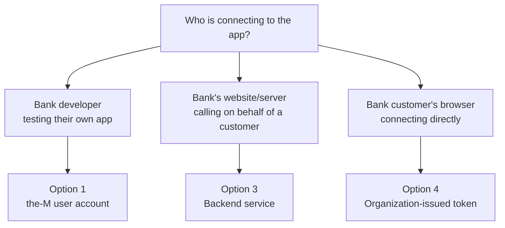
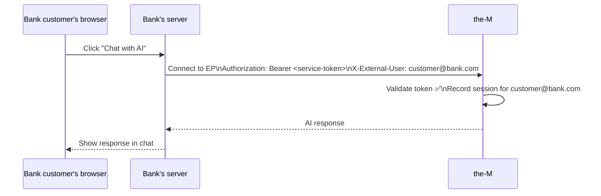
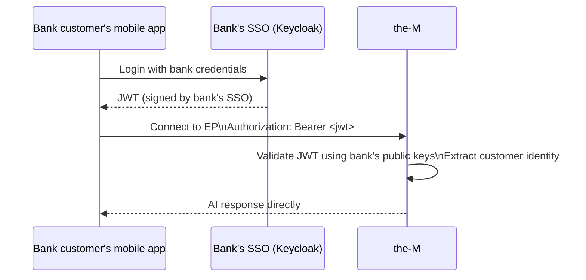

# Entry Point Access — Operator Guide
# the-M Platform · Last updated: 2026-09-13

---

## Who are we talking about?

In the-M, a **tenant** is a customer organisation — for example, a bank.

Inside that bank there are two types of people:

- **Bank developers** — they build AI apps in the Canvas and test them
- **Bank customers** — end users who use the app (e.g. chat with AI on the bank's website)

When you set up an entry point (EP), you are deciding: **who is allowed to connect to this app, and how do they prove their identity?**

---

## The three real-world scenarios



---

## Option 1 — the-M user account

**Who:** A bank developer who is logged in to the-M.

**Story:** The bank developer builds an app in the Canvas and wants to test it in the playground. They log in to the-M (either with a username/password or via the bank's SSO). The-M creates an account for them automatically on first login. They open the playground and chat with the app.

**Where is the credential created?**
- If logging in via SSO → in the **bank's Keycloak** (the developer's existing company account)
- If logging in directly → in **the-M** (Admin → Users)

**No token setup needed** — the developer's login session is the credential.

---

## Option 2 — Internal API access

**Who:** An internal tool, script, or CI pipeline owned by the bank's development team.

**Story:** The bank's dev team has an automated test suite that runs every night against their AI app. It needs to call the-M programmatically — there's no human user involved, just a machine making API calls.

**Where is the credential created?**
→ In **the-M** — Admin → Tokens → New → pick **Internal**

The bank's server puts this token in every request:
```
Authorization: Bearer <internal-token>
```

**Key point:** There is no end customer here. The tool is calling for its own purposes.

---

## Option 3 — Backend service (on behalf of a customer)

**Who:** The bank's production server, calling the-M on behalf of a bank customer.

**Story:** A bank customer opens the bank's website and clicks "Chat with AI". The bank's server receives that click. It calls the-M using a Service token, and tells the-M which customer is asking by passing their identity in the request. The-M runs the AI and sends the response back through the bank's server to the customer. The customer never connects to the-M directly — everything goes through the bank's server.



**Where is the credential created?**
→ In **the-M** — Admin → Tokens → New → pick **Service**

The bank's server uses this token. The bank customer never sees it.

**Important note on security:** One Service token covers all customers going through the bank's server. This is standard industry practice (same as Stripe, OpenAI, Twilio API keys) — but the bank must keep this token secure on their server. If it leaks, all customers are at risk until the token is revoked.

---

## Option 4 — Organization-issued access token

**Who:** A bank customer connecting directly — their browser or mobile app calls the-M, with no bank server in the middle.

**Story:** The bank gives their customers a mobile app. When the customer opens it, they log in with their bank credentials (Keycloak SSO). They get a JWT (a digitally signed token) from the bank's SSO. Their app sends that JWT directly to the-M. The-M validates it and connects them.



**Where is the credential created?**
→ **Nowhere in the-M.** The JWT comes from the **bank's own SSO** (Keycloak, Auth0, etc.). The-M never issues it.

**What the-M admin must set up (once):**
→ Tenant Settings → Runtime Identity → enter the bank's JWKS URI and Issuer URL.

This tells the-M where to find the bank's public keys to validate JWTs. The-M fetches those keys once and caches them — it does **not** call the bank's SSO on every customer request. Validation is done locally using cryptography.

**Key point:** The bank customer has no the-M account. Their bank login is their credential.

---

## Option 5 — Service token — regular or backend

**Who:** Either an internal tool (option 2) or a backend server (option 3) — you want to accept both on the same EP.

**When to use:** Mainly during development, when your own test scripts and a partner's service token both need to hit the same EP. In production, prefer option 2 or 3 so it's clear who is allowed in.

**Where is the credential created?**
→ In **the-M** — Admin → Tokens → either Internal or Service

---

## Option 6 — Open (no auth)

**Who:** Anyone who knows the URL.

**When to use:** Public demos, prototypes, marketing pages with a live chatbot.

**No credential needed — and no setup required.**

> ⚠ Anyone can connect and consume tokens. Never use for production apps with real data.

---

## Quick reference

| Option | Who connects | Credential created where | Customer identity |
|---|---|---|---|
| the-M user account | Bank developer (logged in) | the-M or bank SSO | Their the-M login |
| Internal API access | Bank's internal tools/scripts | the-M (Internal token) | None — machine call |
| Backend service | Bank's production server | the-M (Service token) | Passed by the server |
| Organization-issued token | Bank customer directly | Bank's own SSO | From the JWT |
| Service token — any | Internal or partner tools | the-M (any token) | Depends on token |
| Open | Anyone | Nowhere | None |
