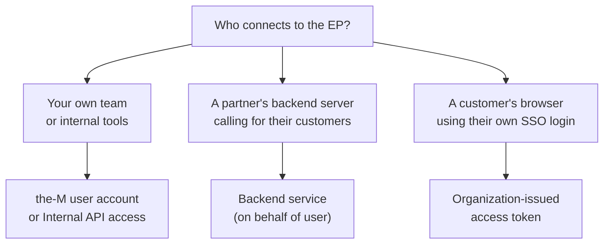
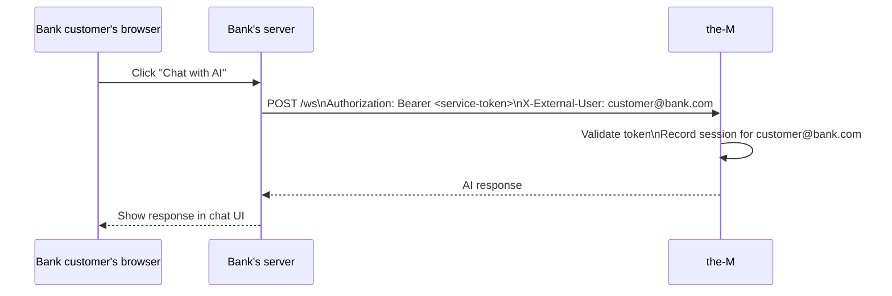
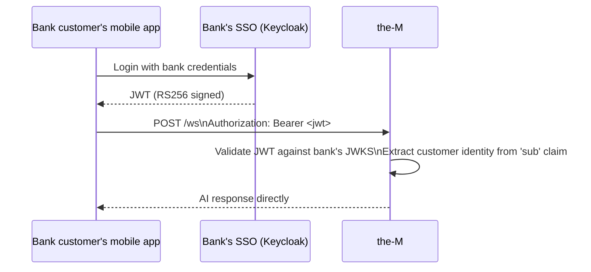
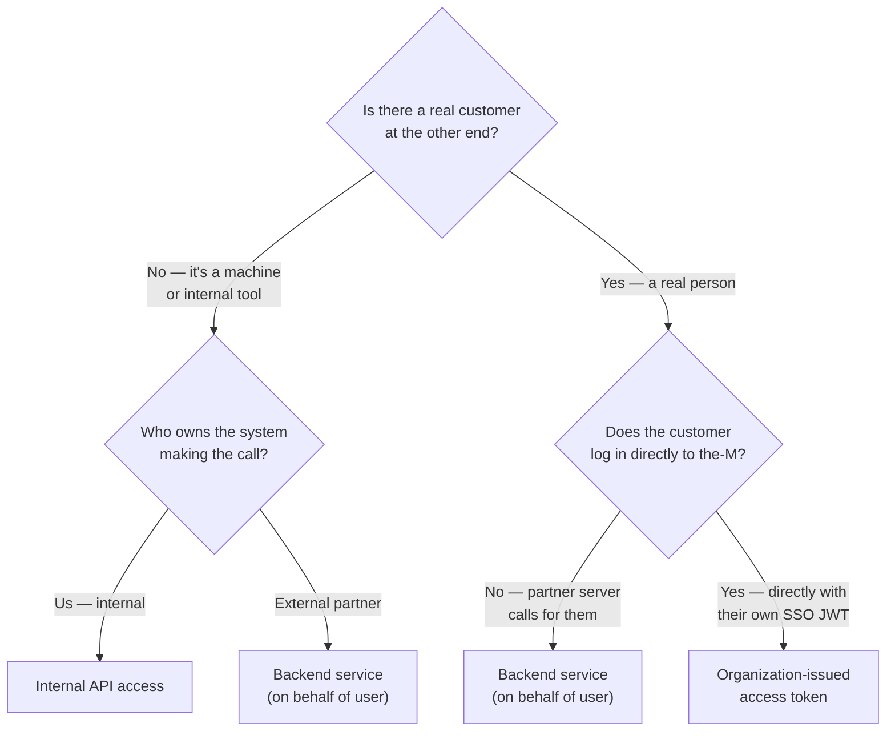

# Entry Point Access — Operator Guide
# the-M Platform · Last updated: 2026-09-13

When you create an entry point (EP) in the Canvas, you choose **who can connect to it**.
This guide explains each option in plain language.

---

## The big picture

Every EP has a door and a lock. The lock decides who gets in.
There are three kinds of people who might want to connect to your app:

1. **Your own team** — developers, admins, testers using the-M directly
2. **A partner system** — an external server (the bank's backend) calling the-M on behalf of their customers
3. **An end user directly** — a bank customer's browser, using their own login (SSO)

---

## The six options

---

### 1. the-M user account
**Use when:** A person on your own team logs into the-M and uses the app directly from the dashboard or playground.

**Example:** Your developer wants to test the customer support app. They log in to the-M, open the playground, and chat with the app.

**What they need:** A the-M account on this tenant. Nothing else.

**What they send:** Their the-M login session (handled automatically by the browser).

---

### 2. Internal API access
**Use when:** Your own internal system, script, or CI pipeline calls the app programmatically — not on behalf of any customer.

**Example:** A monitoring script that pings the app every 5 minutes to check it's alive. Or a CI pipeline that runs automated tests against the app.

**What they need:** An **Internal token** created in Admin → Tokens.

**What they send:** `Authorization: Bearer <internal-token>`

**Key point:** There is no end user here. The caller IS the system. The-M records the token identity, not a person.

---

### 3. Backend service (on behalf of user)
**Use when:** A partner's backend server calls the-M on behalf of one of their customers. The partner authenticates their own customers — the-M never sees the customer directly.

**Example:** A bank customer clicks "Chat with AI" on the bank's website. The bank's server receives that click, then calls the-M on that customer's behalf. The-M talks to the AI and sends the response back through the bank's server to the customer.

**What they need:** A **Service token** created in Admin → Tokens.

**What they send:**
- `Authorization: Bearer <service-token>`
- `X-External-User: customer@bank.com` (any identifier for the customer)

**Key point:** The bank customer has no the-M account. The bank's server is the authenticated caller — it vouches for the customer. Only a Service token is trusted to do this.

---

### The difference between option 2 and option 3

This is the most important distinction:

| | Internal API access (2) | Backend service (3) |
|---|---|---|
| Who is the caller? | Your own system | A partner's system |
| Is there an end user? | No | Yes — a customer of the partner |
| Token type needed | Internal | Service |
| Can pass customer identity? | No (ignored) | Yes — via X-External-User header |
| Use case | Internal tools, monitoring, CI | Bank website, insurance portal, any external integration |

**Simple rule:** If someone's customer is at the other end of the call — use option 3. If it's just a machine talking to a machine for internal purposes — use option 2.

---

### 4. Organization-issued access token
**Use when:** A partner's customer connects **directly** to the-M using the JWT from their own company's SSO (Keycloak, Auth0, Azure AD, etc.). There is no middleman server.

**Example:** The bank gives their customers a mobile app. When a customer opens it, they log in with their bank credentials and get a JWT. That JWT is sent directly to the-M. No bank server involved.

**What they need:** Runtime Identity configured in Tenant Settings → Runtime Identity (JWKS URI + Issuer). No token creation needed.

**What they send:** `Authorization: Bearer <jwt-from-their-sso>`

**Key point:** The customer authenticates with their own organisation's login. The-M validates the JWT cryptographically — no shared secret, no the-M account needed.

---

### 5. Service token — regular or backend
**Use when:** You want to accept both Internal tokens and Service tokens on the same EP without restriction.

**Example:** You're building and testing an integration. During development, your internal tools and the partner's service token both need to connect to the same EP. Rather than creating two EPs, you open it to both.

**What they need:** Any token — Internal or Service — created in Admin → Tokens.

> **Caution:** This is a looser setting. Use it during development or when you have specific reason to allow both. For production integrations, prefer option 2 or 3 so the EP is clearly scoped.

---

### 6. Open (no auth)
**Use when:** Anyone can connect — no credential required.

**Example:** A public demo, a marketing page with a live chatbot, or a prototype you're sharing with stakeholders who don't have accounts.

**What they need:** Nothing.

> **Caution:** Anyone who knows the URL can connect and consume tokens. Never use this for production apps with real data.

---

## Decision guide

---

## Quick reference

| Option | Who connects | Token needed | End user identity |
|---|---|---|---|
| the-M user account | Your team via the-M login | None (session JWT) | The-M user |
| Internal API access | Your internal tools/scripts | Internal token | None |
| Backend service | Partner's server | Service token | Passed via X-External-User |
| Organization-issued token | Customer's browser/app directly | None (their SSO JWT) | From JWT sub claim |
| Service token — regular or backend | Internal or partner tools | Any token | Depends on token type |
| Open | Anyone | None | None |
