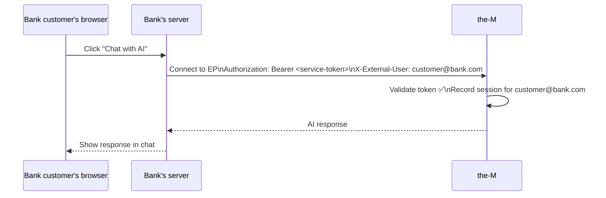
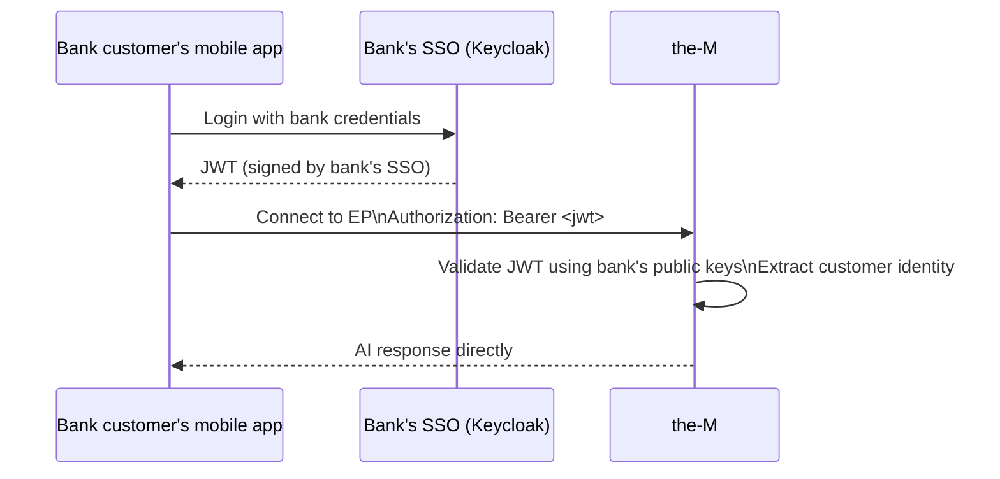

# Entry Point Access — Operator Guide
# the-M Platform · Last updated: 2026-09-13

---

## Who are we talking about?

In the-M, a **tenant** is a customer organisation — for example, a bank.

Inside that bank there are two types of people:

- **Bank developers** — they build AI apps in the Canvas and test them
- **Bank customers** — end users who use the app (e.g. chat with AI on the bank's website)

When you set up an entry point (EP), you are deciding: **who is allowed to connect to this app, and how do they prove their identity?**

---

## The options

### Option 1 — Staff login (the-M user account)

**Who:** A bank developer who is logged in to the-M.

The developer logs in to the-M with their username/password or via the bank's SSO. Their login session is the credential — no token setup needed.

**Where is the credential created?**
- Via SSO → in the **bank's Keycloak** (their existing company account)
- Direct login → in **the-M** (Admin → Users)

**Key point:** This is a human with a session. The session expires when they log out.

---

### Option 2 — Machine — no user (Internal API access)

**Who:** A script, test suite, or CI pipeline. No human involved.

A long-lived API key is created in the-M and hardcoded into the script. The script calls the app directly. There is no end customer — the machine is calling for its own purposes (testing, automation).

**Where is the credential created?**
→ In **the-M** — Admin → Tokens → New → **Internal**

**Key point:** This is a permanent machine key. No user identity is attached to calls made with it.

---

### Option 3 — Machine — on behalf of a customer (Backend service)

**Who:** The bank's production server, calling the-M for a real customer.

Same as Option 2 — a machine with a long-lived API key. The difference is one flag: this token is marked as a **backend/service token** (`is_backend=true`). That flag allows the server to pass the customer's identity in the request (`X-External-User: customer@bank.com`). The-M records that identity on the run.

With Option 2 the server **cannot** assert a customer identity — that header is ignored. With Option 3 it can.



**Where is the credential created?**
→ In **the-M** — Admin → Tokens → New → **Service**

**Key point:** One token covers all customers going through the bank's server. The customer never connects to the-M directly.

---

### Option 4 — Bank SSO token (Organization-issued access token)

**Who:** A bank customer connecting directly — no bank server in the middle.

The customer logs in to the bank's mobile app with their bank credentials (Keycloak, Auth0). They get a JWT signed by the bank's own SSO. Their app sends that JWT directly to the-M. The-M validates it using the bank's public keys and connects them.



**Where is the credential created?**
→ **Nowhere in the-M.** The JWT comes from the **bank's own SSO**. The-M never issues it.

**What the-M admin must set up (once):**
→ Tenant Settings → Runtime Identity → enter the bank's JWKS URI and Issuer URL.

**Key point:** The bank customer has no the-M account. Their bank login is their credential.

---

### Option 5 — Open (no auth)

**Who:** Anyone who knows the URL.

No credential needed. Used for public demos, prototypes, marketing chatbots.

> ⚠ Anyone can connect and consume tokens. Never use for production apps with real data.

---

## What happened to "Service token — any"?

The old UI had a sixth option called "Service token — regular or backend" that accepted both Option 2 and Option 3 tokens. It is redundant — you can achieve the same by creating one of each token type. It has been removed to reduce confusion.

---

## Quick reference

| Option | Who connects | Credential | Customer identity recorded? |
|---|---|---|---|
| Staff login | Bank developer (logged in) | the-M session JWT | Their the-M account |
| Machine — no user | Scripts / automation | Internal token (the-M) | No |
| Machine — on behalf of customer | Bank's production server | Service token (the-M) | Yes — passed by the server |
| Bank SSO token | Bank customer directly | JWT from bank's own SSO | Yes — from the JWT |
| Open | Anyone | None | No |

---

## Testing EPs from the Playground

The Playground is the admin UI's built-in developer tool for chatting with an app.

**Default behaviour — "My login":**
Uses your login session JWT. Works for Options 1, 2, 3, and 5 (open) — the bridge has a JWT fallback that accepts session tokens against any token-mode EP. Does **not** work for Option 4 (bank SSO token) since the platform JWT fails the external signature check.

**"Service token" button:**
Only relevant for **Option 3 (Machine — on behalf of customer)** EPs where `allowed_principals` is restricted to backend callers only. Clicking it creates a one-off Service token on the spot and uses it for the connection. Your session JWT would be rejected by that EP because it carries `is_backend=false`; a Service token carries `is_backend=true` and is admitted.

| EP option | Playground works by default? | Need "Service token" button? |
|---|---|---|
| Staff login | Yes | No |
| Machine — no user | Yes (JWT fallback) | No |
| Machine — on behalf of customer, backend-only | **No** | **Yes** |
| Bank SSO token | **No** | No — needs a real bank JWT, use curl |
| Open | Yes | No |

**Testing a Bank SSO token EP:**
The Playground cannot generate a bank-issued JWT. Get one from the bank's SSO and test with curl:
```bash
curl -X POST https://<host>/{tenant}/a2a/{app}/{ep} \
  -H "Authorization: Bearer <bank-issued-jwt>" \
  -H "Content-Type: application/json" \
  -d '{"jsonrpc":"2.0","id":"1","method":"SendStreamingMessage","params":{...}}'
```
