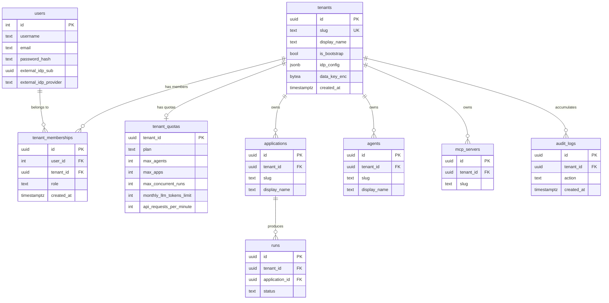
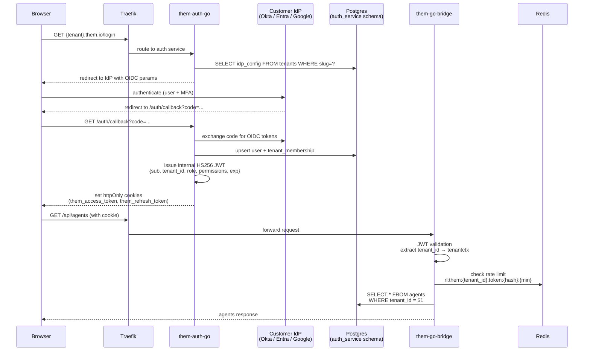
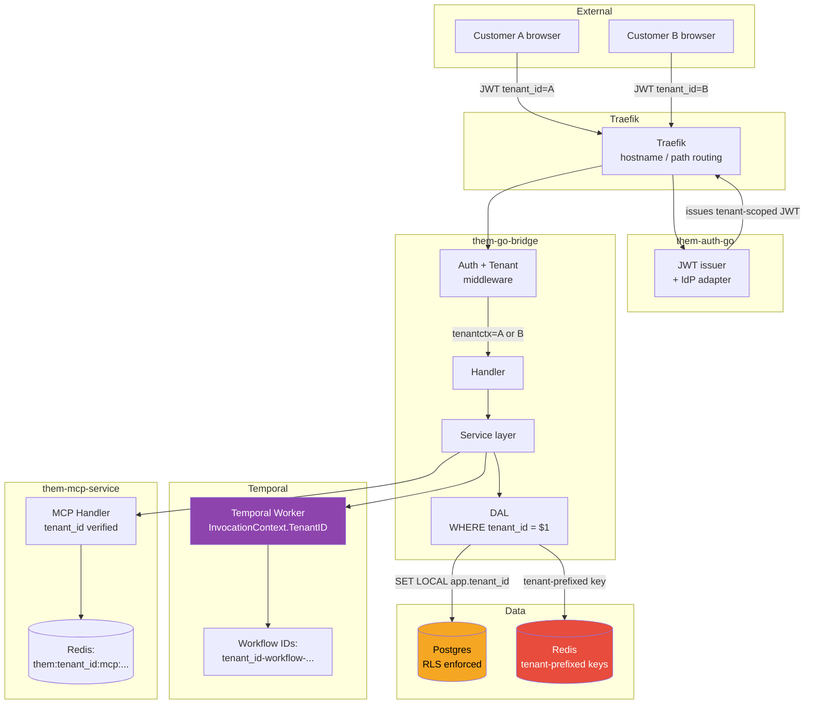
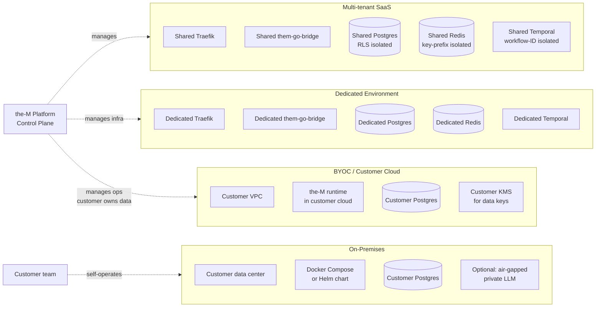
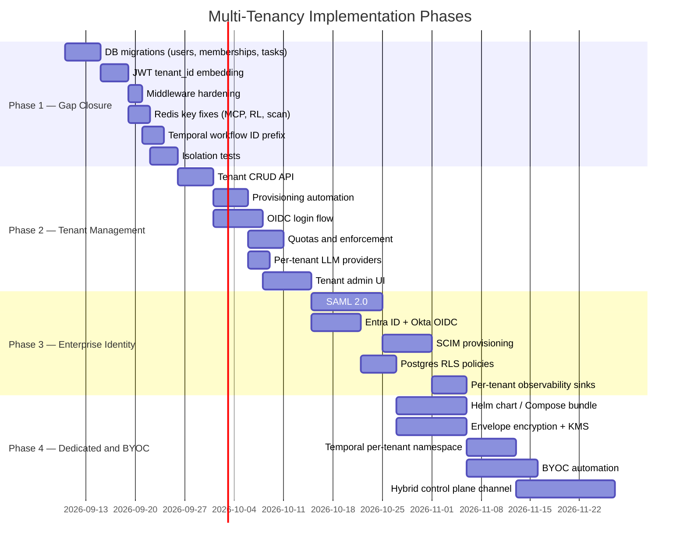

# Multi-Tenancy Architecture Design — the-M
**Status:** Design proposal — not yet implemented
**Date:** 2026-09-02
**Author:** Architecture review

---

## Table of Contents

1. [What We Have Today](#1-what-we-have-today)
2. [What a Tenant Represents](#2-what-a-tenant-represents)
3. [Deployment Models](#3-deployment-models)
4. [Identity and Authentication](#4-identity-and-authentication)
5. [Database Isolation Strategy](#5-database-isolation-strategy)
6. [RBAC and Tenant-Level Permissions](#6-rbac-and-tenant-level-permissions)
7. [Tenant Context Flow](#7-tenant-context-flow)
8. [Secrets and Credentials Isolation](#8-secrets-and-credentials-isolation)
9. [Resource Ownership Model](#9-resource-ownership-model)
10. [Redis Isolation](#10-redis-isolation)
11. [Temporal / Worker Isolation](#11-temporal--worker-isolation)
12. [MCP Isolation](#12-mcp-isolation)
13. [A2A Agent Isolation](#13-a2a-agent-isolation)
14. [Quotas, Limits, and Usage Tracking](#14-quotas-limits-and-usage-tracking)
15. [Audit and Observability Isolation](#15-audit-and-observability-isolation)
16. [Cross-Tenant Security Risks](#16-cross-tenant-security-risks)
17. [Tenant Provisioning and Lifecycle](#17-tenant-provisioning-and-lifecycle)
18. [Migration from Current System](#18-migration-from-current-system)
19. [Recommended Architecture](#19-recommended-architecture)
20. [Alternatives Considered](#20-alternatives-considered)
21. [Key Architectural Decisions Required](#21-key-architectural-decisions-required)
22. [Components Requiring Changes](#22-components-requiring-changes)
23. [Complexity and Risk Estimate](#23-complexity-and-risk-estimate)
24. [Phased Implementation Plan](#24-phased-implementation-plan)
25. [Diagrams](#25-diagrams)

---

## 1. What We Have Today

The current codebase already has a single-tenant foundation that is partially tenant-aware:

**What exists:**
- `them.tenants` table with a single bootstrap tenant (`00000000-0000-0000-0000-000000000001`, slug `default`)
- `tenant_id UUID NOT NULL` on most core tables: `agents`, `orchestrators`, `applications`, `entry_points`, `access_tokens`, `runs`, `agent_definitions`, `agent_runtime_specs`, `mcp_servers`
- `tenantctx` package with typed context key — cannot be spoofed via string injection
- `AdminTenantMiddleware` that reads `claims.TenantID` but currently falls back to bootstrap when empty
- `BearerTenantMiddleware` / `HS256TenantMiddleware` that enforce non-empty `TenantID` on token-authenticated paths
- Redis agent registry keyed by `them:agents:registry:{tenant_id}` — properly scoped

**Critical gaps (the system is NOT multi-tenant yet):**
- `auth_service.users` has no `tenant_id` — flat global user table
- JWT access tokens issued by `them-auth-go` do not include `tenant_id`
- `AdminTenantMiddleware` falls back to bootstrap — all admin users are single-tenant today
- MCP Redis keys (`them:mcp:manifest:{slug}`, `them:mcp:health:{slug}`) use slug only — cross-tenant collision possible
- `them.llm_providers` and `them.config` are global — no per-tenant LLM or platform configuration
- `auth_service.roles` and `auth_service.teams` are globally scoped
- Temporal uses a single shared namespace — no workflow isolation between tenants
- `them.tasks.tenant_id` is nullable (should be NOT NULL)
- WS/SSE public entry points do not yet support hostname/path-prefix routing per tenant

---

## 2. What a Tenant Represents

### Recommended definition

A **Tenant** is an isolated organizational boundary — a company, customer, or business unit that operates the-M independently of all other tenants.

Tenants are the hard security boundary. Everything inside a tenant can be configured, administered, and operated without touching anything belonging to another tenant.

### Internal structure of a Tenant

Rather than a flat single-tenant model, we recommend a **two-level hierarchy**:

```
Tenant (Organization)
└── Environment (dev / staging / prod)
    └── Application (a deployable unit, e.g. "customer-support-bot")
        └── Entry Point (a typed door: WS, SSE, A2A, Voice, WebRTC)
```

**Why two levels (Tenant + Environment) and not more?**

Projects / Workspaces inside a Tenant add significant complexity to RBAC, billing, and provisioning. Most enterprise customers actually want `dev/staging/prod` separation, not arbitrary project trees. The Environment concept covers 80% of this need with far less complexity.

Environments inherit Tenant-level identity (same SSO, same users) but have independent:
- Applications and entry points
- Agents, orchestrators, workflows
- LLM provider bindings
- Secrets and credentials
- Quotas and rate limits

Promotion of agents/workflows from `dev → staging → prod` is an explicit publish action, not automatic inheritance.

### What a Tenant does NOT mean

- A Tenant is not a per-user sandbox — users are members of a Tenant
- A Tenant is not a deployment unit — a Tenant can run in a shared multi-tenant cluster, a dedicated cluster, BYOC, or on-prem (see §3)
- A Tenant does not map 1:1 to an `Application` — Applications exist inside Tenants

---

## 3. Deployment Models

The architecture must support all five deployment models without fundamentally different code paths.

### 3.1 Multi-tenant SaaS (shared infrastructure)

Single deployment. Multiple tenants share the same Postgres instance (row-level isolation), same Redis (key-prefix isolation), same Temporal namespace (workflow ID prefix isolation), same the-M binaries.

- Lowest operational cost
- Fastest onboarding
- Requires the strongest software isolation guarantees (tenant_id enforced everywhere)
- Suitable for SMB and mid-market customers

### 3.2 Dedicated Environment (dedicated cluster, same platform)

Customer gets their own Docker/Kubernetes stack, their own Postgres, Redis, Temporal namespace. The-M platform team operates it.

- Higher operational cost, but simpler code (less cross-tenant risk)
- Suitable for enterprise customers with data residency requirements
- The `bootstrap tenant` becomes the only tenant in this deployment

### 3.3 BYOC — Bring Your Own Cloud

Customer provides their own cloud account (AWS, GCP, Azure). The-M platform provisions and operates the stack inside their VPC.

- Customer retains data sovereignty
- Platform team operates infrastructure but has limited data access
- Temporal namespace is customer-owned
- LLM keys never leave the customer's cloud account

### 3.4 On-Premises

Customer operates the entire stack inside their data center. Air-gapped option possible.

- No external dependencies (except LLM APIs if customer chooses)
- Customer manages all secrets and upgrades
- The-M ships as a Helm chart or Docker Compose bundle
- Tenant bootstrap is performed by the customer at install time

### 3.5 Hybrid — Control Plane + Customer Runtime

The-M hosts the control plane (admin UI, agent builder, workflow designer, audit) while the customer runs the execution runtime (agent-runtime, Temporal workers, MCP service) in their own environment.

- Useful for customers who need execution inside their security boundary but want managed tooling
- Requires a secure data plane channel (mutual TLS or a dedicated VPN tunnel) between control plane and runtime
- This is architecturally complex and should be a Phase 4 consideration

### Unified abstraction

All deployment models share the same code. The difference is configuration and infrastructure. A `TenantConfig` record controls:
- Which features are enabled
- Whether the tenant runs in shared or dedicated infrastructure
- Which identity provider is configured
- Quota and rate limit values

---

## 4. Identity and Authentication

This is the most complex and consequential architectural decision. Different customers have fundamentally different requirements.

### 4.1 Identity models to support

| Model | Description | Target customers |
|---|---|---|
| **the-M managed** | Username + password, MFA. Managed entirely by the platform. | SMB, internal teams, dev/test environments |
| **OIDC (generic)** | Any OIDC-compliant provider (Google, GitHub, Azure AD, Okta, Auth0) | Mid-market |
| **SAML 2.0** | Enterprise SSO via SAML assertions | Large enterprise, financial, healthcare |
| **Microsoft Entra ID** | Azure AD / Entra ID (OIDC + SAML, optional SCIM) | Microsoft-ecosystem enterprise |
| **Okta** | Okta Workforce Identity (OIDC + SAML, SCIM) | Enterprise standard |
| **SCIM provisioning** | Automated user/group lifecycle from customer IdP | Enterprise (any provider above) |
| **Customer-managed entirely** | Customer IdP issues tokens; the-M validates and trusts them | BYOC / on-prem customers |

### 4.2 Recommended identity architecture

**Federated identity hub** — the-M maintains a thin user record per tenant, backed by an upstream IdP per tenant.

```
Customer IdP (Okta / Entra / SAML / OIDC)
        ↓  OIDC authorization code flow  (or SAML assertion)
the-M Auth Service (them-auth-go)
        ↓  internal HS256 JWT  with {sub, tenant_id, role, permissions}
All the-M services
```

Key design decisions:

1. **The-M auth service remains the internal token issuer.** Even when the upstream IdP authenticates the user, the-M auth service issues its own short-lived internal JWT. This means the rest of the-M never needs to understand Okta tokens, SAML assertions, or OIDC JWTs — just the internal format.

2. **One IdP config per Tenant.** The `tenants` table gains an `idp_config JSONB` column describing the identity provider type and its connection parameters (OIDC discovery URL, SAML metadata, etc.). The auth service reads this config at login time based on tenant routing (see §4.3).

3. **JWT must include `tenant_id`.** The internal HS256 access token issued by `them-auth-go` must include `tenant_id` in the payload. This closes the current gap where `AdminTenantMiddleware` falls back to bootstrap.

4. **The `auth_service.users` table must become tenant-scoped.** Add `tenant_id UUID NOT NULL` to `auth_service.users`. A user can belong to multiple tenants (via `auth_service.tenant_memberships` — see §6). Their identity (email) is shared; their role and permissions are per-tenant.

5. **SCIM provisioning endpoint** — an HTTP endpoint under `/_scim/v2/{tenant_slug}/` that accepts SCIM 2.0 User/Group push from the customer's IdP, creating/updating/deactivating users in `auth_service.users` for the relevant tenant.

### 4.3 Tenant routing at the login page

When a user arrives at the login page, the-M must know which IdP to use. Two patterns:

**Option A — Subdomain routing (recommended for SaaS):**
- `{tenant-slug}.them.io/login` → routes to tenant's configured IdP
- Requires wildcard TLS cert and Traefik dynamic routing per tenant

**Option B — Login hint (simpler, works for all deployment models):**
- User enters their email → backend looks up `tenants` by email domain → redirects to correct IdP
- Fallback: user types their tenant slug manually

**Option C — Dedicated URL (dedicated/BYOC/on-prem):**
- Each deployment has its own hostname (`them.customer.com`) → always maps to the single tenant in that deployment

Recommended: support all three. Option B is the safe default for shared SaaS. Option A is available as an upgrade. Option C is built-in for dedicated deployments.

---

## 5. Database Isolation Strategy

### Recommendation: Row-Level Security (RLS) on shared Postgres

The choice between schema-per-tenant, database-per-tenant, and row-level isolation is the most consequential DB decision.

| Strategy | Isolation | Operational cost | Migration cost | Recommended for |
|---|---|---|---|---|
| **Shared DB, `tenant_id` column** | Software only (lowest) | Very low | Already partially done | Multi-tenant SaaS |
| **Schema-per-tenant** | Stronger (schema boundary) | Medium | High | Mid-size deployments |
| **Database-per-tenant** | Strong (DB boundary) | High | Very high | Dedicated / BYOC / on-prem |

**Recommendation: row-level security with Postgres RLS policies as a second enforcement layer.**

The current `tenant_id` column approach is already in place. Adding Postgres RLS policies provides defense in depth — even if application code has a bug that omits the `WHERE tenant_id = ?` clause, the database will enforce the boundary.

```sql
-- Example RLS policy (applied to each tenant-scoped table)
ALTER TABLE them.agents ENABLE ROW LEVEL SECURITY;

CREATE POLICY agents_tenant_isolation ON them.agents
  USING (tenant_id = current_setting('app.tenant_id')::uuid);

-- Set at connection time (connection pooler or query preamble)
SET LOCAL app.tenant_id = '<tenant-uuid>';
```

**Implementation notes:**
- Use PgBouncer transaction-mode pooling — set `app.tenant_id` via `SET LOCAL` at the start of each transaction
- The Go DAL must set the session variable before tenant-scoped queries in a transaction
- The `bootstrapTenantID` is still used for platform-admin operations (not subject to RLS)
- RLS is additive to the existing `WHERE tenant_id = $N` clauses — belt and suspenders

**For dedicated/BYOC/on-prem:** Each deployment gets its own Postgres instance. RLS is still applied for defense in depth, but the isolation is already at the infrastructure level.

### Tables requiring `tenant_id` addition

| Table | Gap | Action |
|---|---|---|
| `auth_service.users` | No tenant_id | Add `tenant_id UUID NOT NULL` + new `tenant_memberships` table |
| `auth_service.roles` | Global | Introduce `tenant_roles` (per-tenant role assignments) |
| `auth_service.teams` | Global | Add `tenant_id` |
| `them.llm_providers` | Global | Add `tenant_id` (NULL = platform default, can be overridden per tenant) |
| `them.config` | Global | Add `tenant_id` (NULL = platform default) |
| `them.tasks` | Nullable tenant_id | Make NOT NULL, add migration to backfill |
| `them.middleware_defs` | Global | Differentiate builtin (NULL) from tenant-custom (NOT NULL) |

---

## 6. RBAC and Tenant-Level Permissions

### Current state

The-M has four global roles: `super_admin`, `developer`, `analyst`, `viewer`. These are defined in `auth_service.roles` with no tenant scoping. All role assignments are global.

### Recommended RBAC model

**Two-tier RBAC:**

```
Platform level (them-auth-service):
  super_admin — can manage tenants, platform config, LLM providers
  platform_viewer — read-only platform dashboard

Tenant level (per tenant):
  tenant_admin — full control within their tenant
  developer — create/edit agents, workflows, MCP servers
  operator — manage runs, view logs, approve HITL
  analyst — read-only access to runs and analytics
  viewer — read-only access to applications
```

**Implementation:**

Add `auth_service.tenant_memberships`:
```sql
CREATE TABLE auth_service.tenant_memberships (
  id         UUID PRIMARY KEY DEFAULT gen_random_uuid(),
  user_id    INTEGER NOT NULL REFERENCES auth_service.users(id),
  tenant_id  UUID NOT NULL,
  role       TEXT NOT NULL,          -- tenant-level role
  created_at TIMESTAMPTZ DEFAULT NOW(),
  UNIQUE (user_id, tenant_id)        -- one role per user per tenant
);
```

A user can belong to multiple tenants. Each membership has an independent role. The JWT `role` claim reflects the role for the currently-scoped tenant.

**Environment-level RBAC (future):**
If environments are added, membership can be extended to `(user_id, tenant_id, environment_id, role)`. Leave the table structure open for this addition — do not bake `environment_id` in Phase 1.

**Permissions** are still derived from roles (the `permissions[]` array in the JWT) but the mapping is tenant-context-aware. A user who is `tenant_admin` of Tenant A and `viewer` of Tenant B will receive different permission sets in their respective JWTs.

### RBAC enforcement in Go

The existing `RequireSuperAdmin`, `RequirePermission` middleware functions work on the JWT claims already. The change: populate `claims.Role` and `claims.Permissions` from the tenant membership, not the global `users.role_id`.

---

## 7. Tenant Context Flow

### Request path (API)

```
HTTP request
  → Traefik (routing by hostname or path prefix)
  → them-go-bridge
      → Auth middleware (JWT validation → extract tenant_id, role, permissions)
      → Tenant middleware (set tenantctx in request context)
      → Handler
          → Service layer (receives ctx with tenant_id)
              → DAL (WHERE tenant_id = $1)
                  SET LOCAL app.tenant_id = $1  ← RLS enforcement
              → Redis (tenant-prefixed keys)
              → Temporal (tenant-namespaced workflow IDs)
```

The `tenantctx` package already provides the correct typed context key pattern. The gap is that `them-auth-go` does not yet embed `tenant_id` in the issued JWT, so the middleware has no value to set.

### Worker path (Temporal)

```
Temporal workflow started with InvocationContext{TenantID: ...}
  → Activity receives ctx + InvocationContext
  → All DB calls use InvocationContext.TenantID
  → Redis operations use tenant-prefixed keys
  → LLM calls use tenant's provider binding
  → Audit events include tenant_id
```

The `InvocationContext` already carries `TenantID` — the Temporal path is largely correct. The gap is that LLM provider resolution is currently global.

### MCP path

```
MCP tool call from canvas agent
  → them-mcp-service receives call with tenant context (from InvocationContext)
  → Looks up mcp_servers WHERE tenant_id = ? AND slug = ?
  → Executes tool in isolation
  → Result returned to agent
```

Gap: MCP Redis manifest/health keys are not tenant-prefixed.

### A2A path

```
External client → Entry Point (app_slug/ep_slug scoped to tenant)
  → them-go-bridge resolves tenant from application
  → Injects tenant context into A2A task
  → Canvas agent runs with tenant context
  → Cross-agent A2A calls carry tenant binding headers (X-Them-Agent-Id, X-Them-Binding-Id)
```

Cross-tenant A2A calls must be explicitly forbidden unless a trust policy is established. Currently there is no guard against this.

---

## 8. Secrets and Credentials Isolation

### Current state

- Single `THE_M_SECRET_KEY` used for all encryption
- LLM API keys: per-app in `applications.provider_keys JSONB` (AES-GCM encrypted with the platform key)
- Agent tokens: per-agent in `agents.auth_token_encrypted`

### Recommended model

**Envelope encryption per tenant:**

```
Platform master key (HSM or cloud KMS in production)
    ↓ wraps
Tenant data key (unique per tenant, stored encrypted in them.tenants)
    ↓ wraps
Per-resource secrets (LLM keys, agent tokens, MCP credentials, etc.)
```

Benefits:
- Revoking a tenant's data key instantly invalidates all their secrets
- The platform master key never touches customer data directly
- Tenant data keys can be customer-managed in BYOC deployments (the customer holds the key)

**For Phase 1 (SaaS, shared):** Use a per-tenant AES-256 data key derived from the platform master key and the tenant UUID (HKDF). Store the encrypted data key in `them.tenants.data_key_enc`. This is simpler than a full KMS integration but provides tenant-level key isolation.

**For Phase 3 (BYOC/on-prem):** Integrate with cloud KMS (AWS KMS, Azure Key Vault, GCP Cloud KMS) or HashiCorp Vault. The customer owns the data key. The-M holds only the encrypted envelope.

### Secrets never shared across tenants

- LLM provider API keys (even if two tenants use the same provider)
- Agent authentication tokens
- MCP server credentials
- SCIM provisioning tokens
- Webhook signing secrets
- Database credentials (in dedicated deployments)

---

## 9. Resource Ownership Model

Every resource in the-M belongs to exactly one tenant. There is no cross-tenant resource sharing at the data layer.

| Resource | Owner | Scope |
|---|---|---|
| Agents | Tenant | Visible within tenant; slug unique per (tenant, environment) |
| Agent definitions / specs | Tenant | Version-controlled; per-tenant |
| Orchestrators | Tenant | Per-tenant |
| Applications / Entry points | Tenant | Per-tenant; app slug unique within tenant |
| MCP servers | Tenant | Per-tenant; slug unique within tenant |
| LLM providers | Tenant (override) or Platform (default) | Tenant can override platform defaults |
| Workflows (canvas DAGs) | Tenant | Per-tenant |
| Runs / Tasks / Steps | Tenant | Always scoped to tenant via application |
| Audit logs | Tenant | Isolated; never cross-visible |
| Access tokens | Tenant | Scoped to tenant at issuance |
| HITL tasks | Tenant | Via run → application → tenant |

**Platform-global resources** (managed by `super_admin`, visible to all tenants as defaults):
- Built-in middleware definitions
- System agents (vision-agent, security-agent)
- Platform-default LLM provider configs (tenants can override)
- Component definitions where `tenant_id IS NULL`

### Agent / MCP / Model marketplace (future)

If a resource marketplace is desired, implement it as explicit publish + copy, not sharing. A tenant can publish an agent to a catalog. Another tenant can import a copy. The copy is then owned by the importing tenant. No live cross-tenant references.

---

## 10. Redis Isolation

### Current gaps and fixes

All Redis keys must follow the pattern: `them:{tenant_id}:{purpose}:{identifier}`

| Current key | Gap | Fixed key |
|---|---|---|
| `them:mcp:manifest:{slug}` | No tenant prefix | `them:{tenant_id}:mcp:manifest:{slug}` |
| `them:mcp:health:{slug}` | No tenant prefix | `them:{tenant_id}:mcp:health:{slug}` |
| `them:scan:state:{agent_id}` | No tenant prefix | `them:{tenant_id}:scan:state:{agent_id}` |
| `rl:them:app:{app_id}:{minute}` | No tenant prefix | `rl:them:{tenant_id}:app:{app_id}:{minute}` |
| `rl:them:token:{hash}:{minute}` | No tenant prefix | `rl:them:{tenant_id}:token:{hash}:{minute}` |
| `them:dash:sessions:state:{app_id}` | Not tenant-prefixed | `them:{tenant_id}:dash:sessions:state:{app_id}` |

**Keys that remain global (intentionally):**
- `them:dash:services:health` — platform worker health (not tenant-scoped)
- `them:mcp:leader` — global leader election lock (one MCP supervisor per stack)

### Redis database isolation (multi-tenant SaaS)

For shared SaaS: key-prefix isolation is sufficient when combined with RLS and proper tenant context enforcement. A bug in the application that omits the tenant prefix is a data leak risk but not a security bypass (the data is still protected at the DB level).

For dedicated/BYOC: each deployment gets its own Redis instance — no key isolation needed.

### Rate limiting

Rate limits must be tracked per tenant:
- Per-tenant request rates (different tiers can have different limits)
- Per-application limits
- Per-token limits (as today, but with tenant prefix)

Quota enforcement (token budgets, run limits) is separate from rate limiting and belongs in the DB, not Redis.

---

## 11. Temporal / Worker Isolation

### Current state

Single Temporal namespace. Workflow IDs are not tenant-prefixed. A compromised workflow could, in theory, query or signal another tenant's workflow.

### Recommended model

**Workflow ID namespacing (Phase 1):**

All workflow IDs include the tenant ID as a prefix:
```
{tenant_id}-run-{run_id}
{tenant_id}-canvas-{invocation_id}
{tenant_id}-middleware-{job_id}
```

This prevents workflow ID collisions across tenants and provides basic isolation within a shared namespace.

**Temporal namespace per tenant (Phase 2 / enterprise tier):**

Enterprise customers can get a dedicated Temporal namespace. The worker pool registers activity implementations against the tenant's namespace. This provides full workflow history isolation and independent retention policies.

Complexity: Temporal namespace management must be automated (provisioned at tenant creation). Workers must be configured to serve specific namespaces (or a worker-per-namespace pool).

**For shared SaaS Phase 1:** workflow ID prefixing is sufficient. The Temporal task queue can include the tenant ID: `{tenant_id}-canvas` vs `canvas-default`.

### Activity security

All Temporal activities that touch the DB must receive and enforce `TenantID`. The `InvocationContext` already does this for canvas workflows. The orchestration worker path must be audited for the same pattern.

---

## 12. MCP Isolation

### Current gaps

1. Redis manifest/health keys are not tenant-prefixed (collision risk)
2. MCP leader election is global (single supervisor per stack — acceptable for Phase 1)
3. MCP server processes are supervised by `them-mcp-service` without tenant-level sandboxing

### Recommended fixes

**Phase 1:**
- Add tenant prefix to all MCP Redis keys
- MCP server process invocation must verify the requesting tenant matches the `mcp_servers.tenant_id`
- MCP tool result routing must include tenant context to prevent result injection

**Phase 2:**
- Consider process-level sandboxing (seccomp, namespaces) for MCP server processes
- Consider per-tenant MCP server quotas (max processes, max memory)
- For BYOC/on-prem: MCP servers run inside the customer's network — no platform process access

### MCP credential isolation

Each tenant's MCP server has its own credentials stored with tenant-level encryption (§8). The MCP service never exposes one tenant's credentials to another tenant's server process.

---

## 13. A2A Agent Isolation

### Cross-tenant A2A calls

The current A2A wire format carries `X-Them-Agent-Id` and `X-Them-Binding-Id`. The receiving agent can verify these against its DB. However, there is no explicit policy preventing a canvas agent in Tenant A from calling an entry point that belongs to Tenant B.

**Recommended policy:**

All A2A calls must be same-tenant by default. Cross-tenant A2A requires an explicit trust grant:

```sql
CREATE TABLE them.cross_tenant_trust (
  id              UUID PRIMARY KEY DEFAULT gen_random_uuid(),
  source_tenant   UUID NOT NULL REFERENCES them.tenants(id),
  target_tenant   UUID NOT NULL REFERENCES them.tenants(id),
  scope           TEXT NOT NULL,  -- e.g. 'ep:{ep_slug}' or '*'
  created_at      TIMESTAMPTZ DEFAULT NOW(),
  UNIQUE (source_tenant, target_tenant, scope)
);
```

The A2A resolver checks: if source tenant ≠ target tenant, validate a trust grant exists before forwarding.

**Public entry points (OAuth-style):**

Some entry points may be intentionally public (external-facing customer APIs). These have `entry_points.visibility = 'public'` and use bearer token authentication rather than internal-trust. The bearer token carries the source tenant context.

---

## 14. Quotas, Limits, and Usage Tracking

### Quota model

```sql
CREATE TABLE them.tenant_quotas (
  tenant_id      UUID PRIMARY KEY REFERENCES them.tenants(id),
  plan           TEXT NOT NULL DEFAULT 'trial',  -- trial, starter, pro, enterprise

  -- hard limits
  max_agents     INTEGER DEFAULT 10,
  max_apps       INTEGER DEFAULT 5,
  max_mcp_servers INTEGER DEFAULT 3,
  max_concurrent_runs INTEGER DEFAULT 5,
  max_users      INTEGER DEFAULT 10,

  -- usage limits (per month, rolling)
  monthly_llm_tokens_limit BIGINT DEFAULT 1000000,
  monthly_runs_limit       INTEGER DEFAULT 1000,

  -- rate limits (per minute)
  api_requests_per_minute  INTEGER DEFAULT 60,
  runs_per_minute          INTEGER DEFAULT 10,

  updated_at     TIMESTAMPTZ DEFAULT NOW()
);
```

### Usage tracking

`them.run_usage` already tracks per-run token consumption. Add:
- `them.tenant_usage_monthly` — aggregated monthly usage per tenant (populated by background job)
- Enforcement: check against `tenant_quotas` before starting a new run
- Metering events: emit to an event stream for billing integration

### Billing integration (future)

Usage events can be forwarded to Stripe Metering, AWS Marketplace, or a custom billing service. The event schema is:
```json
{
  "tenant_id": "...",
  "event_type": "run.completed",
  "timestamp": "...",
  "metadata": {
    "tokens_used": 12500,
    "run_id": "...",
    "model": "claude-opus-5"
  }
}
```

---

## 15. Audit and Observability Isolation

### Audit logs

`them.audit_logs` already has `tenant_id`. Enforce:
- Audit log reads require `tenant_id` in the query — no cross-tenant read possible through the API
- Platform admins can query across tenants via a separate `super_admin` API endpoint that requires explicit tenant targeting
- Audit log retention policies are per-tenant (configurable in `tenant_quotas`)

### Distributed tracing

All traces must include `tenant_id` as a top-level span attribute:
```go
span.SetAttributes(attribute.String("tenant.id", tenantID))
```

Trace exporters should be configured to separate tenant spans (Jaeger project per tenant, or Honeycomb team per tenant). For shared SaaS, tenant-level trace filtering at the collector level.

### Metrics

Prometheus metrics that are currently global must gain a `tenant_id` label:
```
them_run_duration_seconds{tenant_id="...", app_slug="..."}
them_llm_tokens_total{tenant_id="...", model="..."}
```

Note: high-cardinality `tenant_id` labels can cause Prometheus memory issues at scale. Consider pre-aggregating per-tenant and only keeping totals in Prometheus (detailed data in ClickHouse or TimescaleDB).

### Log isolation

Structured logs already should include `tenant_id` in log lines. For multi-tenant SaaS, logs should never expose one tenant's data in another tenant's log stream. Ensure:
- No cross-tenant data in error messages
- Agent output is logged with tenant prefix and purged per retention policy
- Log shipping to per-tenant sinks is available for enterprise customers (Datadog, Splunk, etc.)

---

## 16. Cross-Tenant Security Risks

### Risk inventory

| Risk | Severity | Current state | Mitigation |
|---|---|---|---|
| SQL query missing WHERE tenant_id | Critical | Application-enforced only | Add Postgres RLS |
| JWT tenant_id not set → bootstrap fallback | High | AdminTenantMiddleware falls back to bootstrap | Fix: always embed tenant_id in JWT |
| MCP Redis key collision (same slug, two tenants) | Medium | Possible today | Fix: add tenant prefix to MCP keys |
| A2A cross-tenant call (no tenant check on callee) | High | No guard exists | Add same-tenant enforcement |
| Temporal workflow ID collision | Low | No prefix today | Fix: prefix with tenant_id |
| Rate limit bypass (no tenant in RL key) | Medium | Rate limits are per-token, not per-tenant | Fix: add tenant prefix |
| Audit log cross-read via API | High | DB has tenant_id but API may not enforce | Audit all audit log query paths |
| Log data leakage in error messages | Medium | Unknown | Add log scrubbing policy |
| Temporal history cross-read | Low | Single namespace | Mitigate with workflow ID namespacing; full fix is per-tenant namespace |
| Shared encryption key | High | Single THE_M_SECRET_KEY | Envelope encryption per tenant |

### Security invariants (must hold at all times)

1. No API endpoint returns data for a different tenant than the authenticated caller's tenant
2. No Temporal workflow can read or signal another tenant's workflow (enforced by ID prefix)
3. No Redis read can return another tenant's data (enforced by tenant-prefixed keys)
4. No MCP tool invocation can access another tenant's MCP server config
5. No A2A call can reach another tenant's entry point without an explicit trust grant
6. Audit logs are never readable across tenant boundaries via the API

---

## 17. Tenant Provisioning and Lifecycle

### Provisioning flow

```
1. Platform admin creates tenant:
   - Insert into them.tenants (slug, display_name)
   - Generate tenant data key (envelope encryption)
   - Create default environment (dev)
   - Apply default tenant_quotas (plan: trial)
   - Create initial tenant_admin user (or link to IdP)
   - Create default seed data (example application, echo entry point)

2. Identity provider setup:
   - Tenant admin configures IdP in tenant settings
   - System validates OIDC discovery endpoint / SAML metadata
   - Optionally configure SCIM endpoint

3. Environment promotion:
   - Tenant admin creates staging and production environments
   - Each environment is a logical scope inside the tenant

4. Billing:
   - Attach billing plan to tenant (updates tenant_quotas)
```

### Tenant states

```
pending → active → suspended → terminated
                       ↑
                    quota_exceeded (auto-suspend)
```

- `pending`: tenant created, IdP not yet configured, no access
- `active`: fully operational
- `suspended`: access blocked (billing issue, security hold, manual suspend). Data retained.
- `terminated`: marked for deletion. Data purged after retention period (configurable, default 30 days).

### Tenant deletion (hard delete)

Tenant deletion is a two-phase operation:
1. Mark `terminated` → stop all active runs → block all logins → schedule purge
2. After retention period: delete all tenant-scoped rows, revoke tenant data key, archive audit logs to cold storage

Never hard-delete immediately. Always retain audit logs for the minimum legal retention period (configurable per tenant based on jurisdiction).

---

## 18. Migration from Current System

The current system has one bootstrap tenant. Migration to a real multi-tenant system must not break existing deployments.

### Migration path

**Phase 0 (already done):**
- `them.tenants` table exists with bootstrap tenant
- `tenant_id` on most core tables
- `tenantctx` package
- `AdminTenantMiddleware` (with bootstrap fallback)

**Phase 1 — Close critical gaps (no behavioral change for existing users):**
1. Add `tenant_id` to `auth_service.users` (nullable first, backfill to bootstrap, then NOT NULL)
2. Create `auth_service.tenant_memberships` table
3. Embed `tenant_id` in JWT issued by `them-auth-go` (read from tenant_memberships)
4. Remove bootstrap fallback from `AdminTenantMiddleware` — require `tenant_id` in JWT
5. Fix MCP Redis key prefix
6. Fix `them.tasks.tenant_id` nullable → NOT NULL
7. Prefix all Temporal workflow IDs with tenant_id
8. Add tenant prefix to rate-limit Redis keys

**Phase 2 — Tenant management UI and self-service:**
1. Tenant CRUD API (platform admin only)
2. Tenant provisioning automation
3. OIDC login flow (first external IdP: Google)
4. Tenant quotas and enforcement
5. Tenant-level LLM provider configuration

**Phase 3 — Enterprise identity:**
1. SAML 2.0 support
2. Microsoft Entra ID / Okta OIDC
3. SCIM provisioning
4. Per-tenant audit log sinks (Splunk, Datadog, S3)
5. Postgres RLS policies

**Phase 4 — Dedicated and BYOC:**
1. Temporal namespace per tenant
2. Envelope encryption with customer-managed keys
3. BYOC deployment automation
4. Hybrid control plane + runtime channel

---

## 19. Recommended Architecture

### Core model

```
Tenant
  ├── Identity config (IdP type + connection params)
  ├── Data key (envelope encryption)
  ├── Quotas and plan
  ├── Users (via tenant_memberships)
  └── Environments (dev / staging / prod)
        ├── Applications
        │     └── Entry Points
        ├── Agents + Agent Definitions
        ├── Orchestrators
        ├── MCP Servers
        ├── Workflows / Canvas DAGs
        ├── LLM Provider bindings (override platform defaults)
        └── Runs / Tasks / Audit Logs
```

### Security boundaries

- **Hard boundaries:** DB RLS + tenant_id on all tables + tenant-prefixed Redis + typed context key
- **Enforcement point:** Auth middleware (JWT validation → tenant_id extraction → tenantctx injection)
- **Never bypass:** No `super_admin` endpoint returns cross-tenant data without explicit tenant targeting
- **Audit:** All cross-tenant admin actions are recorded in a separate platform audit log

### Identity flow

```
[Customer browser]
   → GET {tenant}.them.io/login
   → them-auth-go reads tenant config → redirect to customer IdP
   → Customer IdP authenticates user
   → OIDC callback to them-auth-go
   → them-auth-go validates token, maps to them.users + tenant_memberships
   → Issues internal HS256 JWT with {sub, tenant_id, role, permissions, exp}
   → Sets httpOnly cookies (them_access_token, them_refresh_token)
   → Frontend forwards cookies on all API calls
   → them-go-bridge validates JWT → sets tenantctx → enforces isolation
```

---

## 20. Alternatives Considered

### Alt A: Schema-per-tenant in Postgres

**How it would work:** Each tenant gets their own Postgres schema (`tenant_acme.agents`, `tenant_acme.runs`, etc.). The application connects and sets `search_path` to the tenant schema.

**Pros:**
- Stronger DB isolation than row-level
- Easy to dump/restore a single tenant
- Schema-level backups and migrations can be targeted per tenant

**Cons:**
- Schema migrations must be applied to N schemas — operationally expensive at scale
- `pg_catalog` metadata queries become expensive (N schemas × M tables)
- Connection pooling requires per-schema pool or `SET search_path` per connection
- Already have 50+ tables and 50+ migrations — retrofitting this is very high cost
- Not worth it given that Postgres RLS on the shared schema provides nearly equivalent protection

**Verdict:** Not recommended. The current row-level approach plus RLS is the right call.

### Alt B: Database-per-tenant in Postgres

**How it would work:** Each tenant gets their own Postgres database. Connection pooling targets the per-tenant DB.

**Pros:**
- Strongest isolation — a bug cannot leak data between tenants at the DB level
- Per-tenant backup, restore, and migration scheduling

**Cons:**
- Postgres has per-database overhead — impractical at 100+ tenants on shared infrastructure
- Multiple connection pools required
- Schema migrations must be applied to every database independently
- Appropriate only for dedicated/BYOC deployments — which already have their own Postgres instance

**Verdict:** Use for dedicated/BYOC/on-prem (it's free — each deployment is already isolated). Do not use for shared multi-tenant SaaS.

### Alt C: Separate the-M instance per tenant

**How it would work:** Each tenant gets their own Docker stack (their own `them-go-bridge`, `them-postgres`, `them-redis`, etc.).

**Pros:**
- Complete isolation at the infrastructure level
- Simplest security model — no cross-tenant code needed

**Cons:**
- Operational overhead scales linearly with tenant count
- No economy of scale for shared infrastructure
- Platform updates must be applied to N stacks

**Verdict:** This is exactly the "Dedicated Environment" deployment model (§3.2). It is appropriate for enterprise customers who pay for it. It is NOT the architecture for shared SaaS.

### Alt D: Treat Application as the tenant boundary (no Tenant concept)

**How it would work:** Keep the current model where `Application` is the highest-level concept. Add user assignment to Applications. Multiple applications are "multiple tenants" for one customer.

**Pros:**
- No schema changes to `them.tenants`
- Applications already have entry point isolation

**Cons:**
- Applications are not an organizational boundary — they're a deployment unit
- A customer would need a new Application for every team, every environment, every use case
- No shared agent/orchestrator library within a "customer"
- No unified billing or quota per customer
- No SSO/IdP configuration at the customer level
- This already proved insufficient — why `them.tenants` was introduced

**Verdict:** Already rejected by the codebase's own evolution. The-M already has `them.tenants` for a reason.

---

## 21. Key Architectural Decisions Required

Before implementation, these decisions must be made by the team:

### Decision 1: Deployment model priority

**Question:** Which deployment model do we build first? Multi-tenant SaaS or Dedicated?

**Options:**
- A) Multi-tenant SaaS first (hardest, most revenue-generative, supports all models later)
- B) Dedicated environment first (simpler, faster, good for initial enterprise customers)
- C) Build both simultaneously (high risk, don't recommend)

**Recommendation:** A. Multi-tenant SaaS first — it forces you to get isolation right, and dedicated deployments become trivially simple once shared SaaS is correct.

### Decision 2: Identity provider for Phase 1

**Question:** What is the first external IdP we support beyond username/password?

**Options:**
- A) OIDC generic (covers Google, GitHub, Azure AD, Okta, Auth0 in one implementation)
- B) Google specifically (fast, covers many customers)
- C) Microsoft Entra ID (covers enterprise Microsoft shops)
- D) Okta (most common enterprise IdP)

**Recommendation:** A. OIDC generic. Implement the OIDC authorization code flow once, and all major providers work. Add SAML in Phase 3 for providers that require it.

### Decision 3: Environment model scope

**Question:** Do we implement Environments (dev/staging/prod) inside a Tenant in Phase 1?

**Options:**
- A) Yes — build Environment as a first-class concept from the start
- B) No — tenants are flat for now; environments are a future enhancement

**Recommendation:** B for Phase 1. Design the DB schema with `environment_id` in mind (add the column nullable), but do not enforce it in Phase 1. Adding it later is a migration, not a redesign.

### Decision 4: Postgres RLS timing

**Question:** When do we add Postgres RLS policies?

**Options:**
- A) Phase 1 — belt-and-suspenders from the start
- B) Phase 3 — after we've proven the application-level isolation is correct

**Recommendation:** B, but start with the most sensitive tables (runs, agents, audit_logs) in Phase 2. RLS adds query overhead and PgBouncer transaction-mode requirement. Don't let perfect be the enemy of good.

### Decision 5: Temporal namespace strategy

**Question:** Shared namespace with ID prefixing, or per-tenant namespace?

**Recommendation:** Shared namespace + ID prefix for Phase 1. Per-tenant namespace for enterprise tier in Phase 3. The migration path is: add tenant-scoped task queues, then split to separate namespaces when needed.

---

## 22. Components Requiring Changes

### High priority (required for any multi-tenant operation)

| Component | Change required |
|---|---|
| `them-auth-go` (`go/internal/authserver/`) | Add `tenant_id` to issued JWT. Read from `tenant_memberships`. |
| `go/internal/admin/middleware.go` | Remove bootstrap fallback from `AdminTenantMiddleware`. |
| `auth_service/SCHEMA.sql` | Add `tenant_id` to `users`. Add `tenant_memberships` table. |
| `go/internal/mcp/` | Add tenant prefix to Redis manifest/health keys. |
| Temporal workflow IDs | Add `{tenant_id}-` prefix to all workflow IDs in all workers. |
| Rate limit Redis keys | Add `{tenant_id}:` prefix. |
| `them.tasks` | Make `tenant_id` NOT NULL. Migration to backfill. |

### Medium priority (required for self-service multi-tenancy)

| Component | Change required |
|---|---|
| Tenant management API | New routes: create, read, update, suspend, delete tenant. |
| Tenant provisioning service | Automate: data key gen, default quotas, seed data, first user. |
| OIDC login flow | Auth service: handle OIDC callback, map external user to `users`. |
| Tenant quota enforcement | Check quotas before run start; enforce agent/app limits at create time. |
| `them.llm_providers` | Add `tenant_id` nullable; allow per-tenant override of platform defaults. |
| Tenant admin UI | Frontend pages for tenant settings, users, quotas. |

### Lower priority (enterprise features)

| Component | Change required |
|---|---|
| SAML 2.0 | New auth flow in `them-auth-go`. |
| SCIM endpoint | New Go service or handler under `/_scim/v2/{slug}/`. |
| Per-tenant log sinks | Configurable log shipper per tenant. |
| Postgres RLS | RLS policy on all tenant-scoped tables. PgBouncer config update. |
| Temporal per-tenant namespace | Namespace provisioning API + worker pool per namespace. |
| Envelope encryption | Key derivation per tenant; KMS integration for BYOC. |
| Cross-tenant trust grants | `cross_tenant_trust` table + A2A enforcement. |

---

## 23. Complexity and Risk Estimate

### Overall estimate

| Phase | Duration estimate | Risk level | Key risk |
|---|---|---|---|
| Phase 1 — Close gaps | 2–3 weeks | Medium | JWT change breaks existing auth sessions |
| Phase 2 — Tenant management | 3–4 weeks | Medium | Provisioning automation is fiddly |
| Phase 3 — Enterprise identity | 4–6 weeks | High | SAML + SCIM are complex specs |
| Phase 4 — Dedicated/BYOC | 6–8 weeks | High | Infrastructure automation, KMS integration |

### Specific risk areas

**JWT change (Phase 1):**
All existing sessions will be invalid after `them-auth-go` starts embedding `tenant_id` and `AdminTenantMiddleware` stops accepting sessions without it. Plan: deploy with a short transition period where both old (no tenant_id) and new (with tenant_id) JWTs are accepted, then cut over.

**Auth service schema change:**
Adding `tenant_id` to `auth_service.users` requires a migration with backfill. All existing users are assigned to the bootstrap tenant. Downtime window or online migration required.

**SAML 2.0 complexity:**
SAML has many edge cases (IdP-initiated vs SP-initiated, attribute mapping, signing requirements, certificate rotation). Use a well-maintained Go SAML library (e.g., `github.com/crewjam/saml`) rather than implementing from scratch. Budget extra time for customer-specific IdP quirks.

**Temporal workflow ID migration:**
Existing workflow IDs in flight will not have the tenant prefix. Need a cutover window or a compatibility shim that accepts both prefixed and unprefixed IDs during transition.

---

## 24. Phased Implementation Plan

### Phase 1 — Critical Gap Closure (2–3 weeks)
*Goal: Make the existing bootstrap tenant truly tenant-isolated. No new features; only hardening.*

1. **DB migrations:**
   - Add `tenant_id` to `auth_service.users` (nullable → backfill → NOT NULL)
   - Add `auth_service.tenant_memberships` table
   - Make `them.tasks.tenant_id` NOT NULL (backfill to bootstrap)

2. **JWT fix:**
   - Update `them-auth-go` to read `tenant_memberships` and embed `tenant_id` in issued JWT
   - Update JWT `Claims` struct to always expect `tenant_id` (remove omitempty for auth-go path)
   - Add transition period: accept old JWTs for 7 days, then require `tenant_id`

3. **Middleware hardening:**
   - Remove bootstrap fallback from `AdminTenantMiddleware`
   - Add `tenant_id` validation to all middleware paths

4. **Redis key fixes:**
   - MCP manifest/health keys → add tenant prefix
   - Rate-limit keys → add tenant prefix
   - Scan state keys → add tenant prefix

5. **Temporal workflow ID prefix:**
   - Update all workflow ID generation in canvas worker, dag-worker, middleware-worker to prefix with `{tenant_id}-`

6. **Tests:**
   - Add tests that verify cross-tenant isolation (attempt to read another tenant's resource, expect 403/404)
   - Add tests for JWT tenant_id enforcement

### Phase 2 — Tenant Management and Self-Service (3–4 weeks)
*Goal: Platform admins can create and manage tenants. Tenants can configure themselves.*

1. Tenant CRUD API (`/platform/tenants/`)
2. Tenant provisioning automation (data key, quotas, seed data, first user)
3. OIDC generic login flow (Google/GitHub/Azure AD out of the box)
4. Tenant quotas table and enforcement at run-start
5. Per-tenant LLM provider configuration (override platform defaults)
6. Tenant admin UI (settings, users, quotas, IdP config)
7. Email-domain → tenant routing for login page

### Phase 3 — Enterprise Identity and Compliance (4–6 weeks)
*Goal: Support enterprise IdPs, SCIM provisioning, and per-tenant observability.*

1. SAML 2.0 SP implementation
2. Microsoft Entra ID OIDC with group claims → tenant roles mapping
3. Okta OIDC + SCIM provisioning endpoint
4. Per-tenant audit log retention policies
5. Per-tenant log sinks (S3, Splunk, Datadog forwarding)
6. Postgres RLS policies on sensitive tables (runs, agents, audit_logs, access_tokens)
7. Cross-tenant A2A trust grant system

### Phase 4 — Dedicated, BYOC, and On-Prem (6–8 weeks)
*Goal: Support isolated infrastructure deployments with customer-managed identity and keys.*

1. Helm chart / Docker Compose bundle for on-prem
2. Temporal per-tenant namespace provisioning
3. Envelope encryption with per-tenant data keys
4. KMS integration (AWS KMS, Azure Key Vault, GCP KMS, HashiCorp Vault)
5. BYOC deployment automation (Terraform / Pulumi modules)
6. Hybrid control plane + runtime data plane channel (mTLS)
7. Air-gapped deployment support (no external LLM — private model hosting)

---

## 25. Diagrams

### Tenant data model



### Identity and authentication flow



### Tenant request isolation — full stack



### Deployment model comparison



### Phased rollout plan


