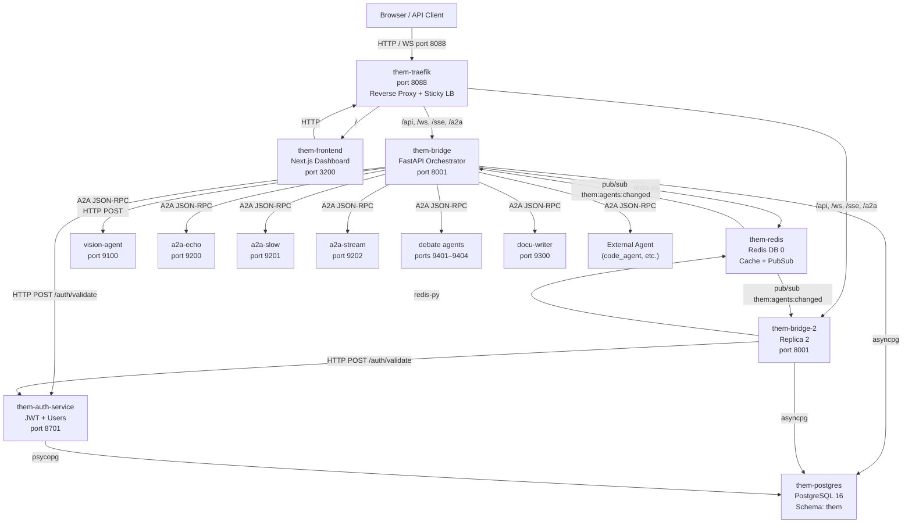
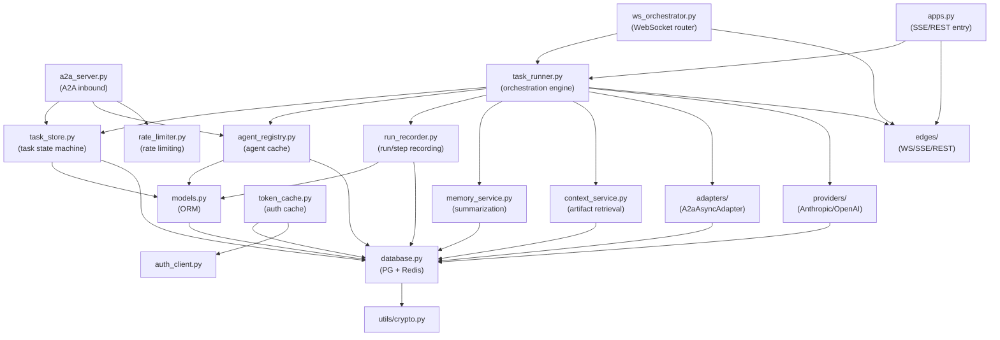
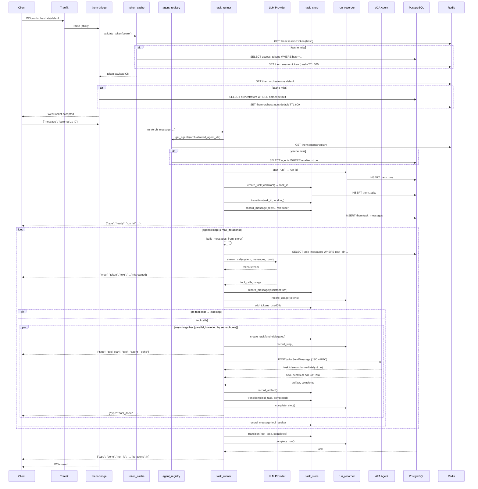
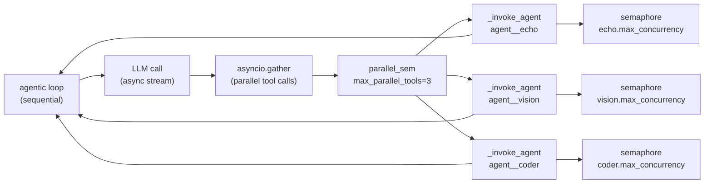
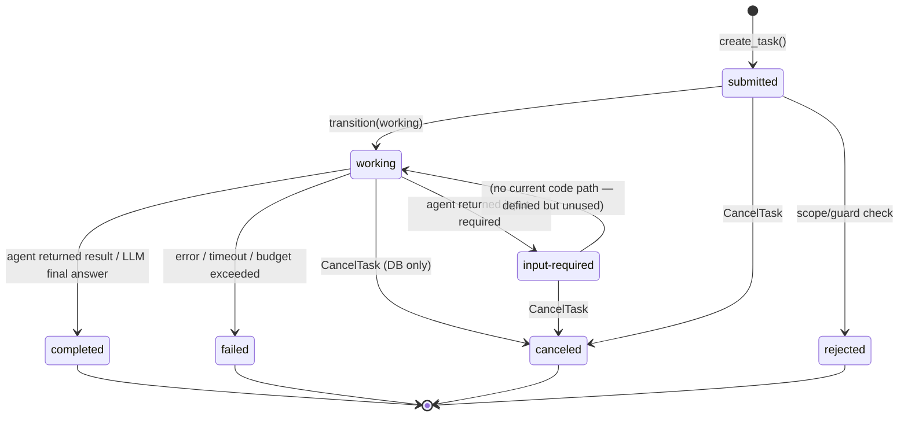

# the-M — Current Orchestration Architecture (As-Is)

**Platform**: the-M (codebase at `/opt/docker/odin`)  
**Document type**: As-Is architecture reference  
**Purpose**: Accurately capture the current implementation for evaluation against alternative runtimes  
**Date**: 2026-07-11  
**A2A SDK version**: v1.1.0  

> **Scope**: This document describes only what is currently implemented. It does not propose changes, improvements, or alternative approaches.

---

## Table of Contents

1. [High-Level Architecture](#1-high-level-architecture)
2. [Repository Structure](#2-repository-structure)
3. [Request Lifecycle](#3-request-lifecycle)
4. [Orchestrator](#4-orchestrator)
5. [Agent Discovery](#5-agent-discovery)
6. [Agent Invocation](#6-agent-invocation)
7. [Execution State](#7-execution-state)
8. [Parallelism](#8-parallelism)
9. [Failure Handling](#9-failure-handling)
10. [Long-Running Tasks](#10-long-running-tasks)
11. [Human Interaction](#11-human-interaction)
12. [Persistence](#12-persistence)
13. [Observability](#13-observability)
14. [A2A Usage](#14-a2a-usage)
15. [Responsibility Matrix](#15-responsibility-matrix)
16. [Current Pain Points](#16-current-pain-points)
17. [Source References](#17-source-references)
18. [Data Flow](#18-data-flow)
19. [Execution Model](#19-execution-model)
20. [State Machine](#20-state-machine)
21. [Orchestrator Memory](#21-orchestrator-memory)

---

## 1. High-Level Architecture

### Overview

the-M is a multi-agent orchestration platform. Its function is to accept user requests via WebSocket or SSE, plan iteratively using a configurable LLM, delegate sub-tasks to downstream agents via the A2A protocol, persist every state transition to PostgreSQL, and stream results back to the client.

The platform runs as a containerized stack. All external traffic enters through a Traefik reverse proxy on port 8088. The orchestration engine (`them-bridge`) runs one or two replicas. A separate auth microservice (`them-auth-service`) owns all user identity and JWT issuance. Downstream agents run as independent containers.

### Component Map

| Container | Role | Internal Port |
|---|---|---|
| `them-traefik` | Reverse proxy — single entry point, path routing, sticky LB | 8088 (host) |
| `them-postgres` | PostgreSQL 16 — all platform tables in schema `them` | 5432 (internal) |
| `them-redis` | Redis DB 0 — caching, pub/sub, rate limiting | 6379 (internal) |
| `them-auth-service` | JWT issuance, user/team management | 8701 (internal) |
| `them-bridge` | Orchestrator API + WebSocket (replica 1) | 8001 (internal) |
| `them-bridge-2` | Replica 2 (profile: replica) | 8001 (internal) |
| `them-frontend` | Next.js dashboard UI | 3200 (internal) |
| `vision-agent` | A2A vision/maps agent | 9100 (internal) |
| `a2a-echo/slow/stream` | A2A test agents (profile: test-agents) | 9200–9202 |
| debate agents | A2A debate agents (4 containers) | 9401–9404 |
| `docu-writer` | A2A documentation agent | 9300 (internal) |

### Architecture Diagram



**Confidence**: High  
**Reason**: Directly observed from `docker-compose.yml`, `app/main.py`, and all router files.

---

## 2. Repository Structure

### Directory Layout

```
/opt/docker/odin/
├── app/                          # FastAPI application — them-bridge
│   ├── main.py                   # App factory, lifespan, router registration
│   ├── config.py                 # Settings (Pydantic BaseSettings, env vars)
│   ├── models.py                 # SQLAlchemy ORM models (them schema)
│   ├── database.py               # DB engine, session factory, redis client
│   ├── _deps.py                  # FastAPI dependency functions (auth)
│   ├── adapters/                 # Outbound agent transport adapters
│   │   ├── base.py               # AgentAdapter ABC, AdapterEvent, NeutralTool
│   │   ├── factory.py            # get_adapter() dispatcher
│   │   ├── a2a_async_adapter.py  # A2A JSON-RPC + SSE/polling adapter
│   │   └── __init__.py
│   ├── edges/                    # Inbound client transport adapters
│   │   ├── base.py               # EdgeAdapter ABC, EdgeRequest
│   │   ├── registry.py           # Edge factory
│   │   ├── websocket_edge.py     # WebSocket implementation
│   │   ├── sse_edge.py           # SSE implementation
│   │   ├── rest_edge.py          # REST stub (NotImplementedError)
│   │   ├── voice_edge.py         # Voice stub (NotImplementedError)
│   │   └── __init__.py
│   ├── routers/
│   │   ├── ws_orchestrator.py    # WS /ws/orchestrate/{name} endpoint
│   │   ├── a2a_server.py         # A2A inbound server (JSON-RPC 2.0)
│   │   ├── apps.py               # Application entry points
│   │   ├── ws_dashboard.py       # Dashboard WebSocket
│   │   ├── runs.py               # Run history API
│   │   ├── admin_agents.py       # Agents CRUD
│   │   ├── admin_orchestrators.py# Orchestrators CRUD
│   │   ├── admin_tokens.py       # Access tokens CRUD
│   │   ├── admin_applications.py # Applications CRUD
│   │   ├── admin_llm_providers.py# LLM providers CRUD
│   │   ├── health.py             # Health check endpoint
│   │   ├── transcription.py      # STT endpoint
│   │   └── tts.py                # TTS endpoint
│   ├── services/
│   │   ├── task_runner.py        # Core orchestration engine (async generator)
│   │   ├── task_store.py         # Task state machine + artifact storage
│   │   ├── agent_registry.py     # Agent list with L1+L2 cache
│   │   ├── run_recorder.py       # Run/step/usage recording
│   │   ├── memory_service.py     # LLM context summarization
│   │   ├── context_service.py    # Artifact retrieval + Redis heads cache
│   │   ├── token_cache.py        # Bearer token validation (L1+L2 cache)
│   │   ├── rate_limiter.py       # Fixed-window rate limiter (Redis)
│   │   ├── auth_client.py        # HTTP client to them-auth-service
│   │   ├── dashboard_broadcaster.py # Redis pub/sub publisher for dashboard
│   │   └── providers/            # LLM provider implementations
│   │       ├── base.py           # LLMProvider ABC
│   │       ├── anthropic.py      # Anthropic streaming provider
│   │       ├── openai_compat.py  # OpenAI-compatible (OpenAI, Groq, Gemini)
│   │       └── __init__.py       # Provider factory
│   └── utils/
│       ├── crypto.py             # Fernet encrypt/decrypt for secrets
│       └── logger.py             # Structured logging
├── agents/                       # Downstream agent implementations
│   ├── a2a_echo/main.py          # Echo test agent (A2A SDK v1.1)
│   ├── a2a_slow/main.py          # Slow test agent (A2A SDK v1.1)
│   ├── a2a_stream/main.py        # Streaming test agent (A2A SDK v1.1)
│   ├── vision_agent/agent.py     # Vision agent (custom A2A, pre-SDK)
│   ├── docu_writer/main.py       # Documentation agent (A2A SDK)
│   └── debate/
│       ├── agent_evidence/main.py
│       ├── agent_logic/main.py
│       ├── agent_creative/main.py
│       └── agent_judge/main.py
├── auth_service/                 # them-auth-service (separate FastAPI app)
│   └── SCHEMA.sql                # Auth schema (auth_service.*)
├── db/                           # Database migrations (applied in order)
│   ├── 001_schema.sql            # Base schema
│   ├── 002_seed.sql              # Default agents and orchestrators
│   ├── 003_phase8.sql            # Memory columns
│   ├── 004_phase9.sql            # tasks.user_id, applications table
│   ├── 005_phase10.sql           # Budget / deadline / tokens_used
│   ├── 006_phase11.sql           # History window, edge types
│   ├── 007_docu_stack.sql        # Docu agents + orchestrator
│   └── 008_debate_stack.sql      # Debate agents + orchestrator
├── frontend/                     # Next.js dashboard
├── traefik/                      # Traefik configuration
├── scripts/tests/                # Test suite
└── docs/                         # Documentation
```

### Module Dependency Diagram



**Confidence**: High  
**Reason**: Directly derived from import statements across all files.

---

## 3. Request Lifecycle

### Step-by-Step (WebSocket path)

1. **Client connects** → `GET /ws/orchestrate/{name}` via Traefik (sticky session to a replica)
2. **Token validation** → `token_cache.validate_token()`: L1 dict → L2 Redis → DB; calls `auth_client.check_user_active()` on DB hit
3. **Orchestrator load** → `_load_orchestrator_row()`: Redis `them:orchestrators:{name}` → DB query
4. **Edge guard** → checks `orch.edges` list; if `"websocket"` not in list → reject with 4003 close
5. **Token scope check** → if token scoped to an orchestrator, validates match
6. **WebSocket accepted** → client sends first message as JSON `{"message": "..."}` or plain text
7. **`task_runner.run()` entered** → async generator begins
8. **Agent registry loaded** → `agent_registry.get_agents()`: L1 → L2 Redis → DB
9. **Skill discovery** → `_ensure_agent_skills()`: for each agent where `agent_card_url` set and `card_fetched_at` older than 1 hour, fetch `/.well-known/agent-card.json`, update `skills` column in DB
10. **Tool list built** → one `NeutralTool` per agent: `name=agent__{slug}`, `description=agent.description`, `schema=_build_agent_tool_schema(agent)`
11. **Run record created** → `run_recorder.start_run()` inserts `them.runs` row
12. **Root task created** → `task_store.create_task(kind="root")` inserts `them.tasks` row
13. **Root task → working** → `task_store.transition(task_id, "working")`
14. **User message persisted** → `task_store.record_message(seq=0, role="user", parts=[text])`
15. **`ready` event yielded** → `{"type": "ready", "run_id": ..., "task_id": ..., "context_id": ...}`
16. **Agentic loop begins** (see Section 4 for detail)
17. **Per iteration**: LLM stream → token events yielded to client → tool calls extracted
18. **Per tool call**: `_invoke_agent()` → child task created → A2A call → artifact streamed back
19. **Loop exits** → on `no tool calls` (natural completion) or `max_iterations` reached
20. **Run finalized** → `run_recorder.complete_run()` updates `them.runs`; root task → `completed`
21. **`done` event yielded** → `{"type": "done", "run_id": ..., "iterations": ...}`
22. **WebSocket closed** by server

### Sequence Diagram



**Confidence**: High  
**Reason**: Directly traced through `ws_orchestrator.py` and `task_runner.py`.

---

## 4. Orchestrator

### Where is the Orchestration Loop?

`app/services/task_runner.py`, function `run()` (async generator). The loop is a `while iteration < max_iterations` block, approximately lines 80–280.

### Is Planning Explicit or Implicit?

**Implicit.** There is no separate planning phase. The LLM receives all tools (one per agent) and decides which agents to call, in what order, and with what inputs, based solely on its reasoning about the user's goal and the tool descriptions. The system prompt may include instructions about sequencing (e.g., the debate orchestrator's system prompt encodes a strict 5-step protocol), but this is enforced via natural language, not code.

### Is Execution Sequential or Parallel?

**Both.** Within a single LLM iteration:
- If the LLM returns multiple tool calls in one response, they are dispatched **in parallel** via `asyncio.gather()`.
- If the LLM returns a single tool call per iteration, execution is **sequential** across iterations.

Across iterations, execution is always sequential — the loop waits for all tool calls in the current iteration to complete before calling the LLM again.

### Does it Recursively Call Agents?

**No recursion** in the platform code. Each `_invoke_agent()` call goes directly to a downstream A2A agent. There is no mechanism for an agent invoked by the-M to call back into the-M's orchestration loop.

Note: the-M itself is exposed as an A2A agent via `a2a_server.py`, so an external orchestrator could call the-M. In that case the-M starts a fresh orchestration run (not nested in an existing one).

### How Does it Determine the Next Action?

After each LLM call, the code inspects `tool_calls`:
- If `tool_calls` is non-empty → dispatch agents, persist tool results, continue loop.
- If `tool_calls` is empty → the LLM produced a final text answer → `break` out of loop.

The LLM itself decides which tool(s) to call. The-M provides no scoring, ranking, or planning layer.

### How Does it Determine Completion?

One of:
1. `tool_calls == []` → natural completion (LLM produced final answer)
2. `iteration >= max_iterations` → loop exits via `else` clause → `run_status = "stopped"`
3. `tokens_used >= budget_tokens` → loop exits early with `"Budget exceeded"` error
4. Client disconnects → `WebSocketDisconnect` exception caught in `ws_orchestrator.py` → generator abandoned (no cleanup beyond what `finally` blocks do)
5. Explicit cancel → `CancelTask` via A2A inbound → root task marked `canceled`

### How is Execution State Maintained?

**Fully rebuilt from PostgreSQL on every iteration.** The function `_build_messages_from_store()` re-queries `them.task_messages` at the start of each LLM call. This means the LLM message history is always consistent with the DB state, not an in-memory accumulation.

The local `messages` variable in the loop is rebuilt every iteration. The only in-memory state within a single run is:
- `iteration` counter (int)
- `tokens_used` counter (int, also mirrored in DB)
- `run_status` string

Everything else — task IDs, artifacts, tool results, conversation history — is in PostgreSQL.

### Loop Pseudocode

```
run_id = start_run()
task_id = create_task(root)
transition(task_id, working)
record_message(seq=0, user)
yield ready

iteration = 0
while iteration < max_iterations:
    if tokens_used >= budget_tokens:
        break with "Budget exceeded"

    messages = build_messages_from_store(task_id)
    messages = prior_history + messages  # multi-turn

    raw_response, tool_calls, usage = stream_llm(messages, tools)
    record_usage(usage)
    persist_assistant_turn(raw_response)
    tokens_used += usage.total

    if not tool_calls:
        break  # final answer

    results = await asyncio.gather(*[
        invoke_agent(tc) for tc in tool_calls
    ])

    persist_tool_results(results)

    if memory_enabled and should_summarize():
        summarize_context()

    iteration += 1
else:
    run_status = "stopped"

complete_run(run_status)
transition(task_id, completed or failed)
yield done
```

**Confidence**: High  
**Reason**: Directly traced through `task_runner.py`.

---

## 5. Agent Discovery

### Registration Mechanism

Agents are registered via the admin REST API (`POST /api/v1/admin/agents`) or directly via SQL. Each agent is a row in `them.agents`.

There is no automatic peer discovery or service registry. All agents must be explicitly registered with their endpoint URL and credentials.

### Agent Metadata (per `them.agents` row)

| Field | Type | Description |
|---|---|---|
| `id` | UUID | Primary key |
| `slug` | TEXT | `^[a-z0-9_]{1,48}$` — used in tool name `agent__{slug}` |
| `name` | TEXT | Human-readable label |
| `description` | TEXT | Sent to LLM as the tool description |
| `endpoint_url` | TEXT | A2A base URL (e.g., `http://a2a-echo:9200`) |
| `transport` | TEXT | Always `a2a_async` (only remaining transport) |
| `enabled` | BOOL | Only enabled agents appear in tool lists |
| `auth_token_encrypted` | TEXT | Fernet-encrypted bearer token for outbound calls |
| `input_schema` | JSONB | `{}` = auto-discover; `{properties: {...}}` = typed input |
| `skills` | JSONB | Auto-discovered from agent card; stored for reference |
| `agent_card_url` | TEXT | URL for `/.well-known/agent-card.json` |
| `card_fetched_at` | TIMESTAMPTZ | Last skill discovery timestamp |
| `supports_streaming` | BOOL | Whether to use SSE (true) or polling (false) |
| `supports_push` | BOOL | Whether agent supports push webhooks |
| `max_concurrency` | INT | Per-agent semaphore limit |
| `timeout_seconds` | INT | Per-agent adapter timeout |

### Capability Matching

There is no capability matching. The LLM selects agents based on the tool description in `agent.description`. There is no vector similarity, capability taxonomy, or programmatic selection logic.

### Agent Cards

The A2A agent card (`/.well-known/agent-card.json`) is fetched by `_ensure_agent_skills()` in `task_runner.py`. Results are stored in `agents.skills` JSONB. TTL: 1 hour (checked via `card_fetched_at`).

Agent card skills are **not** exposed as individual tools to the LLM. Only `agent.description` is used as the tool description. The skills data informs two things:
1. `input_modes` → determines whether to use typed JSON or string input in the A2A call
2. Stored in DB for admin inspection

An admin endpoint `POST /api/v1/admin/agents/discover` fetches a remote agent card and returns suggested `slug`, `description`, and `skills` for registration.

### Static vs Dynamic Registration

**Static.** All agent registrations are persisted in PostgreSQL. The registry is cached (L1 + L2 Redis) and invalidated on writes via pub/sub. There is no dynamic self-registration by agents at startup.

**Confidence**: High  
**Reason**: Fully traced through `admin_agents.py`, `agent_registry.py`, and `task_runner.py`.

---

## 6. Agent Invocation

### Protocol

All agent invocation uses the A2A protocol over HTTP. The implementation is `app/adapters/a2a_async_adapter.py`.

The transport type stored in `them.agents.transport` is always `a2a_async`. The `app/adapters/factory.py` `get_adapter()` function constructs an `A2aAsyncAdapter` for every agent.

### Task Creation

Each agent invocation creates:
- A `delegated` child task row in `them.tasks` (linked to the root task's `context_id`)
- A `them.run_steps` row for billing/analytics

### A2A Call — Send Phase

```
POST {endpoint_url}/a2a
Content-Type: application/json
Authorization: Bearer {decrypted_auth_token}

{
  "jsonrpc": "2.0",
  "method": "SendMessage",
  "id": 1,
  "params": {
    "message": {
      "messageId": "{uuid}",
      "contextId": "{context_id}",
      "role": "user",
      "parts": [
        {"text": "message content"}         // text mode
        // or for typed agents:
        {"text": "context summary"},        // optional context prefix
        {"data": {"key": "value", ...}}    // typed input dict
      ]
    },
    "returnImmediately": true
  }
}
```

Response: `result.task.id` extracted as `remote_task_id`.

### Streaming vs Polling

If `agent.supports_streaming=True`:
- `GET {endpoint_url}/tasks/{remote_task_id}/events` — SSE stream
- Each SSE event parsed as A2A TaskStatusUpdateEvent or TaskArtifactUpdateEvent

If `agent.supports_streaming=False`:
- `GET {endpoint_url}/tasks/{remote_task_id}` (GetTask) every `poll_interval` (default 1.0s)
- Loops until terminal state or `max_poll_seconds` (default 300s) elapsed

### Event Processing

Events streamed back from the agent are processed as `AdapterEvent` objects:

| AdapterEvent type | Action |
|---|---|
| `token` | Text accumulated into `accumulated_text` (not yielded to client during tool call) |
| `artifact` | Parsed into data parts (text → LLM result) and file parts (yielded as `file` events to client) |
| `done` | Result captured; loop exits |
| `error` | Child task marked `failed`; error string returned to LLM as tool result |
| `input_required` | Child task marked `input-required`; **no pause mechanism — treated as terminal** |

### Artifact Handling

Artifacts from agents are processed by `context_service.record_and_cache_artifact()`:
- Inserted into `them.artifacts` with `append_index` for chunked artifacts
- Redis heads cache invalidated: `DEL them:ctx:{context_id}:heads`
- `last_chunk=True` marks the final part of a chunked artifact

### Retries

**None.** There is no retry logic in `A2aAsyncAdapter`. A failed HTTP call or a terminal `failed` state from the agent is immediately returned as an error result to the LLM.

### Timeout Handling

`A2aAsyncAdapter` has:
- `timeout` parameter passed to `stream_invoke()` — used as `aiohttp` session timeout for individual HTTP requests
- `max_poll_seconds` (default 300s) — total wall-clock limit for polling loop

If polling exceeds `max_poll_seconds`, the adapter yields an `error` event: `"Agent timeout"`.

The `_reaper_loop()` background task additionally kills stale tasks at the DB level every 60 seconds.

### Cancellation

**Partial.** The-M can mark a root task as `canceled` via `task_store.transition(task_id, "canceled")`. However:
- In-flight `asyncio.gather()` calls are not cancelled (`asyncio.CancelledError` is not sent to running `_invoke_agent` tasks)
- A cancel call via `/a2a` CancelTask transitions the DB row but does not signal running Python coroutines
- The `_reaper_loop` does not cancel running tasks; it only marks `working` tasks past their `deadline` as `failed`

### Follow-Up Requests (Multi-Turn)

Multi-turn conversations are supported at the **orchestrator** level, not at the agent level. Each new user message creates a new root task with the same `context_id`. Prior root task messages are loaded via `_load_context_history()` and prepended to the LLM messages on each new run.

Individual agent calls are always new A2A `SendMessage` requests. There is no mechanism to continue a specific prior agent task or send follow-up messages to an agent mid-run.

**Confidence**: High  
**Reason**: Fully traced through `a2a_async_adapter.py`, `task_runner.py`, `_invoke_agent()`, and `task_store.py`.

---

## 7. Execution State

### Where State Lives

| State Type | Storage | Key / Location |
|---|---|---|
| Run metadata | PostgreSQL | `them.runs` |
| Root task | PostgreSQL | `them.tasks` (kind=root) |
| Delegated tasks | PostgreSQL | `them.tasks` (kind=delegated) |
| LLM conversation history | PostgreSQL | `them.task_messages` |
| Agent artifacts | PostgreSQL | `them.artifacts` |
| Run steps (billing) | PostgreSQL | `them.run_steps` |
| Token usage per iteration | PostgreSQL | `them.run_usage` |
| Context memory summary | Redis | `them:ctx:{context_id}:summary` TTL 3600s |
| Artifact heads cache | Redis | `them:ctx:{context_id}:heads` TTL 300s |
| Agent registry | Redis + In-process | `them:agents:registry` TTL 600s + `_l1_cache` |
| Orchestrator config | Redis | `them:orchestrators:{name}` TTL 600s |
| Auth token | Redis + In-process | `them:session:token:{hash}` TTL 300s + `_l1` dict |
| Iteration counter | In-process (Python int) | Local variable in `run()` |
| Accumulated LLM text | In-process (Python str) | Local variable in `run()` |
| Remote agent task IDs | In-process (Python str) | Local variable in `_invoke_agent()` |

### Context IDs

`context_id` (UUID) groups related tasks across multiple user turns. It is:
- Generated once on first connection if not provided by the client
- Passed through to all child tasks and A2A agent calls as `contextId`
- Used to query prior conversation history for multi-turn
- Used to scope the context memory summary in Redis

### Sessions

There is no explicit session table. A "session" is implicitly defined by a `context_id`. Continuity across WebSocket connections is maintained by the client re-using the same `context_id`.

### Conversations

Conversations are stored as `them.task_messages` rows ordered by `(task_id, seq)`. Each row contains `role` (`user`/`agent`/`system`) and `parts` (JSONB — serialized in provider-native format).

Multi-turn history is loaded by `_load_context_history()`: queries all root tasks sharing the same `context_id` (excluding the current task), loads their `task_messages`, deserializes via `provider.deserialize_history()`, limited by `orch.history_window` (default 20 turns).

### Intermediate Results

Intermediate agent outputs within a single run are not stored as separate intermediate state. They are:
1. Persisted as `them.artifacts` immediately upon receipt
2. Serialized into `them.task_messages` as tool results (the LLM's context for the next iteration)

**Confidence**: High  
**Reason**: Directly observed from `task_runner.py`, `task_store.py`, `models.py`, and all DB schema files.

---

## 8. Parallelism

### What Executes Concurrently

Within a single LLM iteration: all tool calls returned by the LLM in that iteration are dispatched concurrently via `asyncio.gather()`.

```python
results = await asyncio.gather(*[_run_one(tc) for tc in tool_calls_this_iter])
```

Concurrency is bounded by two semaphores:
- **`parallel_sem`**: `asyncio.Semaphore(orch.max_parallel_tools)` — global per-run limit
- **`semaphores[agent_id]`**: `asyncio.Semaphore(agent.max_concurrency)` — per-agent limit

Background tasks run concurrently with all runs:
- `start_change_listener()` — Redis pub/sub listener for cache invalidation
- `_reaper_loop()` — deadline enforcement (runs every 60s)
- A2A inbound tasks created with `asyncio.create_task()` (detached runs)

### What Executes Sequentially

- LLM iterations: iteration N+1 begins only after all tool calls from iteration N have completed
- Artifact persistence within a single `_invoke_agent()` call
- Task state transitions within a single `_invoke_agent()` call

### Dependency Management

There is no explicit dependency graph between tool calls. The LLM decides which tools to call in each iteration. If the LLM needs the output of agent A before calling agent B, it must call them in separate iterations (A in iteration 1, B in iteration 2). The LLM can call A and B in parallel in the same iteration if no dependency is implied.

No DAG or explicit dependency declaration mechanism exists.

### Async Execution

All I/O is async (`asyncio`). Key async operations:
- All DB queries: asyncpg via SQLAlchemy 2.0 async
- All Redis operations: redis-py async client
- All outbound A2A HTTP calls: aiohttp
- All inbound LLM streaming: provider SDK async streams
- All WebSocket operations: FastAPI WebSocket (Starlette)

### Concurrency Diagram



**Confidence**: High  
**Reason**: Directly observed in `task_runner.py` `asyncio.gather` call and semaphore construction.

---

## 9. Failure Handling

### Agent Failure

If an A2A agent returns a terminal `failed` or `rejected` state, `A2aAsyncAdapter` yields an `AdapterEvent(type="error", error="...")`. `_invoke_agent()` catches this and:
1. Marks the child task as `failed` in DB
2. Returns the error string as the tool result to the LLM

The LLM receives the error message as a tool result and may attempt recovery or surface the error in its final answer. **There is no automatic retry.** The orchestration loop continues with the next iteration.

### Timeout

Two timeout mechanisms:

1. **Adapter-level**: `max_poll_seconds` (default 300s) — if polling loop runs past this, yields `AdapterEvent(type="error", error="Agent timeout")`. Treated same as agent failure.
2. **Reaper-level**: `_reaper_loop()` runs every 60s; sets `state=failed` on any `them.tasks` row where `deadline < now()` and `state IN (working, input-required)`.

A2A inbound tasks get `deadline = now() + 30min`. Orchestration-internal delegated tasks have no deadline set (deadline is `NULL` in DB).

### Malformed / Invalid Response

`A2aAsyncAdapter` wraps SSE parsing and JSON-RPC response parsing in try/except. On parse failure:
- Polling path: exception propagates and is caught by the outer `try/except Exception` in `_invoke_agent()` → marks child task `failed`, returns error string to LLM
- Streaming path: SSE parse error similarly propagates

JSON fallback in debate agents: if LLM returns malformed JSON for typed input, agents have a local fallback to extract `opponent_arguments` from raw text (observed in debate agent implementations).

### Partial Response

Artifacts with `append=True` in the A2A protocol are accumulated. If the agent disconnects mid-stream before `last_chunk=True`:
- The artifacts already received are persisted with `last_chunk=False`
- The adapter loop exits (SSE connection closed) → yields `done` or error
- The partial content is returned to the LLM as whatever text was accumulated

### Duplicate Execution

No idempotency layer. If the same `SendMessage` is sent twice (e.g., due to a bug), two tasks are created and two agent invocations happen. The fork-bomb guard (`count_context_tasks() >= 50`) is the only protection against runaway task creation.

### Cancellation

- **Root task cancel** (via A2A `CancelTask`): transitions DB state to `canceled`. Does not interrupt the running Python coroutine in `task_runner.run()`.
- **WebSocket disconnect**: `WebSocketDisconnect` exception is raised in `ws_orchestrator.py`. The `run()` generator is abandoned. The `finally` block in `ws_orchestrator.py` calls `run_recorder.complete_run()` with `status="error"`. In-flight `asyncio.gather()` tasks continue running in the background until completion or timeout (no cancellation signal sent).
- **A2A cancel propagation**: there is no mechanism to forward a cancel signal to downstream A2A agents.

### Application Restart

The-M does not resume in-flight runs on restart. On `docker compose restart`:
- All `them.runs` rows in `status=running` remain stuck
- All `them.tasks` rows in `state=working` remain stuck
- The `_reaper_loop()` will eventually mark tasks as `failed` when their `deadline` is passed (for tasks that have a deadline)
- Tasks without a deadline (orchestration-internal delegated tasks) remain stuck indefinitely

The `PATCH /runs/{run_id}/cancel` admin endpoint can force-cancel a stuck run.

**Confidence**: High  
**Reason**: Directly observed in `a2a_async_adapter.py`, `task_runner.py`, `ws_orchestrator.py`, and `a2a_server.py`. Restart behavior inferred from absence of recovery logic.

---

## 10. Long-Running Tasks

### Background Execution

**Partial.** A2A inbound requests with `returnImmediately=True` run as detached `asyncio.create_task()` coroutines in `a2a_server.py`. The caller receives a `working` task immediately and can poll via `GetTask`.

WebSocket and SSE orchestration runs are always in the foreground (tied to the connection lifecycle).

### Waiting for External Events

**Not implemented.** There is no `wait_for_event()`, webhook listener, or signal mechanism for pausing an in-progress run and resuming when an external event occurs.

### Waiting for User Input

**Not implemented.** The `input-required` state exists in the task state machine (`them.tasks`) and in the A2A protocol, but there is no mechanism in `task_runner.py` to pause the orchestration loop and wait for client input. If an agent returns `input-required`, it is treated as a terminal event (see Section 6 — `input_required` AdapterEvent handling).

### Long-Running Agents

Supported only via polling. The `max_poll_seconds` parameter (default 300s, per-agent configurable via `timeout_seconds`) controls the maximum wait. The `a2a-slow` test agent (5s delay) is within this range. There is no mechanism for agents that take longer than `max_poll_seconds`.

### Resume After Restart

**Not implemented.** A run that is interrupted by a server restart does not resume. See Section 9 — Application Restart.

**Confidence**: High  
**Reason**: Directly observed from `task_runner.py`, `a2a_server.py`, and the task state machine. Absence of resume logic directly confirmed.

---

## 11. Human Interaction

### Approvals

**Not implemented.** There is no approval gate, human-in-the-loop checkpoint, or authorization step within the orchestration loop.

### Authentication Challenges

**Not implemented.** If a downstream agent requires additional authentication, there is no mechanism to surface this to the user. The-M's auth model handles only inbound token validation.

### Clarification / User Input Mid-Run

**Not implemented.** Once a run begins, the orchestration loop runs to completion without any mechanism to pause and ask the user a question mid-run. The only user interaction point is the initial message.

The `input-required` A2A state is recognized but treated as a terminal error, not as a pause-and-wait signal.

**Confidence**: High  
**Reason**: Directly confirmed by absence of any pause/resume mechanism in `task_runner.py` and `ws_orchestrator.py`.

---

## 12. Persistence

### What is Persisted and Where

| Item | Table | Storage | Notes |
|---|---|---|---|
| Run metadata | `them.runs` | PostgreSQL | status, tokens, cost, iterations |
| Run steps | `them.run_steps` | PostgreSQL | per-agent invocation |
| Token usage | `them.run_usage` | PostgreSQL | per LLM iteration |
| Root tasks | `them.tasks` (kind=root) | PostgreSQL | state machine |
| Delegated tasks | `them.tasks` (kind=delegated) | PostgreSQL | per-agent child task |
| LLM conversation history | `them.task_messages` | PostgreSQL | serialized per-iteration |
| Agent artifacts | `them.artifacts` | PostgreSQL | chunked, JSONB parts |
| Context memory summary | Redis | Redis only | TTL 3600s; also persisted as artifact for durability |
| Agent config | `them.agents` | PostgreSQL | with L1+L2 Redis cache |
| Orchestrator config | `them.orchestrators` | PostgreSQL | with Redis cache |
| Access tokens | `them.access_tokens` | PostgreSQL | sha256 hash only |
| Audit logs | `them.audit_logs` | PostgreSQL | |
| Applications | `them.applications` | PostgreSQL | |

### What is NOT Persisted (In-Memory Only)

| Item | Location | Lifetime |
|---|---|---|
| Iteration counter | Python local var in `run()` | Single run |
| Accumulated LLM streaming text | Python local var | Single LLM iteration |
| Remote agent task IDs (`remote_task_id`) | Python local var in `_invoke_agent()` | Single agent call |
| `_l1_cache` (agent list) | Module-level list | Process lifetime |
| `_l1` (token cache dict) | Module-level dict | Process lifetime |

### Context Memory Durability

Context summaries are stored in Redis (TTL 3600s) as the primary store. As a secondary durability mechanism, the memory service also persists the summary as an artifact row in `them.artifacts`. However, on Redis eviction without a DB reload, the summary is lost for the current session unless the context_service reads from artifacts.

**Confidence**: High  
**Reason**: Directly traced through `task_store.py`, `run_recorder.py`, `memory_service.py`, and `models.py`.

---

## 13. Observability

### Logging

`app/utils/logger.py` provides a structured logger. All major events log:
- Agent invocation start/end
- LLM call start/end with token counts
- Task state transitions
- Cache hits/misses
- Redis pub/sub events

Log format is standard Python `logging`. No structured JSON output is configured. Logs go to stdout (captured by Docker).

### Dashboard (Real-Time)

`/ws/dashboard` WebSocket endpoint provides a real-time pub/sub relay. Events published during runs are relayed to the dashboard:
- `run_start`, `iteration_start`, `tool_start`, `tool_done`, `usage`, `run_end`
- Agent status changes

The dashboard WebSocket multiplexes multiple logical channels (`runs`, `run:<uuid>`, `agents`, `metrics`) over a single connection.

### Run History

`GET /api/v1/runs` — queryable run history with status, token counts, cost.
`GET /api/v1/runs/stats` — aggregate statistics.
`GET /api/v1/runs/{run_id}` — full run detail with steps and per-iteration usage.

### Task Graph

`GET /api/v1/runs/{run_id}/tasks` — returns the task tree (root + all delegated tasks) with state and timestamps.

### Artifacts

`GET /api/v1/runs/{run_id}/artifacts` — all artifacts for a run.
`GET /api/v1/runs/context/{context_id}/artifacts` — memory inspector for a context.

### Tracing

**Not implemented.** There is no distributed tracing (OpenTelemetry, Jaeger, Zipkin, etc.). Runs can be correlated manually via `run_id`, `task_id`, and `context_id` in logs.

### Metrics

**Not implemented** as a scrape endpoint. No Prometheus `/metrics` endpoint. Cost tracking (USD per run) is available in the DB via `them.run_usage` and `them.runs.cost_usd`.

### Debugging

- `run_id` and `task_id` are returned in the `ready` event to the client
- `context_id` is exposed for multi-turn correlation
- Dashboard WebSocket provides real-time visibility into running tasks
- Admin can query run history and artifact content via REST API

**Confidence**: High  
**Reason**: Directly observed from `logger.py`, `ws_dashboard.py`, `run_recorder.py`, `runs.py`, and dashboard event publishing in `task_runner.py`. Absence of tracing/metrics directly confirmed.

---

## 14. A2A Usage

### Overview

the-M uses A2A in two directions:
1. **Outbound** (the-M as client): calls downstream A2A agents to delegate sub-tasks
2. **Inbound** (the-M as server): exposes itself as an A2A agent for external orchestrators

### Agent Cards

| Feature | Status | Notes |
|---|---|---|
| Fetching remote agent cards | Implemented | `_ensure_agent_skills()` — TTL 1 hour |
| Storing card skills in DB | Implemented | `them.agents.skills` JSONB |
| Exposing own agent card | Implemented | `GET /.well-known/agent-card.json` |
| Card-based capability routing | Not implemented | LLM uses `agent.description` only |
| Admin-triggered card discovery | Implemented | `POST /admin/agents/discover` |

### Tasks

| Feature | Status | Notes |
|---|---|---|
| SendMessage (outbound) | Implemented | JSON-RPC 2.0, `returnImmediately=true` |
| GetTask (outbound poll) | Implemented | Used when `supports_streaming=false` |
| CancelTask (outbound) | Not implemented | No outbound cancel sent to agents |
| CancelTask (inbound) | Implemented | Transitions root task to `canceled` |
| Task state machine | Implemented | 7 states: submitted/working/input-required/completed/failed/canceled/rejected |
| Task deadlines | Implemented | `_reaper_loop` enforces TTL on A2A inbound tasks |
| Task budget (tokens) | Implemented | `budget_tokens` + `tokens_used` on `them.tasks` |

### Messages

| Feature | Status | Notes |
|---|---|---|
| TextPart in outbound messages | Implemented | Generic agent: `[{"text": "..."}]` |
| DataPart in outbound messages | Implemented | Typed agents: `[{"text": ctx}, {"data": {...}}]` |
| contextId threading | Implemented | Passed in all outbound SendMessage calls |
| messageId | Implemented | UUID generated per call |
| Multi-part messages | Implemented | Text + Data combination |
| FilePart in outbound | Not implemented | |
| Inbound message parsing | Implemented | `a2a_server.py` |

### Artifacts

| Feature | Status | Notes |
|---|---|---|
| Receiving artifacts (outbound) | Implemented | Parsed in `A2aAsyncAdapter` |
| Persisting artifacts | Implemented | `them.artifacts` via `context_service` |
| Chunked artifacts (`append=True`) | Implemented | Tracked with `append_index` |
| `last_chunk` marker | Implemented | `them.artifacts.last_chunk` |
| File artifacts → client `file` events | Implemented | Media type check in `_invoke_agent` |
| Serving artifacts (inbound) | Implemented | `GetTask` returns artifacts |
| mediaType normalization | Implemented | `media_type` normalized at ingestion |

### Streaming

| Feature | Status | Notes |
|---|---|---|
| SSE event streaming (outbound receive) | Implemented | When `agent.supports_streaming=true` |
| SSE event streaming (inbound serve) | Not implemented | Inbound `GetTask` returns snapshot only |
| Token-level streaming to end client | Implemented | LLM tokens yielded via WS/SSE |
| Artifact streaming to end client | Implemented | `file` events forwarded |

### Context IDs

| Feature | Status | Notes |
|---|---|---|
| `contextId` in outbound calls | Implemented | UUID passed in all `SendMessage` |
| `contextId` for multi-turn grouping | Implemented | Used to load prior history |
| `contextId` for memory scoping | Implemented | Redis key `them:ctx:{context_id}:summary` |

### Task IDs

| Feature | Status | Notes |
|---|---|---|
| Remote task ID tracking | Implemented | Stored in local var during poll/stream |
| Remote task ID persistence | Not implemented | `remote_task_id` not stored in DB |
| Task correlation (local ↔ remote) | Partial | `run_steps` records `agent_id` but not remote task ID |

### Push Webhooks

| Feature | Status | Notes |
|---|---|---|
| `supports_push` flag | Implemented | Column in `them.agents` |
| Push webhook endpoint | Implemented | `POST /a2a/push/{task_id}` |
| Outbound push subscription | Not implemented | Adapter does not register webhook with agent |

**Confidence**: High for implemented features (directly observed in code). High for not-implemented (confirmed by absence).

---

## 15. Responsibility Matrix

| Responsibility | Current Component |
|---|---|
| Planning | LLM (implicit, via tool selection) |
| Agent Selection | LLM (via tool call choice) |
| Agent Discovery | `admin_agents.py` (manual registration) + `_ensure_agent_skills()` (card fetch) |
| Execution | `task_runner.py` → `a2a_async_adapter.py` |
| Retry | Not implemented |
| Timeout | `a2a_async_adapter.py` (`max_poll_seconds`) + `_reaper_loop()` (deadline) |
| Parallel Execution | `asyncio.gather()` in `task_runner.py`, bounded by semaphores |
| Conversation Management | `task_store.record_message()` + `_build_messages_from_store()` |
| Memory (context summary) | `memory_service.py` → Redis + `them.artifacts` |
| Persistence | `task_store.py` + `run_recorder.py` → PostgreSQL |
| Execution State | `them.tasks` (PostgreSQL) + local Python vars |
| Result Evaluation | LLM (implicit — decides if answer is complete) |
| Security (auth) | `token_cache.py` + `auth_client.py` + `them-auth-service` |
| Security (secrets) | `utils/crypto.py` (Fernet encryption) |
| Policies (rate limiting) | `rate_limiter.py` (Redis fixed-window) |
| Policies (budget) | `task_store.add_tokens_used()` + loop budget check |
| A2A Communication (outbound) | `a2a_async_adapter.py` |
| A2A Communication (inbound) | `a2a_server.py` |
| Artifacts | `context_service.py` + `them.artifacts` |
| Streaming (to client) | `ws_orchestrator.py` / `apps.py` (WS/SSE edges) |
| Streaming (from agents) | `a2a_async_adapter.py` (SSE receive) |
| Cancellation | `task_store.transition(canceled)` (DB only — no signal propagation) |
| Human Approval | Not implemented |
| Logging | `utils/logger.py` (stdout) |
| Tracing | Not implemented |
| Metrics | Not implemented (cost in DB only) |
| Dashboard / Real-Time | `ws_dashboard.py` + Redis pub/sub |
| Run History | `runs.py` + `them.runs/run_steps/run_usage` |
| Cache Invalidation | `agent_registry.py` pub/sub + TTL expiry |
| Multi-Replica Coordination | Redis pub/sub (agent changes) + sticky sessions (Traefik) |

---

## 16. Current Pain Points

These are directly observable from the implementation — no speculation.

### 1. No Retry Logic

`app/adapters/a2a_async_adapter.py` has zero retry logic. A transient HTTP error or a 500 from an agent terminates the child task immediately. The error is surfaced to the LLM, which may or may not attempt recovery.

### 2. Cancellation Does Not Propagate

`task_store.transition(task_id, "canceled")` updates the DB row. Running Python coroutines in `asyncio.gather()` are not interrupted. In-flight A2A calls to downstream agents are not cancelled. The-M cannot forward a `CancelTask` to a downstream agent.

### 3. No Resume After Restart

`them.runs` rows in `status=running` and `them.tasks` rows in `state=working` are not recovered on restart. The `_reaper_loop()` catches tasks with explicit `deadline` set, but orchestration-internal delegated tasks have no deadline, so they remain stuck.

### 4. In-Flight Tasks Continue After WS Disconnect

When a WebSocket disconnects, `asyncio.gather()` tasks in progress continue running until completion or timeout. There is no mechanism to detect disconnect and abort in-flight agent calls.

### 5. `input-required` State is Effectively Dead

The `input-required` state exists in the task state machine and A2A protocol, but `task_runner.py` has no code path to pause the loop and wait for user input. An agent returning `input-required` is treated as a terminal failure.

### 6. Remote Task ID Not Persisted

`remote_task_id` (the A2A task ID on the downstream agent) is stored only as a Python local variable in `_invoke_agent()`. It is not persisted in `them.run_steps` or `them.tasks`. If a run is interrupted mid-invocation, there is no way to re-attach to the in-progress agent task.

### 7. Context Memory is Redis-Primary

The context summary is stored in Redis with TTL 3600s. While it is also persisted as an artifact, the primary read path is Redis only (`get_injected_context()` reads only the Redis key). A Redis restart or eviction under memory pressure causes the summary to be lost for the current session, and there is no automatic reload from the artifact fallback.

### 8. Parallel Tool Call Completion is All-or-Nothing

`asyncio.gather()` with no `return_exceptions=True` means an unhandled exception in any `_run_one()` call cancels all pending coroutines in the gather. The code does use `return_exceptions=True`-equivalent handling via try/except inside `_run_one`, but a truly unhandled exception (e.g., a bug) could silently lose partial results.

### 9. Edge Types `rest` and `voice` are Stubs

`rest_edge.py` and `voice_edge.py` raise `NotImplementedError`. The `webrtc` application entry point type is accepted in the DB schema but has no implementation in `apps.py`.

### 10. Orchestrator Cache Missing `budget_tokens`

The Redis-cached orchestrator object (`_OrchestratorProxy`) does not include `budget_tokens` (added in a later migration). The code falls back to `None` when loading from cache, which silently disables budget enforcement for cache-served orchestrators until the cache expires.

**Confidence**: High  
**Reason**: Each item directly observable in source code. No inference required.

---

## 17. Source References

### Section 1 — Architecture
- `docker-compose.yml` — container definitions, ports, profiles
- `docker-compose.local.yml` — local overrides
- `traefik/traefik.yml` — routing rules, sticky sessions
- `app/main.py` — router registration, lifespan handlers

### Section 2 — Repository Structure
- All files under `app/`, `agents/`, `db/`, `auth_service/`

### Section 3 — Request Lifecycle
- `app/routers/ws_orchestrator.py` — WebSocket entry point, token validation, edge guard
- `app/services/task_runner.py` — `run()` async generator (full lifecycle)
- `app/services/token_cache.py` — `validate_token()`
- `app/services/agent_registry.py` — `get_agents()`
- `app/services/run_recorder.py` — `start_run()`, `complete_run()`
- `app/services/task_store.py` — `create_task()`, `transition()`, `record_message()`

### Section 4 — Orchestrator
- `app/services/task_runner.py` — `run()`, `_build_messages_from_store()`, `_load_context_history()`, `_build_agent_tool_schema()`
- `app/services/providers/base.py` — `LLMProvider`, `NeutralTool`, `LLMStreamEvent`
- `app/services/providers/anthropic.py` — `AnthropicProvider.stream_call()`
- `app/models.py` — `Orchestrator` model fields

### Section 5 — Agent Discovery
- `app/routers/admin_agents.py` — agent CRUD, discover endpoint
- `app/services/agent_registry.py` — `get_agents()`, `invalidate_registry()`
- `app/services/task_runner.py` — `_ensure_agent_skills()`, `_load_agents()`
- `app/models.py` — `Agent` model fields

### Section 6 — Agent Invocation
- `app/adapters/a2a_async_adapter.py` — `A2aAsyncAdapter.stream_invoke()`, `_build_parts()`, `_poll_until_done()`, `_stream_until_done()`
- `app/adapters/base.py` — `AgentAdapter`, `AdapterEvent`
- `app/adapters/factory.py` — `get_adapter()`
- `app/services/task_runner.py` — `_invoke_agent()`, `_run_one()`
- `app/services/context_service.py` — `record_and_cache_artifact()`

### Section 7 — Execution State
- `app/services/task_store.py` — all functions
- `app/services/run_recorder.py` — all functions
- `app/services/memory_service.py` — `get_injected_context()`, `summarize_context()`
- `app/models.py` — `Task`, `TaskMessage`, `Artifact`, `Run`, `RunStep`, `RunUsage`
- `db/001_schema.sql` — canonical schema

### Section 8 — Parallelism
- `app/services/task_runner.py` — `asyncio.gather()` call, semaphore construction
- `app/models.py` — `Orchestrator.max_parallel_tools`, `Agent.max_concurrency`

### Section 9 — Failure Handling
- `app/adapters/a2a_async_adapter.py` — error handling in `_poll_until_done()`, `_stream_until_done()`
- `app/services/task_runner.py` — `_invoke_agent()` try/except, WS disconnect handling
- `app/routers/ws_orchestrator.py` — `WebSocketDisconnect` catch
- `app/main.py` — `_reaper_loop()`
- `app/services/task_store.py` — `_TRANSITIONS` dict

### Section 10 — Long-Running Tasks
- `app/routers/a2a_server.py` — `asyncio.create_task()` for detached runs
- `app/adapters/a2a_async_adapter.py` — `max_poll_seconds`
- `app/main.py` — `_reaper_loop()`

### Section 11 — Human Interaction
- `app/services/task_runner.py` — absence of pause/resume logic
- `app/services/task_store.py` — `input-required` state definition

### Section 12 — Persistence
- `app/services/task_store.py` — all DB write operations
- `app/services/run_recorder.py` — all DB write operations
- `app/services/memory_service.py` — Redis + artifact persistence
- `db/001_schema.sql` through `db/008_debate_stack.sql`

### Section 13 — Observability
- `app/utils/logger.py` — logger setup
- `app/routers/ws_dashboard.py` — dashboard WebSocket, channel relay
- `app/services/task_runner.py` — `_publish_dash()` calls
- `app/routers/runs.py` — run history endpoints

### Section 14 — A2A Usage
- `app/adapters/a2a_async_adapter.py` — full A2A client implementation
- `app/routers/a2a_server.py` — A2A server implementation
- `agents/a2a_echo/main.py`, `agents/a2a_slow/main.py`, `agents/a2a_stream/main.py` — A2A SDK v1.1 patterns
- `docs/A2A_REFERENCE.md` — A2A SDK ground truth

### Section 15 — Responsibility Matrix
- Cross-references all files above

### Section 16 — Pain Points
- `app/adapters/a2a_async_adapter.py` — no retry (directly verified)
- `app/services/task_runner.py` — WS disconnect handling, `asyncio.gather()` usage
- `app/services/task_store.py` — `transition()` DB-only
- `app/services/memory_service.py` — Redis-primary read
- `app/edges/rest_edge.py`, `app/edges/voice_edge.py` — `NotImplementedError`
- `db/005_phase10.sql` — `budget_tokens` column (added late, not in cache proxy)

---

*Document generated from direct codebase analysis. Files analyzed: 48 Python source files, 8 SQL migration files, 7 documentation files, docker-compose configuration. All claims are traceable to specific source files listed in Section 17.*

---

## 18. Data Flow

This section traces exactly what data moves between which components, in what format, at each stage of a run.

### 18.1 Inbound — Client to Platform

```
Client
  │
  │  WebSocket frame: {"message": "user goal text"}
  ▼
ws_orchestrator.py
  │  Extracts: orchestrator_name (path param), bearer token (header), raw message text
  │  Calls: token_cache.validate_token(token) → token_payload dict
  │  Calls: _load_orchestrator_row(name) → _OrchestratorProxy
  │
  ▼
task_runner.run()        [async generator]
  │  Receives: orchestrator_name, user_message (str), user_id (int), token_payload (dict),
  │            session_id (UUID), context_id (UUID)
  │  Emits upstream: event dicts {"type": ..., ...}
```

### 18.2 Startup Phase Data Flow

```
task_runner.run()
  │
  ├─► agent_registry.get_agents(allowed_agent_ids)
  │     DB: SELECT agents WHERE enabled AND id IN (allowed_ids)
  │     Returns: list[Agent ORM objects]
  │
  ├─► _ensure_agent_skills(agent)  [per agent, TTL-gated]
  │     HTTP GET {endpoint}/.well-known/agent-card.json
  │     Writes:  agent.skills (JSONB), agent.card_fetched_at
  │     DB:      UPDATE agents SET skills=..., card_fetched_at=...
  │
  ├─► Tool list construction
  │     Input:   list[Agent]
  │     Output:  list[NeutralTool]  {"name": "agent__{slug}", "description": ..., "schema": {...}}
  │
  ├─► run_recorder.start_run()
  │     DB INSERT: them.runs → run_id (UUID)
  │
  ├─► task_store.create_task(kind=root)
  │     DB INSERT: them.tasks → root_task (Task ORM)
  │     Redis PUBLISH: them:tasks:{id}:events → {"type": "task_created", ...}
  │
  ├─► task_store.transition(task_id, "working")
  │     DB UPDATE: them.tasks SET state="working"
  │     Redis PUBLISH: them:tasks:{id}:events → {"type": "task_state", "state": "working"}
  │
  ├─► task_store.record_message(seq=0, role="user", parts={"content": user_message})
  │     DB INSERT: them.task_messages
  │
  └─► Yield {"type": "ready", "run_id": ..., "task_id": ..., "context_id": ...}
        Redis PUBLISH: them:dash:run:{run_id} + them:dash:runs
```

### 18.3 Per-Iteration Data Flow

```
[Start of iteration N]
  │
  ├─► _load_context_history()                           [multi-turn — prior turns]
  │     DB: SELECT tasks WHERE context_id=... AND kind=root AND id != current
  │         SELECT task_messages WHERE task_id IN (prior_task_ids) ORDER BY seq
  │     Returns: list of provider-native message objects (prior_history)
  │
  ├─► _build_messages_from_store()                      [current turn]
  │     DB: SELECT task_messages WHERE task_id=current ORDER BY seq
  │     provider.deserialize_history(rows) → provider-native list
  │     Returns: current_messages
  │
  ├─► messages = prior_history + current_messages
  │
  ├─► provider.stream_call(system, messages, tools, max_tokens=4096)
  │     HTTP stream to LLM API (Anthropic / OpenAI / Groq / Gemini)
  │     Yields: LLMStreamEvent objects
  │       type="token"           → text fragment
  │       type="tool_calls_ready"→ {tool_calls: [ToolCall], raw_response, usage: TokenUsage}
  │       type="done"            → {answer: str, raw_response, usage: TokenUsage}
  │       type="error"           → {error: str}
  │
  ├─► [token events] → Yield {"type": "token", "text": "..."} to client (streaming)
  │
  ├─► [on tool_calls_ready or done]
  │     record_usage: DB INSERT them.run_usage (provider, model, input/output tokens, cost)
  │     add_tokens_used: DB UPDATE them.tasks SET tokens_used += N
  │     Redis PUBLISH: them:dash:run:{run_id} → {"type": "usage", ...}
  │
  ├─► _persist_assistant_turn()
  │     provider.serialize_turn(raw_response) → portable dict
  │     DB INSERT: them.task_messages (role="agent", seq=N, parts={content: portable_dict})
  │
  ├─► [if no tool calls] → break (final answer)
  │
  └─► [if tool calls] → fan-out (see 18.4)
```

### 18.4 Agent Fan-Out Data Flow (per tool call, concurrent)

```
asyncio.gather(*[_run_one(tc) for tc in tool_calls_this_iter])

Per _run_one(tc):
  │
  ├─► memory_service.get_injected_context(context_id)    [if memory_enabled]
  │     Redis GET them:ctx:{context_id}:summary → Optional[str]
  │     Prepend to tc.input["message"]  (text agents)
  │     or set tc.input["__context__"]  (typed agents)
  │
  ├─► task_store.create_task(kind=delegated)
  │     DB INSERT: them.tasks (parent_task_id=root.id, agent_id=agent.id, kind=delegated)
  │
  ├─► task_store.transition(child_task, "working")
  │
  ├─► run_recorder.record_step()
  │     DB INSERT: them.run_steps
  │
  ├─► get_adapter(agent, context_id) → A2aAsyncAdapter
  │
  ├─► A2aAsyncAdapter.stream_invoke(input, timeout)
  │
  │   [Send phase]
  │     HTTP POST {endpoint}/a2a
  │     Body: JSON-RPC 2.0 SendMessage
  │       params.message.parts:
  │         text agents:  [{"text": "message content"}]
  │         typed agents: [{"text": ctx_if_any}, {"data": {key: val, ...}}]
  │       params.contextId: context_id (UUID)
  │       params.returnImmediately: true
  │     Response: result.task.id → remote_task_id (Python local var only)
  │
  │   [Receive phase — SSE or poll]
  │     if supports_streaming:
  │       GET {endpoint}/tasks/{remote_task_id}/events  (SSE)
  │       Each event: TaskStatusUpdateEvent or TaskArtifactUpdateEvent (A2A SDK)
  │     else:
  │       GET {endpoint}/tasks/{remote_task_id}  every poll_interval (1s)
  │       Until: terminal state or max_poll_seconds elapsed
  │
  │   Yields: AdapterEvent objects
  │     type="token"    → text fragment (accumulated into result_text)
  │     type="status"   → agent state update → status_queue → Yield "agent_status" to client
  │     type="artifact" → parsed into:
  │                         data parts (application/json, no filename) → result_text
  │                         file parts (has filename or media_type)    → file_parts list
  │     type="done"     → result captured
  │     type="error"    → status="failed"
  │
  ├─► context_service.record_and_cache_artifact()
  │     DB INSERT: them.artifacts (task_id=child, context_id, artifact_id, parts, last_chunk)
  │     Redis DEL: them:ctx:{context_id}:heads   [invalidate artifact heads cache]
  │     Redis PUBLISH: them:tasks:{child_id}:events → {"type": "artifact", ...}
  │
  ├─► task_store.transition(child_task, "completed" | "failed")
  │
  ├─► run_recorder.complete_step()
  │     DB UPDATE: them.run_steps (output, status, latency_ms)
  │
  ├─► [file parts] → Yield {"type": "file", "filename": ..., "media_type": ..., "text": ...}
  │
  └─► Returns: (result_text: str, file_parts: list[dict])
```

### 18.5 Tool Result Persistence and Memory

```
After asyncio.gather completes:
  │
  ├─► _persist_tool_results()
  │     DB INSERT: them.task_messages
  │       role="user", seq=N
  │       parts={"content": [{"type": "tool_result", "tool_use_id": tc.id, "content": result}, ...]}
  │
  ├─► [if memory_enabled and agent_calls_since_summary >= summarize_every_n_calls]
  │     context_service.get_context_artifacts(context_id)
  │       Redis GET them:ctx:{context_id}:heads → list[artifact dicts]  (or DB fallback)
  │     memory_service.summarize_context()
  │       Builds text blob from artifact parts
  │       HTTP call to summarizer LLM (cheap model — haiku default)
  │       Redis SETEX them:ctx:{context_id}:summary TTL=3600s
  │       DB INSERT: them.artifacts (name="Context Summary", kind=text)
  │
  └─► [next iteration or break]
```

### 18.6 Run Completion Data Flow

```
[Loop exits]
  │
  ├─► [if final_answer exists]
  │     context_service.record_and_cache_artifact(artifact_id="final-answer")
  │     DB INSERT: them.artifacts
  │
  ├─► task_store.transition(root_task, "completed" | "failed")
  │     DB UPDATE: them.tasks
  │     Redis PUBLISH: them:tasks:{root_id}:events
  │
  ├─► run_recorder.complete_run()
  │     DB UPDATE: them.runs (status, final_output, error, iterations, tokens, cost, ended_at)
  │
  ├─► Redis PUBLISH: them:dash:run:{run_id} + them:dash:runs → {"type": "run_end", ...}
  │
  └─► Yield {"type": "done", "run_id": ..., "task_id": ..., "iterations": N}
        — or nothing if run_status != "completed"
```

### 18.7 Data Format Summary

| Data | Format | Where stored |
|---|---|---|
| User message (inbound) | Plain string | `them.task_messages` seq=0, parts=`{"content": str}` |
| LLM message history | Provider-native JSONB | `them.task_messages` parts=`{"content": [...]}` |
| Tool call input | JSON dict | `them.task_messages` as tool_result content |
| A2A outbound message | JSON-RPC 2.0 POST body | Wire only (not persisted) |
| A2A response parts | A2A Part objects (text/data/file) | `them.artifacts` parts JSONB |
| Context memory summary | Plain string | Redis `them:ctx:{id}:summary` + `them.artifacts` |
| Run cost | Decimal USD | `them.run_usage.cost_usd`, `them.runs.cost_usd` |
| Token counts | Integers | `them.run_usage`, `them.tasks.tokens_used` |
| Remote task ID | String (UUID) | Python local var only — not persisted |

**Confidence**: High  
**Reason**: Every arrow in this section is directly traced through `task_runner.py`, `task_store.py`, `a2a_async_adapter.py`, `memory_service.py`, and `context_service.py`.

---

## 19. Execution Model

This section describes the current execution model precisely — the scheduling, control-flow, and lifecycle properties that govern how work is dispatched and completed. This is the section most relevant to evaluating an alternative runtime.

### 19.1 Execution Unit

The fundamental unit of execution is the **agentic run** — a single invocation of `task_runner.run()`. It is an `async` Python generator. It is not a thread, not a process, not a persistent coroutine — it is a generator function that is driven by the WebSocket handler frame-by-frame.

There is no separate scheduler, worker pool, or job queue. The run lives and dies with the WebSocket connection (or the detached `asyncio.create_task` for A2A inbound requests).

### 19.2 Execution Flow Type

**Reactive, iterative, LLM-driven.**

The loop does not pre-plan a sequence of steps. Each iteration:
1. Queries the DB to reconstruct full LLM context
2. Calls the LLM
3. Dispatches whatever tool calls the LLM returned
4. Persists results
5. Repeats

Control never leaves the Python process between iterations. There is no checkpoint where execution could be handed off to another worker.

### 19.3 Concurrency Model

| Scope | Model | Mechanism |
|---|---|---|
| Across runs | Concurrent | Each WS connection runs its own `async` generator; asyncio event loop multiplexes |
| Within a run — across iterations | Sequential | Iteration N+1 begins only after iteration N's gather completes |
| Within an iteration — across agents | Concurrent | `asyncio.gather()` dispatches all tool calls in parallel |
| Within an agent call — internal | Sequential | `_invoke_agent()` is a linear sequence of await calls |
| Agent call I/O | Non-blocking | All HTTP, DB, Redis calls are `await`-based |

### 19.4 Scheduling

**No scheduler.** Work is not placed on a queue and picked up by a worker. The execution path is:

```
WS connect → handler coroutine starts → generator drives → WS disconnect → generator abandoned
```

For A2A inbound with `returnImmediately=True`:
```
HTTP request → asyncio.create_task(run()) → returns 200 immediately → task runs to completion in background
```

The `asyncio` event loop itself is the only scheduler. There is no priority queue, no fairness mechanism, no backpressure (beyond the semaphores).

### 19.5 State Reconstruction vs State Continuity

This is a key design property:

**State is NOT kept in memory across iterations.** On every iteration, `_build_messages_from_store()` re-reads `them.task_messages` from PostgreSQL and rebuilds the full LLM message list. The generator holds no prior-iteration LLM context in memory — it is rebuilt from the DB each time.

This means:
- The DB is the source of truth for run state, not the in-memory generator
- A WS disconnect does not lose the DB state — a new connection with the same `context_id` can continue
- However, the in-flight generator itself cannot be resumed — only a new `run()` invocation can continue

### 19.6 Execution Lifecycle States

```
[not started]
      │  WS connect / asyncio.create_task
      ▼
  [running]   ◄──────────────────────────────────────────────────────────┐
      │  LLM call + tool dispatch (one iteration)                         │
      │                                                                   │
      ├─► no tool calls → [completing]                                    │
      ├─► tool calls → agent fan-out → persist results ──────────────────►┘
      ├─► budget exceeded → [failing]
      ├─► max_iterations → [stopping]
      ├─► LLM error → [failing]
      ├─► unhandled exception → [failing]
      └─► WS disconnect → [abandoned]  ← in-flight gather continues until done/timeout

  [completing]
      │  record final-answer artifact, complete_run, transition root→completed
      ▼
  [done]  → Yield {"type": "done"} → WS close

  [failing]
      │  complete_run(status=failed), transition root→failed
      ▼
  [failed]  → WS close (or A2A task stuck if no deadline)

  [stopping]
      │  complete_run(status=stopped)
      ▼
  [stopped]  → WS close

  [abandoned]
      │  WebSocketDisconnect caught in ws_orchestrator.py
      │  run_recorder.complete_run(status="error")
      │  in-flight asyncio tasks: still running, no cancellation
      ▼
  [error]
```

### 19.7 What "Durable" Means in the Current Model

The codebase docstring describes `task_runner` as a "durable agentic loop." This refers specifically to:

- **LLM context durability**: every assistant turn and every tool result is written to `them.task_messages` immediately. If the process restarts between iterations, the next run can rebuild the same LLM context from DB.
- **Task graph durability**: every task state transition is immediately committed to `them.tasks`.
- **NOT execution durability**: a running generator is not checkpointed. If the process dies mid-`asyncio.gather()`, the generator is gone. The DB reflects the last committed state, but no code will resume the generator.

### 19.8 Execution Boundaries

| Boundary | What crosses it | What does not |
|---|---|---|
| Python process restart | DB and Redis state (persisted) | In-flight generator, accumulated text, remote_task_id |
| WS disconnect | context_id, prior task_messages in DB | Current generator, in-flight gather tasks |
| Iteration boundary | task_messages (persisted before next iter) | In-memory `messages` list (rebuilt from DB) |
| Agent call boundary | Artifact in DB | remote_task_id (Python local var) |
| Replica switch (Traefik) | Not possible mid-run (sticky sessions) | — |

### 19.9 Execution Guarantees (Current)

| Guarantee | Status | Evidence |
|---|---|---|
| At-most-once agent invocation per tool call | No | No idempotency key; a retry would create a second child task |
| At-least-once agent invocation | No | No retry on failure |
| Exactly-once | No | — |
| DB state reflects last completed step | Yes | All transitions committed before next step |
| In-order iteration | Yes | `while iteration < max_iterations` is sequential |
| Parallel within iteration | Yes | `asyncio.gather()` |
| Resumable after restart | No | Generator state lost; DB state preserved but nothing resumes it |

### 19.10 Multi-Replica Foundation

The platform is designed to run multiple `them-bridge` replicas from day one. A second replica (`them-bridge-2`) is available via `--profile replica`. The motivation is horizontal scaling: as user count grows, additional replicas can be added without changing the data layer.

**Why it works today**: all durable state is external to the process. PostgreSQL holds the full task graph, conversation history, and artifacts. Redis holds the shared caches and pub/sub channels. Any replica can serve the admin API, handle a new WebSocket connection, or respond to an A2A inbound request — because it reads all the state it needs from the shared stores on startup of each request.

**Why sticky sessions are required**: the in-process async generator is the one piece of state that is not shared. Once a run starts on replica 1, its generator lives in replica 1's memory. Traefik sticky sessions (cookie-based) ensure that subsequent WebSocket frames from the same client always reach the same replica, keeping the generator alive for the duration of the run.

**The scaling boundary**: the number of concurrent runs is bounded by how many generators a single replica can hold in its asyncio event loop. Adding replicas distributes new connections across replicas, so each replica handles a subset of concurrent runs. Runs do not migrate between replicas.

**What this means for growth**: the architecture already separates durable state (shared, scalable) from execution state (per-process, ephemeral). Adding replicas increases throughput for new runs linearly. The constraint is that a replica failure mid-run loses the in-flight generator — the DB state is intact but nothing resumes the run automatically.

**Confidence**: High  
**Reason**: Directly observed from `docker-compose.yml` (replica profile), `traefik/traefik.yml` (sticky session config), and the DB/Redis shared state design confirmed across `task_runner.py`, `task_store.py`, and `agent_registry.py`.

---

## 20. State Machine

### 20.1 Task State Machine

Every task row (`them.tasks`) moves through a state machine enforced by `task_store.transition()`. The transition table is defined as `_TRANSITIONS` in `app/services/task_store.py`.

#### States

| State | Meaning | Terminal? |
|---|---|---|
| `submitted` | Task created, not yet picked up | No |
| `working` | Task is actively being executed | No |
| `input-required` | Agent requested additional user input | No |
| `completed` | Task finished successfully | Yes |
| `failed` | Task finished with an error | Yes |
| `canceled` | Task was explicitly canceled | Yes |
| `rejected` | Task was rejected at creation (e.g., scope check) | Yes |

#### Transition Table

| From | Allowed To |
|---|---|
| `submitted` | `working`, `canceled`, `rejected` |
| `working` | `input-required`, `completed`, `failed`, `canceled` |
| `input-required` | `working`, `canceled` |
| `completed` | *(none — terminal)* |
| `failed` | *(none — terminal)* |
| `canceled` | *(none — terminal)* |
| `rejected` | *(none — terminal)* |

#### State Diagram



#### Illegal Transitions

Any transition not in `_TRANSITIONS` is silently rejected — `task_store.transition()` logs a warning and returns the current task without raising. The run continues.

#### State on Events

| Event | State before | State after |
|---|---|---|
| Root task created | — | `submitted` |
| `task_runner.run()` begins | `submitted` | `working` |
| LLM iteration produces final answer | `working` | `completed` |
| Budget exceeded / max iterations | `working` | `failed` |
| WS disconnect (run abandoned) | `working` | `failed` (via `complete_run`) |
| Delegated task created | — | `submitted` |
| `_invoke_agent()` begins | `submitted` | `working` |
| Agent returns result | `working` | `completed` |
| Agent returns error | `working` | `failed` |
| `_reaper_loop()` deadline hit | `working` | `failed` |
| A2A `CancelTask` inbound | any non-terminal | `canceled` |

### 20.2 Run State Machine

`them.runs` has a `status` column that tracks the run-level outcome. It is not a formal state machine with enforced transitions — it is set directly by `run_recorder`.

| Status | Set by | Meaning |
|---|---|---|
| `running` | `run_recorder.start_run()` | Run in progress |
| `completed` | `run_recorder.complete_run(status="completed")` | LLM produced final answer |
| `failed` | `run_recorder.complete_run(status="failed")` | Error, budget, or exception |
| `stopped` | `run_recorder.complete_run(status="stopped")` | max_iterations reached |
| `error` | `run_recorder.complete_run(status="error")` | WS disconnect / unexpected exit |

There is no DB-level constraint on run status. Illegal status values are not prevented.

### 20.3 Redis Event Publication on State Change

Every `task_store.transition()` call publishes to Redis:

```
Channel: them:tasks:{task_id}:events
Payload: {
  "type": "task_state",
  "task_id": "...",
  "context_id": "...",
  "state": "<new_state>",
  "error": "<error string or null>"
}
```

This is in addition to the dashboard channel events published by `task_runner._publish_dash()`. The `them:tasks:*:events` channel is consumed by the A2A inbound server push webhook path and is available for future subscribers.

### 20.4 Artifact State

Artifacts do not have their own state machine. They have two fields that indicate completeness:

- `append_index` (int): position within a chunked artifact sequence
- `last_chunk` (bool): `True` marks the final chunk of an artifact

Once written, artifact rows are never mutated. The `context_service` always queries `WHERE last_chunk = True` when retrieving artifact heads for memory injection.

**Confidence**: High  
**Reason**: `_TRANSITIONS` dict in `task_store.py` is the authoritative source. All state change callers verified in `task_runner.py` and `a2a_server.py`.

---

## 21. Orchestrator Memory

This section describes exactly what the orchestrator currently "remembers" across iterations and across turns — where each piece of information lives, how it is stored, and what is absent.

### 21.1 Current Plan

**Not stored anywhere.**

The orchestrator has no explicit plan object. Planning is implicit: the LLM receives the current conversation history (messages list) on each iteration and decides what to do next. There is no data structure that represents "the plan", no sequence of steps, no goal decomposition that persists between iterations.

The only approximation of a plan is the LLM's reasoning, which is part of the streamed token output. This text is captured in `text_buffer` (Python local var) and optionally in `final_answer`, but is not stored in a structured form.

**What IS stored that functions as implicit plan state:**
- `them.task_messages` — the full LLM conversation history, including all prior assistant responses. On each iteration, the LLM can "see" what it decided in prior iterations by reading this history.

### 21.2 Visited Agents

**Not stored as a dedicated data structure.**

Agents that have been called are implicitly recorded in:
- `them.run_steps` — one row per agent invocation (`agent_id`, `agent_slug`, `iteration`, timestamps, input, output)
- `them.tasks` (kind=delegated) — one row per agent invocation (`agent_id`, `state`, `created_at`)
- `them.task_messages` — tool results (the LLM sees which tools were called and what they returned)

There is no in-memory list of visited agents. The LLM infers which agents it has called by reading its own conversation history.

**Query to reconstruct visited agents for a run:**
```sql
SELECT agent_slug, iteration, created_at, status
FROM them.run_steps
WHERE run_id = '<run_id>'
ORDER BY created_at;
```

### 21.3 Failures

**Partially stored.**

Agent-level failures:
- `them.tasks` (kind=delegated): `state="failed"`, `error` column contains the error string
- `them.run_steps`: `status="failed"`, `error` column

Run-level failures:
- `them.runs`: `status`, `error` column

What the LLM sees: when an agent fails, `_invoke_agent()` returns `f"[Agent {slug} error: {error_msg}]"` as the tool result. This error string is persisted to `them.task_messages` as a tool result. The LLM reads it on the next iteration and may attempt recovery.

**What is NOT stored:**
- No retry count per agent
- No structured failure reason (only the raw error string)
- No circuit-breaker state
- No distinction between transient errors and permanent failures

### 21.4 Attempts

**Not counted.**

There is no attempt counter. Each `_invoke_agent()` call is a fresh invocation with no memory of prior calls to the same agent. If the LLM calls the same agent twice (e.g., after a failure), two separate child task rows are created, each starting from `submitted`.

The only way to infer attempt count is to query `them.run_steps` or `them.tasks` (kind=delegated) and count rows with the same `agent_id` within the same `run_id`.

### 21.5 Objectives / Goals

**Stored only as raw input text.**

The original user goal is stored in:
- `them.runs.goal` (plain text string)
- `them.tasks.input_message` (JSONB: `{"parts": [{"kind": "text", "text": "..."}]}`) for the root task
- `them.task_messages` seq=0, role="user" (the initial user message)

There is no structured goal decomposition. No sub-goals, no objective list, no priority ordering. The LLM determines what it is trying to achieve by reading the original user message and its conversation history.

The system prompt (`them.orchestrators.system_prompt`) can contain goal framing instructions (e.g., the debate orchestrator's system prompt encodes a 5-step protocol), but this is natural language, not a machine-readable goal structure.

### 21.6 Satisfied Goals

**Not tracked.**

There is no "satisfied goals" data structure. The LLM determines when the goal is satisfied implicitly — when it produces a response with no tool calls, the loop interprets this as task completion. The `final_answer` string is the only record that a goal was satisfied.

What IS stored as a proxy for satisfaction:
- `them.runs.status = "completed"` — the run completed without error
- `them.runs.final_output` — the final answer text
- `them.artifacts` where `artifact_id = "final-answer"` — the final answer as an artifact

### 21.7 Pending Goals

**Not tracked.**

There is no queue of pending sub-goals. The LLM manages its own internal agenda by reasoning over the conversation history. If the LLM decides mid-run that it needs to call additional agents in future iterations, this intent exists only in the LLM's weights — it is not serialized anywhere.

### 21.8 Context Memory (Cross-Turn Summary)

This is the only explicitly stored memory that goes beyond conversation history. It is the closest thing to persistent orchestrator state across turns.

**What it is**: A compressed text summary of recent agent outputs for a `context_id`.

**How it works**:
1. After every `summarize_every_n_calls` agent invocations, `memory_service.summarize_context()` is called
2. It reads the most recent `last_chunk=True` artifacts for the `context_id` (from Redis heads cache → DB fallback)
3. Builds a text blob from artifact text parts
4. Calls the summarizer LLM with a fixed prompt: *"Summarize the following agent outputs into a concise context block..."*
5. Stores result in Redis `them:ctx:{context_id}:summary` TTL 3600s
6. Also persists as `them.artifacts` (name="Context Summary") for durability

**How it is injected**:
- Before each agent invocation: `get_injected_context(context_id)` reads Redis
- Text agents: summary prepended to `message` string as `"[Context summary]\n{ctx}\n\n{message}"`
- Typed agents: summary added as `__context__` key in input dict

**What the summary contains**: whatever the summarizer LLM decides to include from the artifact texts. There is no schema — it is free-form text.

**Summary storage map**:

| Storage | Key | TTL | Written by | Read by |
|---|---|---|---|---|
| Redis | `them:ctx:{context_id}:summary` | 3600s | `memory_service.summarize_context()` | `memory_service.get_injected_context()` |
| PostgreSQL | `them.artifacts` (name="Context Summary") | Permanent | `memory_service.summarize_context()` | Not read automatically — only via admin API |

### 21.9 Complete Orchestrator Memory Map

| Memory Item | Stored? | Storage Location | Format | Lifetime |
|---|---|---|---|---|
| Current plan | No | — | — | — |
| Visited agents | Implicitly | `them.run_steps`, `them.tasks` (kind=delegated) | DB rows | Permanent |
| Failure reasons | Partially | `them.tasks.error`, `them.run_steps.error` | Text string | Permanent |
| Failure count / retries | No | — | — | — |
| Attempt count per agent | No | — | — | — |
| Objectives / goals | As raw text | `them.runs.goal`, `them.tasks.input_message` | Plain text / JSONB | Permanent |
| Goal decomposition | No | — | — | — |
| Satisfied goals | No | — | — | — |
| Pending goals | No | — | — | — |
| Conversation history | Yes | `them.task_messages` | Provider-native JSONB | Permanent |
| Multi-turn history | Yes | `them.task_messages` across root tasks | Provider-native JSONB | Permanent (limited by history_window) |
| Context memory summary | Yes | Redis + `them.artifacts` | Free-form text | 3600s (Redis) / Permanent (DB) |
| Agent outputs / artifacts | Yes | `them.artifacts` | A2A parts JSONB | Permanent |
| Token usage per iteration | Yes | `them.run_usage` | Integers + Decimal | Permanent |
| Total tokens used | Yes | `them.tasks.tokens_used` | Integer (atomic) | Permanent |
| Run cost | Yes | `them.runs.cost_usd`, `them.run_usage.cost_usd` | Decimal USD | Permanent |
| Remote agent task ID | No | Python local var only | String | Single agent call |
| LLM raw response | Yes | `them.task_messages` (serialized) | Provider-native JSONB | Permanent |
| Iteration counter | No | Python local var | Integer | Single run |

**Confidence**: High  
**Reason**: Every row in this table is directly verified: "Yes" items confirmed in `task_runner.py` write calls and DB schema; "No" items confirmed by absence of any write to a persistent store.
