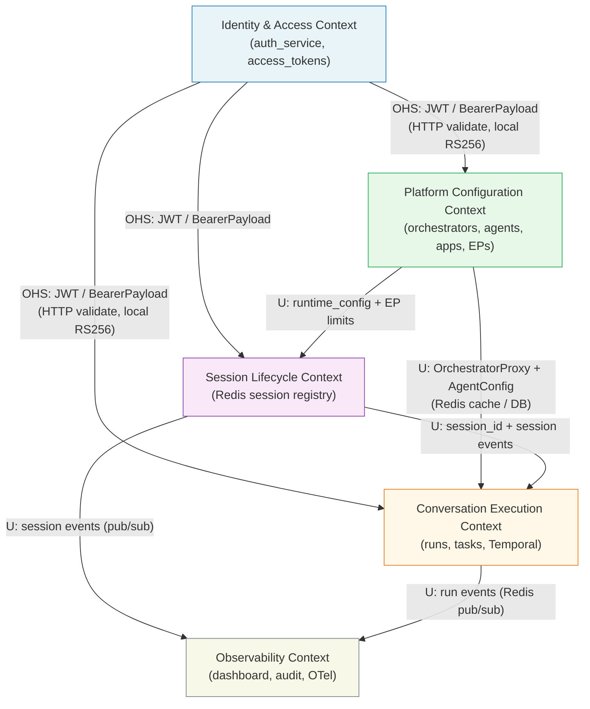

# 07 — Bounded Contexts

> Source of truth: derived from `app/models.py`, `app/services/session_manager.py`,
> `app/temporal/activities.py`, `app/routers/apps.py`.

---

## 1. Named Bounded Contexts

### Identity & Access Context

**Owns:**
- User identities (`auth_service.users`)
- Roles and teams (`auth_service.roles`, `auth_service.teams`, `auth_service.team_members`)
- JWT issuance and RS256 key material
- Blacklisted tokens (`auth_service.blacklisted_tokens`)
- Auth audit log (`auth_service.auth_audit`)
- Access token credentials (`them.access_tokens` — the hash and metadata)

**Exposes:**
- `POST /auth/login` → JWT (RS256, HS256 fallback)
- `POST /auth/validate` → claims (HTTP, called by bridge auth client)
- RS256 public key (for local JWT verification without network hop)
- `BearerPayload` value object: `{user_id, orchestrator_id, expires_at}`

**Consumes:** Nothing from other internal contexts. External: LDAP/SAML (future).

**Isolation note:** Bridge MUST NOT query `auth_service.*` tables directly. All auth flows go through `app/services/auth_client.py` (HTTP to port 8701). JWT claims are validated locally using the cached public key.

---

### Platform Configuration Context

**Owns:**
- Orchestrator Templates (`them.orchestrators`)
- App Orchestrators (`them.app_orchestrators`)
- Applications (`them.applications`)
- Entry Points (`them.entry_points`)
- LLM Provider configurations (`them.llm_providers`)
- Agent Registry (`them.agents`)
- Middleware Definitions (`them.middleware_defs`)
- Middleware Wirings (`them.middleware_wirings`)
- System config (`them.config`)

**Exposes:**
- REST admin API (`/api/v1/admin/*`) — CRUD for all configuration entities
- Redis caches: `them:agents:registry`, `them:orch:tmpl:{name}`, `them:app:{app_id}:orch:{name}`
- Pub/sub invalidation signals: `them:agents:changed`, orchestrator cache bust on update
- `OrchestratorProxy` value object (cached config materialisation)

**Consumes:**
- Identity & Access Context: auth validation for admin API requests

---

### Conversation Execution Context

**Owns:**
- Run records (`them.runs`)
- Run steps (`them.run_steps`)
- Run usage (`them.run_usage`)
- Domain Tasks (`them.tasks`)
- Task messages (`them.task_messages`)
- Artifacts (`them.artifacts`)
- Temporal Workflow execution state (Temporal Server)

**Exposes:**
- Temporal `OrchestrationWorkflow` (started by bridge via `temporal.StartWorkflow`)
- Run events via Redis pub/sub channels (`them:dash:run:{run_id}:tokens`, `them:dash:run:{context_id}:ctx`)
- Summary run events via `them:dash:runs` channel
- REST signal endpoint: `POST /api/v1/runs/{run_id}/signal`
- Run query API: `GET /api/v1/runs/*`

**Consumes:**
- Platform Configuration Context: orchestrator config, agent registry, LLM provider keys
- Identity & Access Context: `BearerPayload` for user_id and scope check
- Session Lifecycle Context: `session_id` injected into run records

---

### Session Lifecycle Context

**Owns (split between Gate and SessionManager):**

`Gate` (`internal/gate`) — sole owner of Set membership at admission time:
- `them:ep:{ep_slug}:sessions` Set (SADD on Check, SREM on Rollback/End)
- `them:app:{app_id}:sessions` Set (SADD on Check, SREM on Rollback/End)
- `them:ep:{ep_slug}:shadow:{session_id}` key (EX ReservationTTL=10s at Check, extended to ShadowTTL=90s at Confirm, DEL on Rollback/End)
- `them:app:{app_id}:shadow:{session_id}` key (same lifecycle)
- `them:ep:gate:queue:{slug}` BLPop signal channel (LPush "1" on Release/Rollback)
- `rl:them:token:{hash}:{minute}` rate limit counters (INCR in luaAdmit Lua)

`SessionManager` (`internal/session`) — owns the Hash only:
- `them:sess:{session_id}` Hash (90s TTL, written by Register, deleted by End)
- `them:sess:{session_id}:active` Set (active agents, set_active_agent/clear_active_agent)
- Pod liveness: `them:pod:{pod_id}` Hash (30s TTL), `them:pods` Set

**Caller contract** (edge handlers enforce this order):
1. `Gate.Check()` — atomic Lua admission (SADD + shadow EX 10s)
2. `session.Register()` — writes Hash only
3. `Gate.Confirm()` — extends shadow to 90s
4. On Register failure: `Gate.Rollback()` (SREM + DEL shadow + Release)
5. On session end: `session.End()` (DEL Hash + SREM + DEL shadow) then `Gate.Release()` (LPush "1")

**Exposes:**
- `Gate.Check()` / `Gate.Confirm()` / `Gate.Rollback()` / `Gate.Release()` — admission lifecycle
- `session.Register()` / `session.End()` — Hash lifecycle
- `session.SignalDisconnect()` — publishes to `them:sess:control:{session_id}`
- Session count queries for dashboard and admin

**Consumes:**
- Platform Configuration Context: `Application.runtime_config`, `EntryPoint.max_concurrent_sessions`, `EntryPoint.queue_timeout_seconds`
- Observability Context: publishes `session_start` / `session_end` / `session_update` events to dashboard broadcaster

---

### Observability Context

**Owns:**
- Dashboard event fan-out (dashboard broadcaster service)
- AuditLog records (`them.audit_logs`)
- OTel span data (sent to collector)

**Exposes:**
- Dashboard WebSocket: `WS /api/v1/dashboard/ws`
- Redis channels consumed by dashboard: `them:dash:runs`, `them:dash:run:{run_id}`, `them:dash:app:{app_id}:sessions`
- Admin monitoring config API

**Consumes:**
- Conversation Execution Context: run events from Redis pub/sub
- Session Lifecycle Context: session events
- Platform Configuration Context: entity labels for audit log

---

## 2. Context Map Diagram



Relationship type key:
- **U** = Upstream (the labeled context is upstream — its changes affect the downstream)
- **D** = Downstream (the labeled context depends on the upstream)
- **OHS** = Open Host Service (the upstream exposes a stable public protocol)
- **ACL** = Anti-Corruption Layer (see Section 4)

---

## 3. Data Ownership Table

| DB Table | Owning Context | Read by | Write by |
|---|---|---|---|
| `auth_service.users` | Identity & Access | Identity & Access | Identity & Access |
| `auth_service.blacklisted_tokens` | Identity & Access | Identity & Access | Identity & Access |
| `them.access_tokens` | Identity & Access | Platform Config (admin CRUD), Conversation Exec (token validation) | Identity & Access |
| `them.llm_providers` | Platform Config | Conversation Exec (pricing lookup) | Platform Config |
| `them.agents` | Platform Config | Conversation Exec (agent load), Platform Config | Platform Config |
| `them.orchestrators` | Platform Config | Conversation Exec (orch load), Platform Config | Platform Config |
| `them.app_orchestrators` | Platform Config | Conversation Exec (orch load), Platform Config | Platform Config |
| `them.applications` | Platform Config | Session Lifecycle (runtime_config), Conversation Exec, Platform Config | Platform Config |
| `them.entry_points` | Platform Config | Session Lifecycle (EP limits), Conversation Exec, Platform Config | Platform Config |
| `them.middleware_defs` | Platform Config | Conversation Exec (pipeline build) | Platform Config |
| `them.middleware_wirings` | Platform Config | Conversation Exec (pipeline build) | Platform Config |
| `them.config` | Platform Config | All | Platform Config |
| `them.runs` | Conversation Exec | Conversation Exec, Observability (admin query) | Conversation Exec |
| `them.run_steps` | Conversation Exec | Conversation Exec, Observability | Conversation Exec |
| `them.run_usage` | Conversation Exec | Conversation Exec, Observability | Conversation Exec |
| `them.tasks` | Conversation Exec | Conversation Exec | Conversation Exec |
| `them.task_messages` | Conversation Exec | Conversation Exec | Conversation Exec |
| `them.artifacts` | Conversation Exec | Conversation Exec | Conversation Exec |
| `them.audit_logs` | Observability | Observability | All (append-only writes from all contexts) |

---

## 4. Anti-Corruption Layers

### ACL 1: `_AgentProxy` (Temporal boundary → agent adapter)

**Location:** `app/temporal/activities.py:invoke_agent_activity`

**Problem:** `invoke_agent_activity` receives an `InvokeAgentInput` dataclass (a Temporal-serializable value object with no methods). The `get_adapter()` factory requires an agent object with specific attributes (`id`, `slug`, `transport`, `endpoint_url`, etc.).

**Solution:** The `_AgentProxy` class reconstructs a duck-typed object from `InvokeAgentInput` fields:

```python
class _AgentProxy:
    def __init__(self, cfg: InvokeAgentInput):
        self.id = uuid.UUID(cfg.agent_id)
        self.slug = cfg.agent_slug
        self.name = cfg.agent_name
        self.transport = cfg.transport
        self.endpoint_url = cfg.endpoint_url
        self.auth_token_encrypted = cfg.auth_token_encrypted
        self.timeout_seconds = cfg.timeout_seconds
        self.max_concurrency = 1
        self.input_schema = cfg.input_schema
```

**In Go:** This must be a named type `AgentProxy` in `internal/agent` that implements the `AgentConfig` interface expected by the adapter factory. The proxy is constructed from the deserialized `InvokeAgentInput` proto.

---

### ACL 2: `OrchestratorProxy` (DB row → WorkflowInput)

**Location:** `app/services/task_runner.py:_OrchestratorProxy`, `app/temporal/loaders.py:orch_to_config`

**Problem:** `them.orchestrators` and `them.app_orchestrators` are ORM entities. The Temporal Workflow cannot use ORM objects (not serializable, not deterministic). The agentic loop needs a stable typed config.

**Solution:** `_OrchestratorProxy` is a typed `@dataclass` with all config fields flattened. It is constructed from either an ORM row or a Redis-cached JSON dict. It adds `is_app_orchestrator` (bool) and `application_id` (Optional[str]) that the ORM rows don't have in a uniform way.

**In Go:** This must be a named type `OrchestratorConfig` struct in `internal/orchestration`. It carries all fields needed by the workflow and is constructed by the `orchestration.Loader.Load(name string)` function, which implements the Redis-first, AppOrch-first, template-fallback resolution algorithm.

---

### ACL 3: `BridgeClient` abstraction (Temporal workflow → WS edge layer)

**Location:** `app/temporal/bridge_client.py`

**Problem:** The WS edge layer (`apps.py:ws_entry`) needs to stream events from a running `OrchestrationWorkflow` back to the WebSocket client without creating a direct coupling between the edge and Temporal's SDK.

**Solution:** `bridge_client.start_orchestration_workflow()` returns `(handle, workflow_id, pubsub)`. The edge layer interacts only with:
- `handle.result()` — to await completion
- The Redis pub/sub subscription — to receive streaming events
- `cancel_workflow(workflow_id)` — to cancel

The Temporal SDK is hidden behind this three-value return. The edge layer never imports `temporalio` directly.

**In Go:** This must be a named interface `WorkflowBridge` in `internal/gateway`:

```go
type WorkflowBridge interface {
    StartWorkflow(ctx context.Context, inp WorkflowInput) (WorkflowHandle, error)
    CancelWorkflow(ctx context.Context, workflowID string) error
}
```

The concrete `TemporalBridge` implementation lives in `internal/worker` and is injected into the gateway/edge layer.

---

## 5. Aggregate Roots

An aggregate root is the entity through which all changes to its cluster must flow. Invariants are enforced at the aggregate boundary.

### Identity & Access Context

| Aggregate Root | Children | Consistency Boundary |
|---|---|---|
| `User` | `TeamMembership`, `UserOverride` | All user identity changes go through the auth service. Bridge never writes to auth_service tables. |
| `AccessToken` | — | Token creation, revocation, and expiry are atomic operations on the `them.access_tokens` table. The token hash is immutable after creation. |

### Platform Configuration Context

| Aggregate Root | Children | Consistency Boundary |
|---|---|---|
| `Application` | `EntryPoint`, `AppOrchestrator`, `MiddlewareWiring` | All children are owned by the Application (CASCADE delete). Configuration changes bust the Redis cache for that application's orchestrators. |
| `Orchestrator` | — | Standalone template. Agent allowlist changes invalidate the `them:agents:registry` cache. |
| `Agent` | — | Standalone entry. Adding/removing agents invalidates `them:agents:registry` and publishes `them:agents:changed`. |

### Conversation Execution Context

| Aggregate Root | Children | Consistency Boundary |
|---|---|---|
| `Run` | `RunStep`, `RunUsage` | A Run transitions through statuses only via `run_recorder` service. Steps and usage rows are append-only. |
| `Task` | `TaskMessage`, `Artifact` | Task state transitions go only through `task_store.transition()`. Messages and artifacts are append-only. A delegated Task's parent_task_id is set at creation and never changes. |

### Session Lifecycle Context

| Aggregate Root | Children | Consistency Boundary |
|---|---|---|
| `Session` (Redis Hash) | `them:sess:{id}:active` (Redis Set) | Admission (Set membership) goes through `Gate`; Hash lifecycle goes through `SessionManager`. The caller contract enforces the order: Gate.Check → session.Register → Gate.Confirm. The TTL refresh (Touch) is the only non-structural mutation after admission. |
