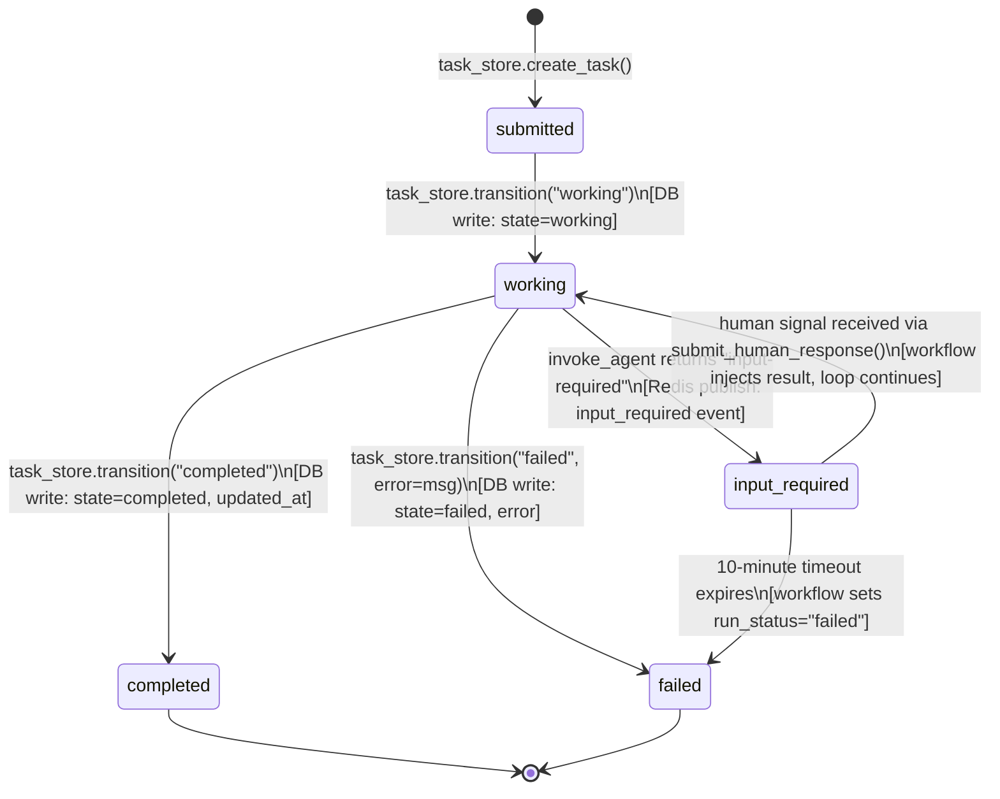
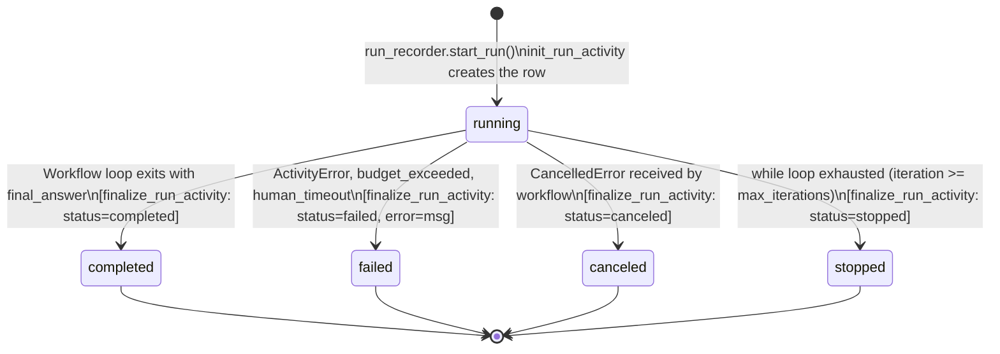
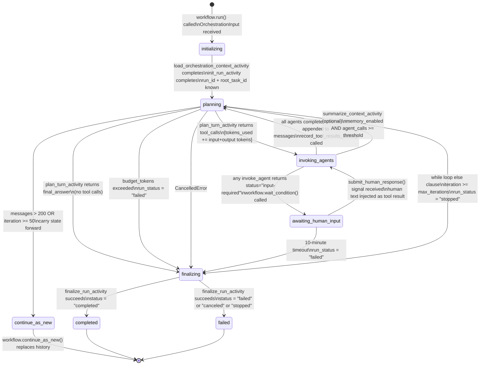

# 08 — State Machines

> Source of truth: `internal/gate/gate.go` (admission, reservation, queue),
> `internal/session/session.go` (Hash lifecycle, SREM on End),
> `app/temporal/activities.py` (task_store.transition calls),
> `app/temporal/workflows.py` (run_status logic),
> `app/adapters/a2a_async_adapter.py`.

All state machines are specified with: valid states, triggering events, side effects,
and explicitly forbidden transitions.

---

## 1. Task State Machine

The `them.tasks.state` column. Transitions are executed only through `task_store.transition()`.



### Transition Table

| From | To | Triggering Event | Side Effects | Guard |
|---|---|---|---|---|
| `submitted` | `working` | `init_run_activity` (root task) or `invoke_agent_activity` (delegated task) calls `transition("working")` | DB write: state=working, updated_at | None |
| `working` | `completed` | `finalize_run_activity` (root task) or `invoke_agent_activity` (delegated task) completes successfully | DB write: state=completed, updated_at | status must be "completed" |
| `working` | `failed` | `finalize_run_activity` with error, or `invoke_agent_activity` on agent error | DB write: state=failed, error, updated_at | error message present |
| `working` | `input_required` | `invoke_agent_activity` receives `input_required=True` from adapter status event | Redis publish `{type: "input_required"}` to tokens channel; workflow pauses via `wait_condition` | adapter emits `input_required=True` |
| `input_required` | `working` | `OrchestrationWorkflow.submit_human_response()` signal received | Workflow injects human text as tool result; loop continues; task remains `working` | signal received before 10-min timeout |
| `input_required` | `failed` | 10-minute `wait_condition` timeout | run_status set to "failed"; finalize_run_activity called | timeout elapsed |

### Invalid Transitions (Forbidden)

- `completed → any` — terminal state, no recovery
- `failed → any` — terminal state, no recovery
- `submitted → completed` — must pass through `working`
- `submitted → failed` — must pass through `working`
- `submitted → input_required` — must pass through `working`
- `input_required → completed` — must return to `working` first

---

## 2. Run State Machine

The `them.runs.status` column. Transitions executed by `finalize_run_activity` at workflow completion.



### Status Semantics

| Status | Meaning | How It's Set |
|---|---|---|
| `running` | Initial state. Workflow is executing. | `run_recorder.start_run()` default |
| `completed` | LLM produced a final answer (no tool calls). | `run_status = "completed"` + `break` when `not plan_result.tool_calls` |
| `failed` | Error or budget exceeded. | `ActivityError` (non-cancel), budget check failure, human response timeout |
| `canceled` | User sent `{"type":"cancel"}` or workflow was explicitly cancelled. | `CancelledError` caught in workflow `except` block |
| `stopped` | Max iterations reached (normal exhaustion, not an error). | `while` loop `else` clause: `run_status = "stopped"` |

**Key distinction:** `stopped` is NOT a failure. It means the orchestrator reached its configured iteration limit. The run may have partial results. `failed` means something went wrong. Both are terminal, but monitoring dashboards should treat `stopped` differently from `failed`.

### Side Effects on finalize_run_activity

For all terminal statuses:
1. DB: `run_recorder.complete_run()` — sets status, final_output, error, iterations, token totals
2. DB: `context_service.record_and_cache_artifact("final-answer")` — only if `final_answer` is not None
3. DB: `task_store.transition(root_task_id, "completed"|"failed")` — root task mirrors run status
4. Redis: `_publish_dash(run_id, {type: "run_end", ...})`
5. Redis: publish terminal event to `them:dash:run:{run_id}:tokens` — `{type: "done"}` or `{type: "error"}`

---

## 3. Session State Machine

The session lifecycle managed by `internal/gate/gate.go` (admission, queue, reservation) and
`internal/session/session.go` (Hash only). Session state is in Redis, not a DB column.

**Ownership boundary (non-negotiable):**
- `Gate` is the **sole owner** of Set membership (`them:ep:{slug}:sessions`, `them:app:{app_id}:sessions`). It writes SADD at admission and SREM at rollback/end.
- `SessionManager` owns the Hash (`them:sess:{id}`) and shadow TTL keys **only**. It never touches the Set index keys at admission time.

```mermaid
stateDiagram-v2
    [*] --> connecting : WebSocket connection accepted\nauthentication checked

    connecting --> queued : Gate.Check() — cap full, QueueTimeout > 0\n[WS send: {type: "waiting", message}]\n[Gate blocks on BLPop them:ep:gate:queue:{slug}]
    connecting --> reserved : Gate.Check() succeeds\n[Lua: ghost prune → cap check → rate limit INCR\n→ SADD EP set + app set\n→ SET shadow EX ReservationTTL (10s)]
    queued --> reserved : BLPop wakes — re-compete via luaAdmit\n[full atomic Lua re-runs; NOT a guaranteed slot]
    queued --> [*] : QueueTimeout exceeded or context cancelled\n[WS close: code 4403]
    queued --> [*] : re-compete fails (slot taken by concurrent session)\n[ErrCapExceeded — no re-queue]

    reserved --> active : session.Register() succeeds\nthen Gate.Confirm() called\n[HSET them:sess:{id}, EXPIRE 90s\nSET shadow EX ShadowTTL (90s)]
    reserved --> [*] : session.Register() fails\n[Gate.Rollback(): SREM sets + DEL shadow + Release]\n[Gate.Release(): LPush "1" to queue — wakes one waiter]

    active --> active_with_agent : set_active_agent() called\n[Redis: SADD them:sess:{id}:active]
    active_with_agent --> active : clear_active_agent() called\n[Redis: SREM them:sess:{id}:active]
    active --> ending : workflow completes OR cancel_evt set OR admin_terminate
    active_with_agent --> ending : same termination triggers
    ending --> ended : session.End() + Gate.Release()\n[Lua: DEL them:sess:{id}, SREM EP set, DEL shadow\nLPush "1" to queue — wakes one waiter]
    ended --> [*]
```



### Caller Contract (enforced in ws/handler.go and sse/handler.go)

```go
res, err := gate.Check(ctx, cfg)       // atomic Lua: SADD + shadow EX 10s
if err != nil { reject; return }
err = session.Register(ctx, info)      // HSET + EXPIRE 90s (Hash only)
if err != nil {
    gate.Rollback(ctx, cfg)            // SREM + DEL shadow + LPush "1"
    return
}
gate.Confirm(ctx, cfg)                 // SET shadow EX 90s (extend from 10s)
defer func() {
    session.End(ctx, ...)              // DEL Hash + Lua SREM + DEL shadow
    gate.Release(ctx, cfg)             // LPush "1" — wakes one queued waiter
}()
```

### Redis Key Operations per Transition

| Transition | Owner | Redis Operations |
|---|---|---|
| `connecting → queued` | Gate | `luaAdmit` returns `luaEPCap`; `BLPop them:ep:gate:queue:{slug}` blocks |
| `queued → reserved` | Gate | BLPop wakes; `luaAdmit(recheck=true)` reruns full Lua atomically |
| `queued → [*] (timeout/fail)` | Gate | No Redis writes; WS close code 4403 or `ErrCapExceeded` |
| `connecting → reserved` | Gate | `luaAdmit`: prune ghosts → SCARD cap check → INCR rate limit → `SADD them:ep:{slug}:sessions {sid}` → `SADD them:app:{app_id}:sessions {sid}` → `SET them:ep:{slug}:shadow:{sid} 1 EX 10` → `SET them:app:{app_id}:shadow:{sid} 1 EX 10` |
| `reserved → active` | SessionManager then Gate | `HSET them:sess:{id} ...`, `EXPIRE them:sess:{id} 90`; then `SET them:ep:{slug}:shadow:{sid} 1 EX 90`, `SET them:app:{app_id}:shadow:{sid} 1 EX 90` |
| `reserved → [*] (Register fail)` | Gate.Rollback | Lua: `SREM them:ep:{slug}:sessions {sid}`, `DEL them:ep:{slug}:shadow:{sid}` (+ app equivalents); `LPush them:ep:gate:queue:{slug} 1` |
| `active → active_with_agent` | SessionManager | `SADD them:sess:{id}:active {slug}`, `EXPIRE ... 90` |
| `active_with_agent → active` | SessionManager | `SREM them:sess:{id}:active {slug}` |
| `ending → ended` | SessionManager + Gate | `DEL them:sess:{id}`; Lua: `SREM them:ep:{slug}:sessions {sid}`, `DEL them:ep:{slug}:shadow:{sid}` (+ app equivalents); `LPush them:ep:gate:queue:{slug} 1` |

### EP Queue Protocol

When `max_concurrent_sessions` is reached and `QueueTimeout > 0`:

```
WS sends: {type: "waiting", message: queue_message or "All agents are busy..."}
Gate.Check() blocks: BLPop(them:ep:gate:queue:{slug}, QueueTimeout)
  On wake: re-run luaAdmit(recheck=true) — this is a COMPETE, not a guarantee
    → slot taken by concurrent session: ErrCapExceeded (no re-queue)
    → slot available: proceed to reserved state
  On timeout: ErrQueueFull → WS close code 4403
Gate.Release() / Gate.Rollback() both call LPush "1" — wakes exactly one waiter
```

**Queue key is a pure signal channel.** Waiters only consume (`BLPop`). Only `Gate.Release()` and `Gate.Rollback()` produce (`LPush "1"`). No session IDs are ever pushed. No `LRem` is needed. One `Release` call wakes exactly one waiter.

---

## 4. OrchestrationWorkflow State Machine (Temporal)

The internal execution state of the `OrchestrationWorkflow` Temporal Workflow.



### Key Temporal-Specific Behaviors

**`planning` state — budget check:**
```
if budget_tokens is not None and tokens_used >= budget_tokens:
    run_error = "Budget exceeded: {tokens_used} tokens (limit: {budget_tokens})"
    run_status = "failed"
    break → finalizing
```

**`awaiting_human_input` — 10-minute timeout:**
```python
await workflow.wait_condition(
    lambda: self._human_response is not None,
    timeout=timedelta(minutes=10),
)
```
If `wait_condition` times out, `_human_response` remains None. The workflow checks this and transitions to `finalizing` with `run_status="failed"`.

**`continue_as_new` threshold:**
```
total_messages > 200 OR self.iteration >= 50
```
When triggered, `workflow.continue_as_new(carry)` is called with a new `OrchestrationInput` carrying `tokens_used_carry` and `iteration_carry`. This resets Temporal's event history while preserving execution counters.

**Sub-orchestrator depth limit:**
```
_MAX_SUB_ORCH_DEPTH = 3
```
A sub-orchestrator dispatch (transport=`sub_orchestrator`) is rejected with `status="failed"` if `inp.depth + 1 > 3`.

---

## 5. A2A Adapter State Machine

The execution state of `A2aAsyncAdapter.stream_invoke()`.

```mermaid
stateDiagram-v2
    [*] --> idle : stream_invoke() called

    idle --> sending : httpx.AsyncClient created\nsubmit() called (POST SendMessage)
    sending --> polling : remote_task_id received\nyield task_created event\n[supports_streaming=False]
    sending --> streaming : remote_task_id received\nyield task_created event\n[supports_streaming=True]
    sending --> error : HTTP error or RPC error in SendMessage

    polling --> polling : GetTask response received\nstate not terminal\nAsyncIO.sleep(poll_interval=1.0s)
    polling --> done : state in TERMINAL (completed)\nyield artifact events + done event
    polling --> error : state in TERMINAL (failed/canceled/rejected)\nyield error event
    polling --> input_required_pause : state = input-required\nyield status(input_required=True)
    polling --> error : deadline exceeded\nyield timeout error event

    streaming --> streaming : SSE line received\nnon-terminal status or artifact
    streaming --> done : terminal status (completed)\nyield done event
    streaming --> error : terminal status (failed/canceled/rejected)
    streaming --> input_required_pause : status = input-required\nyield status(input_required=True)
    streaming --> polling : httpx.HTTPStatusError on SSE connect\n[SSE fallback to polling]

    input_required_pause --> [*] : invoke_agent_activity returns status="input-required"\nadapter exits; workflow pauses

    done --> [*] : yield done event, return
    error --> [*] : yield error event, return
```



### SSE Fallback Path

When `supports_streaming=True` but the remote agent's SSE endpoint returns an HTTP error:

```python
except httpx.HTTPStatusError:
    logger.warning("A2aAsyncAdapter SSE stream unavailable, falling back to poll", ...)
    async for event in self._poll_events(client, remote_task_id, timeout):
        yield event
```

This is transparent to the caller — the event stream continues uninterrupted via polling.

### input_required Exit Path

When the remote task enters `input-required` state:
1. Adapter yields `AdapterEvent(type="status", state=state, input_required=True)` and `break`s
2. `invoke_agent_activity` detects `event.input_required` and sets `status = "input-required"`
3. Activity returns `InvokeAgentResult(status="input-required", result_text="", ...)`
4. Workflow detects the `input-required` result and calls `workflow.wait_condition()`
5. The adapter has already exited — a new adapter invocation is NOT made for the human response injection

The human response is injected directly as a synthetic tool result by the workflow (not by re-invoking the agent).

### Poll Timing

- `poll_interval`: 1.0s (configurable at construction, default 1.0s)
- `max_poll_seconds`: 300.0s (configurable, default 300.0s)
- Effective timeout: `min(activity_timeout, max_poll_seconds)`
- Heartbeat interval: on every `status` event received from GetTask
