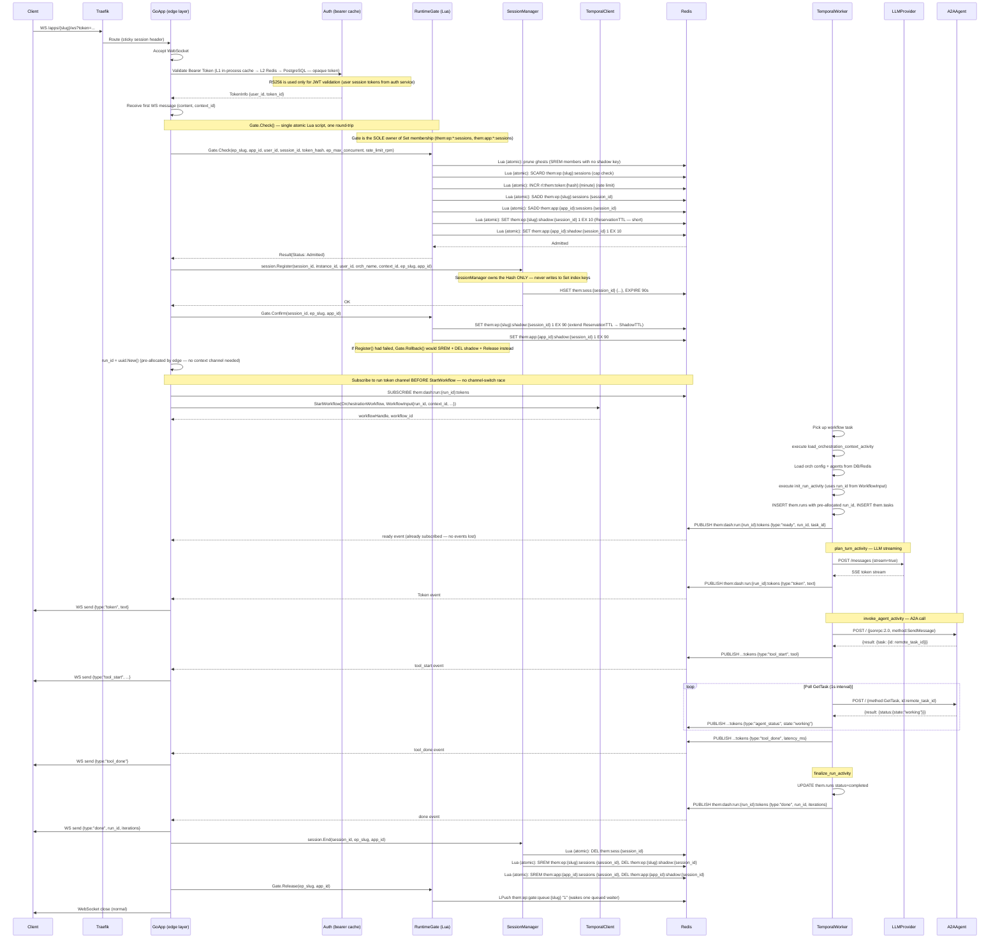
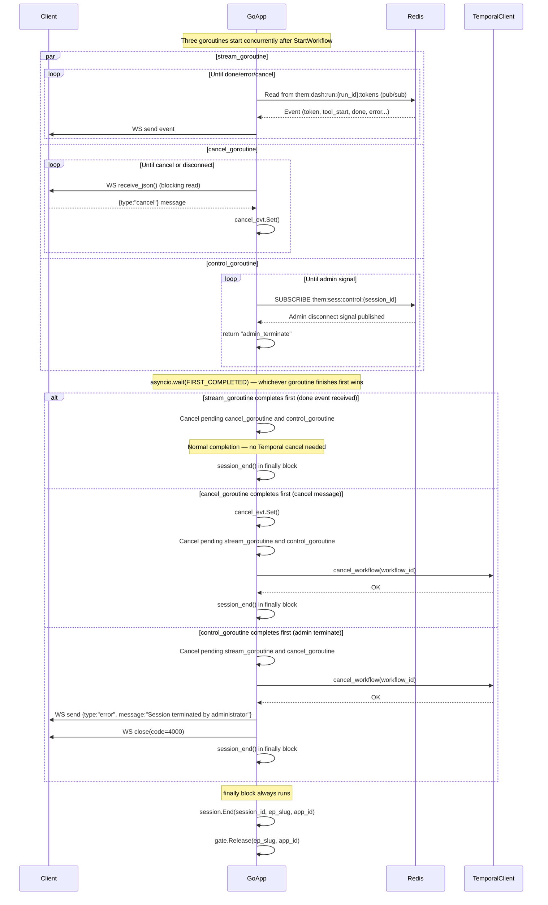
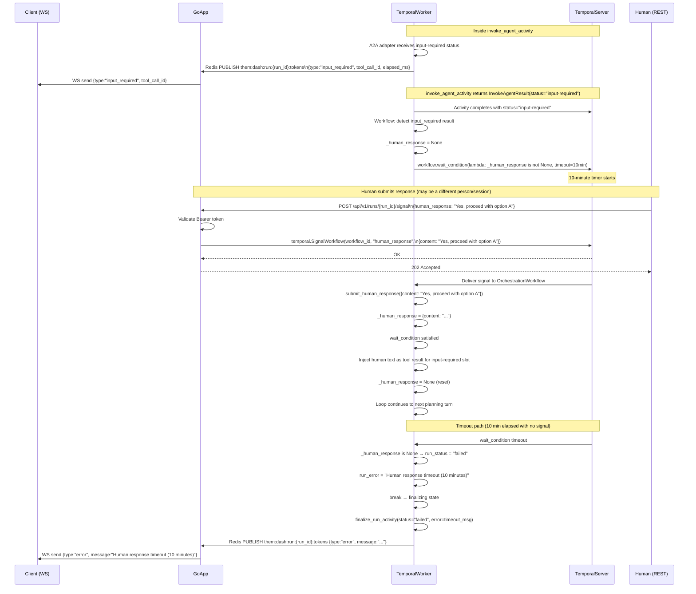
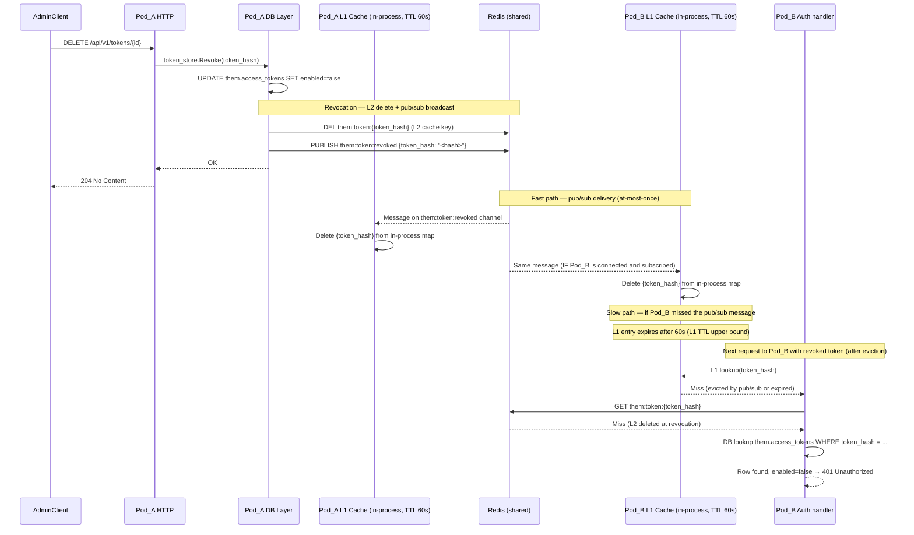
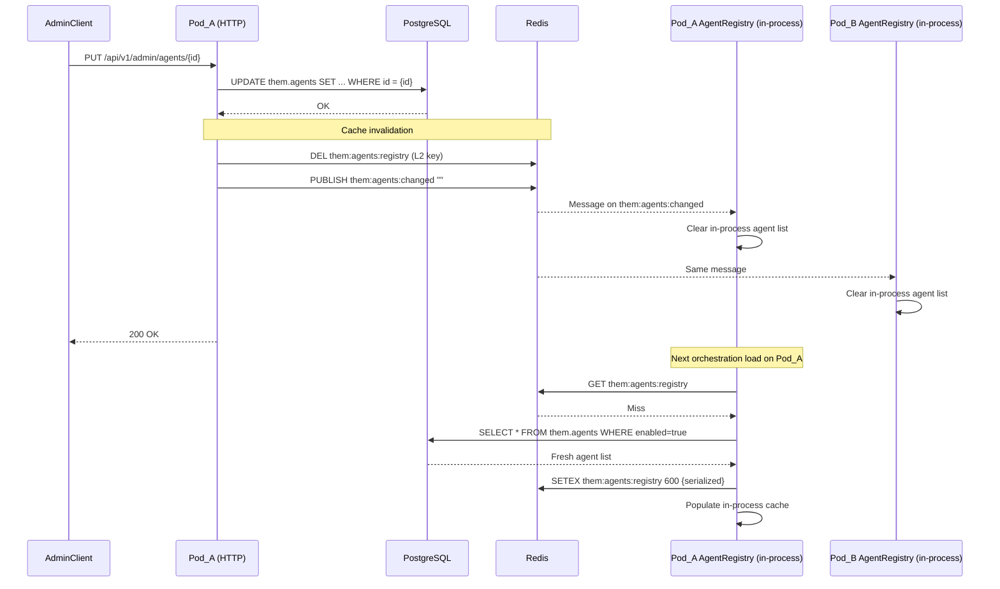
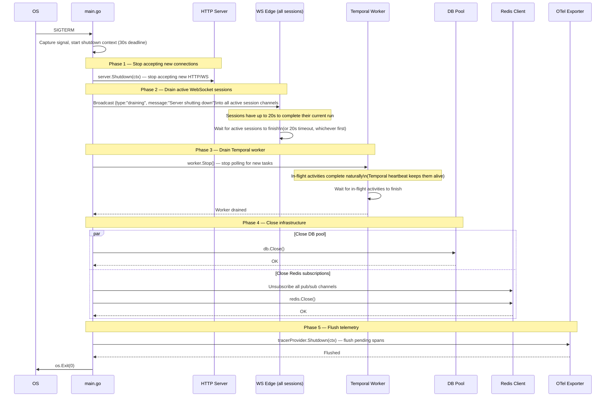

# 10 — Sequence Diagrams

> Source of truth: `app/routers/apps.py`, `app/temporal/activities.py`,
> `app/temporal/workflows.py`, `app/services/session_manager.py`,
> `app/adapters/a2a_async_adapter.py`.

---

## 1. WebSocket Request Lifecycle (Primary Path)

**Channel design note:** The edge pre-allocates `run_id` (UUID) before calling `StartWorkflow` and subscribes to `them:dash:run:{run_id}:tokens` immediately. `run_id` is passed as part of `WorkflowInput` so the worker publishes directly to that channel. There is no context channel and no channel-switch — this eliminates the ready-bootstrap race entirely (see §7 for the race that this replaces).



---

## 2. WebSocket Termination Paths (Three Concurrent Goroutines)



**In Go**, the three goroutines map directly to a `select{}` over three channels:

```go
select {
case <-streamDone:      // stream goroutine finished
case <-cancelRequested: // client sent cancel
case <-controlSignal:   // admin disconnect
}
```

The `finally block` maps to a `defer` registered immediately after `Gate.Confirm()`:
```go
defer func() {
    session.End(ctx, sessionID, epSlug, appID)
    gate.Release(ctx, cfg)
}()
```

---

## 3. HITL (Human-in-the-Loop) Signal Flow



---

## 4. Token Revocation Broadcast (Multi-Pod)

**Actual guarantee:** Redis Pub/Sub is at-most-once. A pod that misses the revocation message (restart, transient Redis disconnect) will continue accepting the token from its L1 cache until the L1 entry expires. The L2 key is deleted at revocation time, but L1 is not backed by L2 on reads — an L1 hit returns without consulting L2. The real worst-case window is the **L1 TTL** (60s), not sub-second.

**Design decision:** L1 TTL is set to 60s (not 300s). The pub/sub path provides fast-path eviction in the common case. The 60s TTL is the hard upper bound for pods that miss the event. For use cases that require stronger guarantees, set `AUTH_BEARER_L1_TTL_SECONDS=0` to disable L1 caching entirely — all validation falls through to L2 Redis (one Redis GET per request, ~0.5ms, no L1 stale window).



**Revocation guarantee summary:**

| Scenario | Window |
|---|---|
| Pod receives pub/sub message | ~1ms (pub/sub latency) |
| Pod misses pub/sub (restart / transient disconnect) | ≤60s (L1 TTL) |
| L1 disabled (`AUTH_BEARER_L1_TTL_SECONDS=0`) | ~0.5ms per request (L2 Redis GET) |

**What the L2 TTL does NOT protect:** If L1 holds an entry and L2 is already deleted, L1 does not fall through to L2 on the next read. L1 hit = return immediately. Only pub/sub eviction or L1 TTL expiry clears a stale L1 entry.

⚠️ **Python note:** The current Python implementation does NOT publish `them:token:revoked`. The Python path relies solely on L1/L2 TTL expiry (300s window). The sequence above documents the Go implementation.

---

## 5. Agent Registry Invalidation (Multi-Pod)



---

## 6. Graceful Shutdown Sequence



**Shutdown timeline notes:**

---

## 7. Ready Bootstrap Race — Why the Context Channel Was Removed

The previous design used two Redis channels with a channel-switch between them:

```
Edge subscribes to: them:dash:run:{context_id}:ctx
Edge calls StartWorkflow(WorkflowInput without run_id)
Worker runs init_run_activity, allocates run_id, publishes to context channel
Edge receives {type:"ready", run_id}
Edge UNSUBSCRIBES context channel          ← gap opens here
Edge SUBSCRIBES them:dash:run:{run_id}:tokens  ← gap closes here
Worker immediately starts plan_turn_activity, publishes token events
```

**The race:** Between UNSUBSCRIBE and SUBSCRIBE, the worker may already be executing `plan_turn_activity` and publishing token events. These events are published to `them:dash:run:{run_id}:tokens` before the edge has subscribed. Redis Pub/Sub is at-most-once with no message buffering — events published during the gap are silently lost. The client never sees the first token(s) of the response.

**The fix (§1 above):**

```
Edge pre-allocates run_id = uuid.New()
Edge SUBSCRIBES them:dash:run:{run_id}:tokens  ← subscribed before workflow starts
Edge calls StartWorkflow(WorkflowInput{run_id: run_id, ...})
Worker runs init_run_activity using the pre-allocated run_id
Worker publishes all events to them:dash:run:{run_id}:tokens
Edge receives all events — no gap, no channel switch
```

The context channel (`them:dash:run:{context_id}:ctx`) is removed entirely. The worker no longer needs to publish a `ready` signal to a separate channel; the single token channel carries the `ready` event as well.

**WorkflowInput change required:** `run_id uuid.UUID` must be added to `WorkflowInput` (and the Python `OrchestrationInput` dataclass during Phase 5.4 overlap). `init_run_activity` uses the provided `run_id` for the `INSERT INTO them.runs` row instead of allocating one internally.

- Total shutdown budget: 30 seconds (configurable via `SHUTDOWN_TIMEOUT_SECONDS`)
- Active sessions have 20 of those 30 seconds to complete
- Temporal worker drain is concurrent with the 20-second session wait
- A session that takes longer than 20 seconds is disconnected with `{type:"error", message:"Server shutting down"}`
- The Temporal workflow is NOT cancelled on graceful shutdown — it continues on the next available worker
- Only on SIGKILL (forced) would in-flight activities be interrupted
