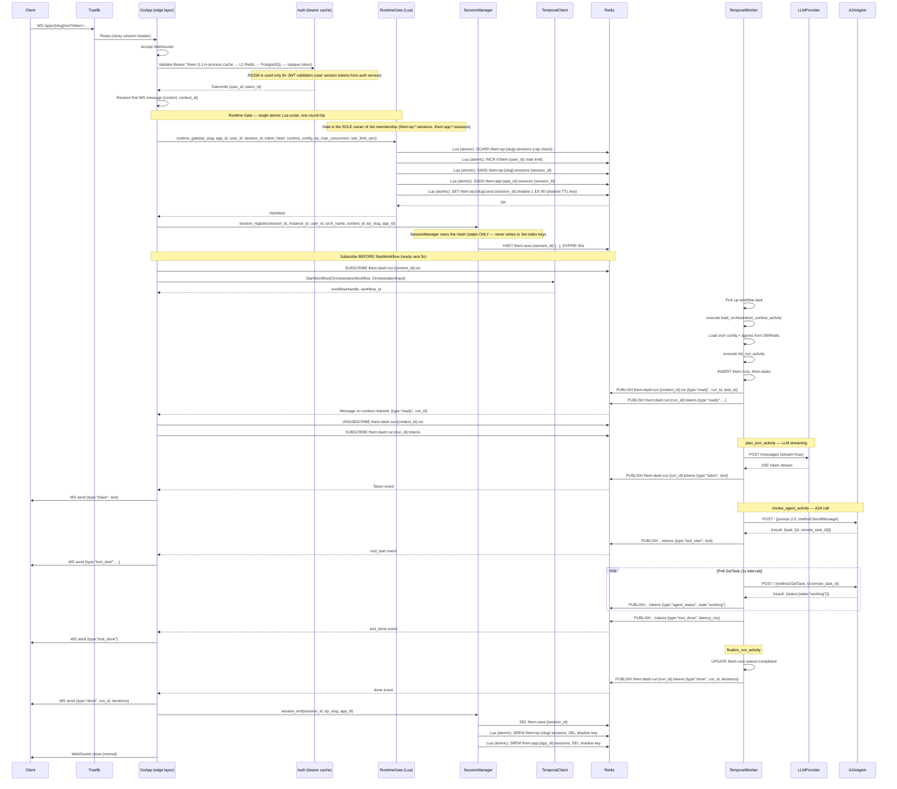
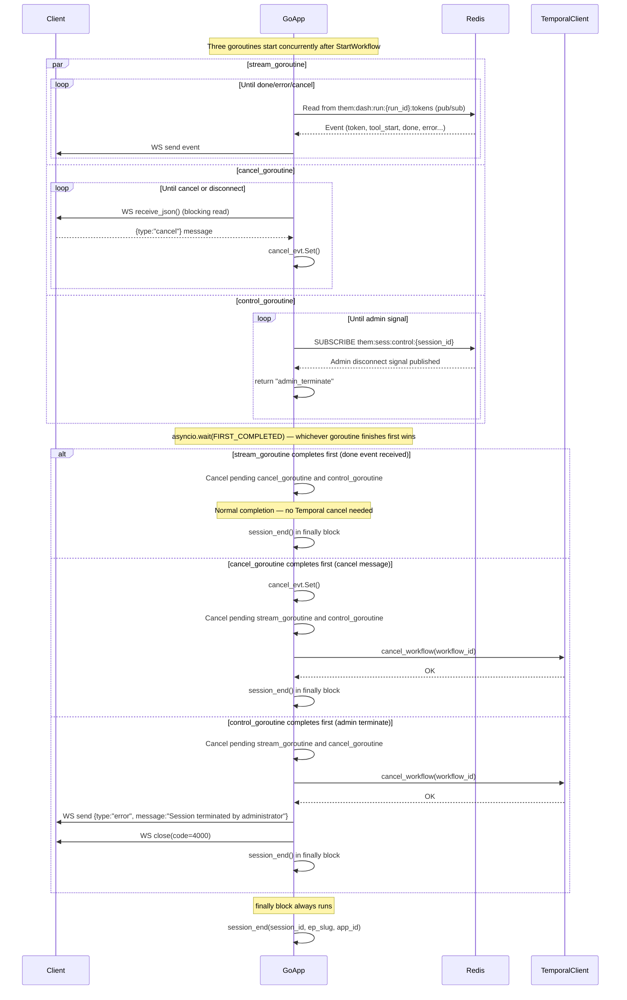
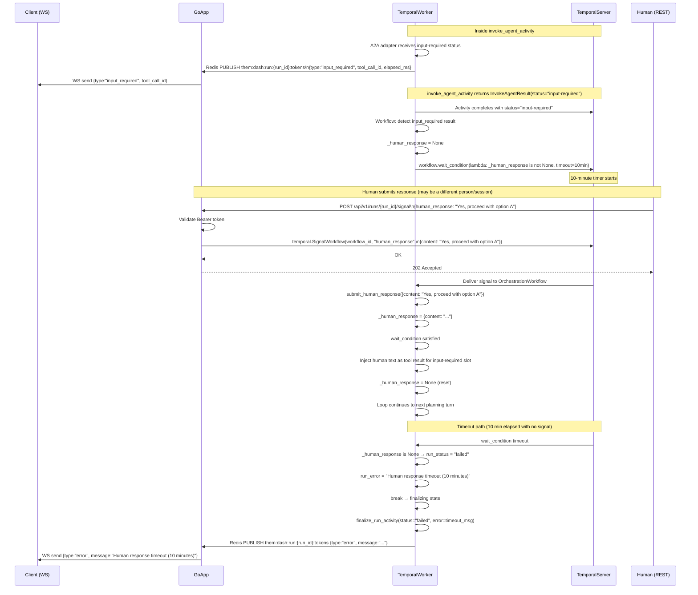
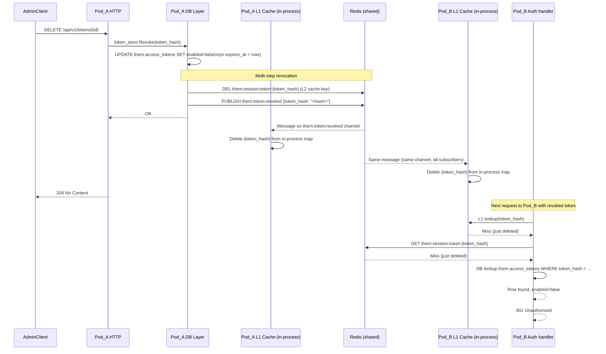
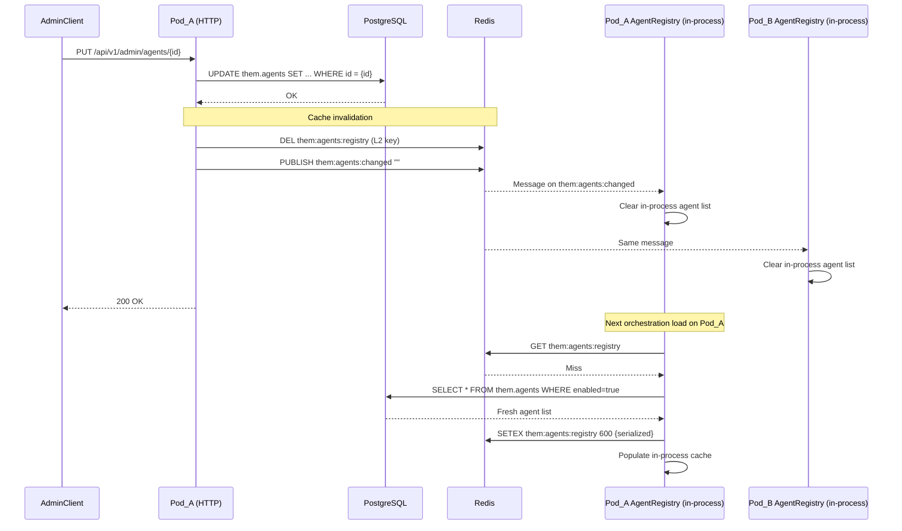
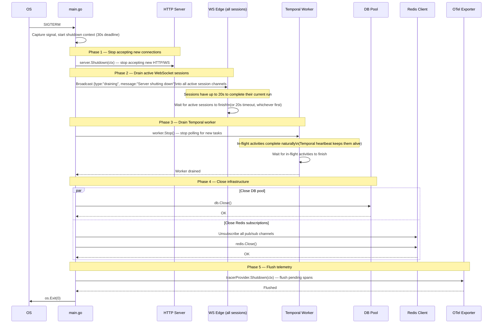

# 10 — Sequence Diagrams

> Source of truth: `app/routers/apps.py`, `app/temporal/activities.py`,
> `app/temporal/workflows.py`, `app/services/session_manager.py`,
> `app/adapters/a2a_async_adapter.py`.

---

## 1. WebSocket Request Lifecycle (Primary Path)



---

## 2. WebSocket Termination Paths (Three Concurrent Goroutines)



**In Go**, the three goroutines map directly to a `select{}` over three channels:

```go
select {
case <-streamDone:      // stream goroutine finished
case <-cancelRequested: // client sent cancel
case <-controlSignal:   // admin disconnect
}
```

The `finally block` maps to a `defer session_end()` registered immediately after `session_register()`.

---

## 3. HITL (Human-in-the-Loop) Signal Flow



---

## 4. Token Revocation Broadcast (Multi-Pod)



⚠️ **Correction:** The current Python implementation does NOT publish `them:token:revoked`. The L1 cache is per-replica and only expires via TTL (300s). The sequence above documents the **required Go implementation**. The Python path relies solely on L2 TTL expiry — revoked tokens may be accepted for up to 5 minutes on replicas that hold a valid L1/L2 cache entry.

---

## 5. Agent Registry Invalidation (Multi-Pod)



---

## 6. Graceful Shutdown Sequence



**Shutdown timeline notes:**

- Total shutdown budget: 30 seconds (configurable via `SHUTDOWN_TIMEOUT_SECONDS`)
- Active sessions have 20 of those 30 seconds to complete
- Temporal worker drain is concurrent with the 20-second session wait
- A session that takes longer than 20 seconds is disconnected with `{type:"error", message:"Server shutting down"}`
- The Temporal workflow is NOT cancelled on graceful shutdown — it continues on the next available worker
- Only on SIGKILL (forced) would in-flight activities be interrupted
