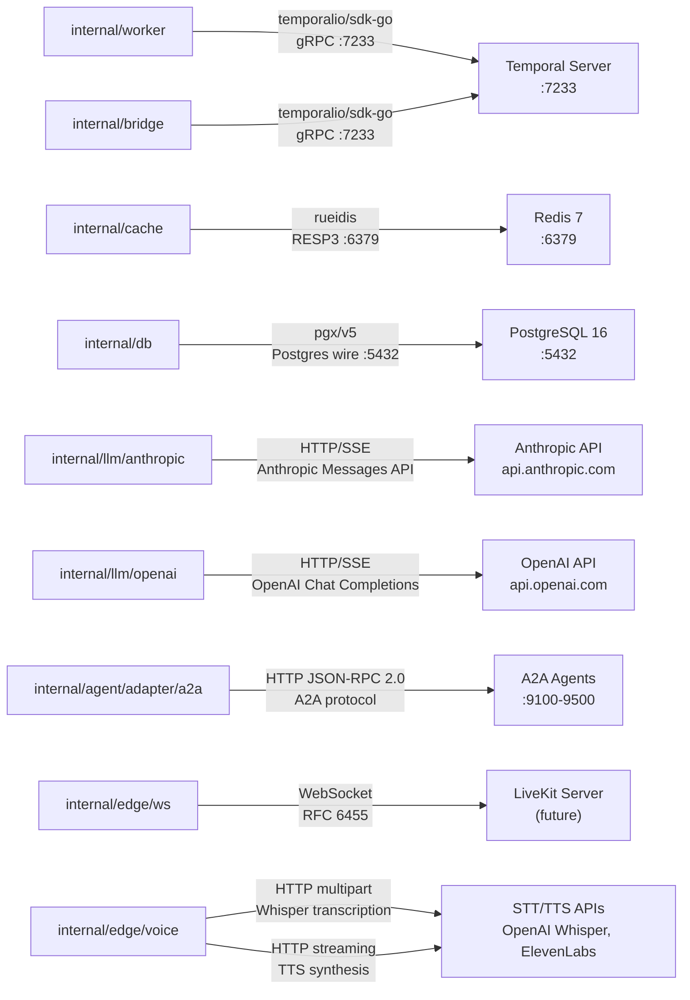
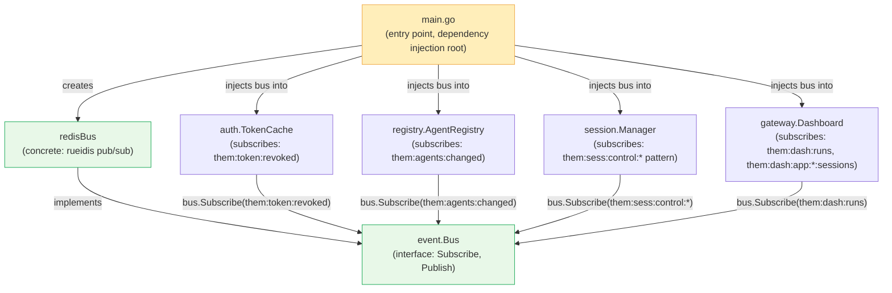
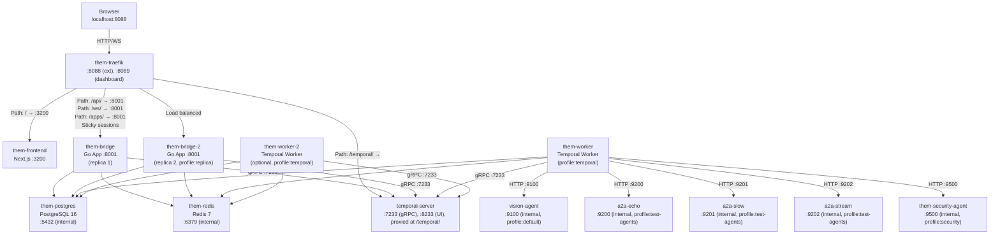

# 11 — Component Diagram

> Source of truth: `app/` package structure, `app/temporal/activities.py`,
> `app/routers/apps.py`, `app/services/session_manager.py`.

---

## 1. Package Dependency Graph

The 22 internal packages of the Go rewrite, with permitted and forbidden import relationships.
Each package must contain only the code that belongs to its named responsibility.

```mermaid
graph TD
    %% ── Leaf packages (no internal imports) ─────────────────────────────
    config["config\n(env vars, Settings)"]
    telemetry["telemetry\n(OTel traces, metrics)"]

    %% ── Infrastructure packages ──────────────────────────────────────────
    db["db\n(pgx pool, migrations)"]
    cache["cache\n(rueidis, pub/sub)"]
    event["event\n(event.Bus interface)"]

    %% ── Domain packages ──────────────────────────────────────────────────
    auth["auth\n(JWT validate, token cache L1+L2)"]
    registry["registry\n(AgentRegistry, NeutralTool builder)"]
    orchestration["orchestration\n(OrchestratorLoader, OrchestratorConfig)"]
    session["session\n(SessionManager, Redis keys)"]
    gate["gate\n(RuntimeGate, rate limit Lua)"]

    %% ── Agent adapter packages ───────────────────────────────────────────
    agent["agent\n(AgentProxy, adapter interface)"]
    adapter_a2a["adapter/a2a\n(A2aAsyncAdapter)"]
    adapter_ws["adapter/ws\n(WebSocket mock adapter)"]

    %% ── LLM provider packages ────────────────────────────────────────────
    llm["llm\n(LLMProvider interface)"]
    llm_anthropic["llm/anthropic\n(Anthropic streaming)"]
    llm_openai["llm/openai\n(OpenAI streaming)"]

    %% ── Temporal packages ────────────────────────────────────────────────
    workflow["workflow\n(OrchestrationWorkflow def)"]
    activity["activity\n(all Activity functions)"]
    worker["worker\n(Temporal Worker entrypoint)"]
    bridge["bridge\n(WorkflowBridge interface + TemporalBridge)"]

    %% ── Edge / gateway packages ──────────────────────────────────────────
    edge_ws["edge/ws\n(WS handler, 3 goroutines)"]
    edge_sse["edge/sse\n(SSE handler)"]
    edge_voice["edge/voice\n(STT/TTS handler)"]
    gateway["gateway\n(HTTP router, middleware wiring)"]

    %% ── Permitted import edges ───────────────────────────────────────────

    %% Everyone imports config + telemetry (shown at bottom)
    auth --> config
    auth --> telemetry
    auth --> db
    auth --> cache
    auth --> event

    registry --> config
    registry --> telemetry
    registry --> db
    registry --> cache
    registry --> event

    orchestration --> config
    orchestration --> telemetry
    orchestration --> db
    orchestration --> cache

    session --> config
    session --> telemetry
    session --> cache
    session --> event

    gate --> config
    gate --> telemetry
    gate --> cache

    agent --> config
    adapter_a2a --> agent
    adapter_ws --> agent

    llm_anthropic --> llm
    llm_openai --> llm

    activity --> db
    activity --> cache
    activity --> registry
    activity --> orchestration
    activity --> agent
    activity --> adapter_a2a
    activity --> llm
    activity --> llm_anthropic
    activity --> llm_openai
    activity --> session
    activity --> telemetry

    workflow --> activity

    worker --> workflow
    worker --> activity
    worker --> db
    worker --> cache
    worker --> config

    bridge --> cache
    bridge --> config
    bridge --> telemetry

    edge_ws --> bridge
    edge_ws --> auth
    edge_ws --> gate
    edge_ws --> session
    edge_ws --> cache
    edge_ws --> telemetry

    edge_sse --> bridge
    edge_sse --> auth
    edge_sse --> gate
    edge_sse --> session
    edge_sse --> telemetry

    edge_voice --> auth
    edge_voice --> orchestration
    edge_voice --> telemetry

    gateway --> edge_ws
    gateway --> edge_sse
    gateway --> edge_voice
    gateway --> auth
    gateway --> telemetry
    gateway --> config

    db --> config
    cache --> config
    event --> config

    %% ── FORBIDDEN import edges (labeled) ─────────────────────────────────
    auth -.->|"FORBIDDEN: auth must not import orchestration"| orchestration
    auth -.->|"FORBIDDEN: auth must not import session"| session
    auth -.->|"FORBIDDEN: auth must not import gate"| gate
    auth -.->|"FORBIDDEN: auth must not import edge"| edge_ws

    orchestration -.->|"FORBIDDEN: orchestration must not import edge"| edge_ws
    orchestration -.->|"FORBIDDEN: orchestration must not import gateway"| gateway

    edge_ws -.->|"FORBIDDEN: edge must not import orchestration directly"| orchestration
    edge_ws -.->|"FORBIDDEN: edge must not import workflow"| workflow

    llm -.->|"FORBIDDEN: llm must not import agent"| agent
    llm -.->|"FORBIDDEN: llm must not import orchestration"| orchestration

    agent -.->|"FORBIDDEN: agent must not import llm"| llm
    agent -.->|"FORBIDDEN: agent must not import orchestration"| orchestration

    session -.->|"FORBIDDEN: session must not import gate"| gate
    session -.->|"FORBIDDEN: session must not import orchestration"| orchestration
    session -.->|"FORBIDDEN: session must not import edge"| edge_ws

    %% Style forbidden edges
    style auth fill:#e8f4f8,stroke:#2980b9
    style orchestration fill:#fff8e8,stroke:#e67e22
    style edge_ws fill:#f8e8f8,stroke:#8e44ad
    style llm fill:#e8f8e8,stroke:#27ae60
    style agent fill:#f0f0f0,stroke:#7f8c8d
    style config fill:#ffeeba,stroke:#f0ad4e
    style telemetry fill:#ffeeba,stroke:#f0ad4e
    style db fill:#ffeeba,stroke:#f0ad4e
    style cache fill:#ffeeba,stroke:#f0ad4e
```



### Constraint Summary

| Package | Must NOT import |
|---|---|
| `auth` | `orchestration`, `session`, `gate`, `edge/*`, `workflow`, `activity` |
| `orchestration` | `edge/*`, `gateway` |
| `edge/*` | `orchestration` directly (use `bridge` interface), `workflow`, `activity` |
| `llm` | `agent`, `orchestration`, `registry` |
| `agent` | `llm`, `orchestration`, `registry` |
| `session` | `gate`, `orchestration`, `edge/*`, `activity` |
| `workflow` | `db`, `cache`, `gateway`, `edge/*` (Temporal determinism — no I/O) |

---

## 2. External Dependency Map



### External SDK Versions (Target for Go Rewrite)

| External Service | SDK | Notes |
|---|---|---|
| Temporal | `go.temporal.io/sdk v1.x` | gRPC. Worker and bridge client both use this SDK. |
| Redis | `github.com/redis/rueidis` | RESP3 protocol. Chosen over go-redis for streaming performance. |
| PostgreSQL | `github.com/jackc/pgx/v5` | Direct driver, no ORM. Use `pgxpool` for connection pooling. |
| Anthropic | `github.com/anthropics/anthropic-sdk-go` (or direct HTTP) | SSE streaming required. |
| OpenAI | `github.com/openai/openai-go` (or direct HTTP) | SSE streaming required. |
| A2A Agents | `net/http` + `encoding/json` | JSON-RPC 2.0 over HTTP. No external SDK needed. |

---

## 3. event.Bus Wiring Diagram

The `event.Bus` is the mechanism by which cross-package pub/sub wiring is achieved without violating package dependency constraints. Packages do not import each other to register callbacks — they all receive the bus as a dependency injection.



### The event.Bus Interface

```go
// internal/event/bus.go
package event

type Handler func(channel string, payload []byte)

type Bus interface {
    // Subscribe registers handler for messages on channel.
    // Pattern subscriptions (e.g., "them:sess:control:*") use PSUBSCRIBE.
    Subscribe(ctx context.Context, channel string, handler Handler) error
    SubscribePattern(ctx context.Context, pattern string, handler Handler) error

    // Publish sends payload to channel. Used by admin endpoints for invalidation.
    Publish(ctx context.Context, channel string, payload []byte) error

    // Close gracefully shuts down all subscriptions.
    Close() error
}
```

### Why This Pattern

The `auth` package must not import the `session` or `orchestration` packages. But `auth.TokenCache` needs to hear about token revocations published by the admin token endpoint (in `gateway`). If `auth` imported `gateway` or vice versa, you would have a cycle.

The `event.Bus` breaks this cycle: `gateway` (the publisher) calls `bus.Publish(them:token:revoked, ...)`. `auth.TokenCache` (the subscriber) receives the event via the bus. Neither package imports the other. Both import only `event` (a leaf package).

### Concrete Registration in main.go

```go
// main.go
bus := redisBus.New(redisClient)

tokenCache := auth.NewTokenCache(db, bus)    // bus.Subscribe("them:token:revoked", ...)
agentReg   := registry.New(db, bus)          // bus.Subscribe("them:agents:changed", ...)
sessMgr    := session.NewManager(redisClient, bus)  // bus.SubscribePattern("them:sess:control:*", ...)
dashboard  := gateway.NewDashboard(redisClient, bus) // bus.Subscribe("them:dash:runs", ...)
```

Packages receive the bus as a constructor argument. They register their own subscriptions inside their constructors. They do NOT call `import event` in a registration sense — they accept `event.Bus` as an interface, which any concrete implementation satisfies.

---

## 4. Deployment Topology

### Development (Docker Compose)



### Production VPS

Same topology with these differences:

| Aspect | Development | Production VPS |
|---|---|---|
| Go App replicas | 2 (Bridge + Bridge-2) | 2+ (horizontal scale on same host) |
| Session affinity | Traefik sticky (cookie) | Required — preserve for active WS sessions |
| Temporal Server | Local container | Option A: local container; Option B: Temporal Cloud (eliminates Temporal Server from VPS) |
| PostgreSQL | Single local container | Single local container (VPS); managed PG for scale |
| Redis | Single local container | Single local container; Redis Sentinel for HA |
| Health checks | Docker healthchecks | Same + Traefik `/healthz` passive health |
| Resource limits | Unlimited (dev) | CPU/memory limits per container |
| TLS | None (loopback only) | Traefik Let's Encrypt (ACME) |
| Temporal Cloud option | N/A | Eliminates self-hosted Temporal Server; use `TEMPORAL_CLOUD_ENDPOINT` + mTLS cert |

**Temporal Cloud adoption path:** Replace the `temporal-server` container with:
```
TEMPORAL_HOST_URL=<namespace>.tmprl.cloud:7233
TEMPORAL_NAMESPACE=<namespace>
TEMPORAL_TLS_CERT=/run/secrets/temporal_client.pem
TEMPORAL_TLS_KEY=/run/secrets/temporal_client.key
```

This eliminates the Temporal Server container, its Postgres dependency, and its operational overhead. The worker and bridge client connect directly to Temporal Cloud.

---

## 5. Data Flow Summary

A WebSocket client message travels through the following components and data formats on its way to an LLM response and back:

**Inbound path (client → Temporal worker):**

1. **Client** sends JSON over WebSocket: `{"content": "What is the weather in Paris?", "context_id": "..."}`. Protocol: WebSocket (RFC 6455).

2. **Traefik** routes based on path prefix (`/apps/{slug}/ws`), applies sticky session cookie, forwards raw TCP WebSocket frames to the Go App replica.

3. **GoApp edge handler** (`internal/edge/ws`) accepts the frame, deserializes JSON, validates the Bearer token (L1 in-process `sync.Map` → L2 Redis `them:token:{sha256}` → PostgreSQL — opaque token, **not** RS256; RS256 is used only for JWT user session tokens), then runs the Gate/Session admission sequence:
   - `Gate.Check()` — atomic Lua: ghost prune → cap check → rate limit → SADD membership Sets → SET shadow key EX 10s
   - `session.Register()` — writes Hash only (HSET + EXPIRE 90s); no Set writes
   - `Gate.Confirm()` — extends shadow key from 10s to 90s
   - On `Register()` failure: `Gate.Rollback()` (SREM + DEL shadow + Release)
   - On session end: `session.End()` + `Gate.Release()` (LPush "1" to queue)
   
   Then subscribes to the context Redis channel and calls `internal/bridge.StartWorkflow()`.

4. **TemporalClient** serializes `OrchestrationInput` as JSON (Temporal's default data converter) and submits the workflow execution request to Temporal Server over gRPC.

5. **Temporal Server** persists the workflow start event to its database and enqueues the workflow task.

6. **Temporal Worker** polls for the workflow task, deserializes `OrchestrationInput`, and begins executing `OrchestrationWorkflow.run()`.

7. **`load_orchestration_context_activity`** fetches orchestrator config and agent list from PostgreSQL (or Redis cache), builds `NeutralTool` list, loads prior `TaskMessage` rows from PostgreSQL for conversation history.

8. **`init_run_activity`** inserts `them.runs` and `them.tasks` rows into PostgreSQL, publishes `ready` event to Redis context channel.

**Streaming path (Temporal worker → client):**

9. **`plan_turn_activity`** calls the LLM API (Anthropic/OpenAI) with streaming enabled. Each SSE token from the LLM API is immediately published to Redis channel `them:dash:run:{run_id}:tokens` as `{type:"token", text}`.

10. **GoApp edge handler** reads from the Redis pub/sub subscription (rueidis RESP3) and forwards each event as a WebSocket JSON frame to the client.

11. **`invoke_agent_activity`** sends an HTTP JSON-RPC 2.0 `SendMessage` request to the A2A agent, polls `GetTask` at 1-second intervals, and publishes `tool_start`, `agent_status`, and `tool_done` events to the same Redis token channel.

12. **`finalize_run_activity`** updates `them.runs` in PostgreSQL with the final status, persists the final answer as an `Artifact`, and publishes `{type:"done"}` to the token channel.

13. **GoApp edge handler** receives the `done` event, sends it as the final WebSocket frame, closes the pub/sub subscription, calls `session_manager.end()` to clean up Redis session keys, and allows the WebSocket connection to close normally.

The data format at each hop: WebSocket JSON → Go structs → Temporal JSON (gRPC) → Go structs → PostgreSQL rows → Go structs → HTTP/SSE (LLM) → Redis RESP3 pub/sub → WebSocket JSON.
